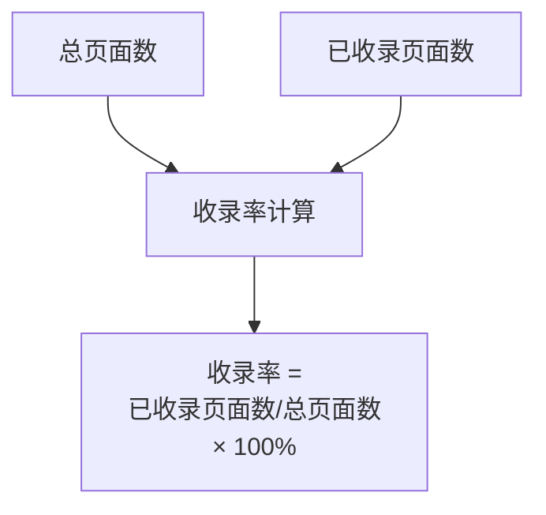
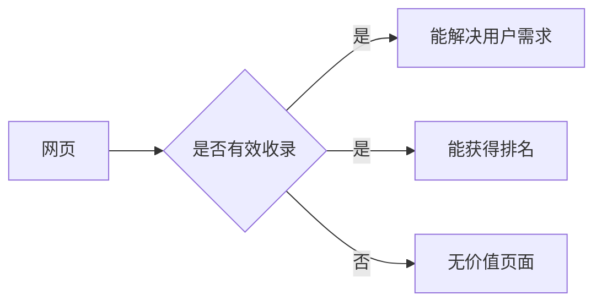

# SEO收录质量计算规则

## 核心概念

### 1. 收录率
收录率是衡量网站质量的重要指标之一。




### 2. 有效收录
有效收录指的是能够为用户提供实际价值并获得排名的页面。




## 重要结论

1. 收录数量不等于质量
2. 高收录率通常代表:
   - 页面质量好
   - 蜘蛛友好度高
   - 用户体验好
3. 有效收录比收录数量更重要

## 练习题

### 1. 收录率计算
请补全以下代码,计算网站的收录率:

```javascript
function calculateIndexRate(totalPages, indexedPages) {
    // 补全代码,计算收录率(结果需要带百分号)
}
```


### 2. 数据分析
给定两个网站数据,判断哪个网站的SEO效果更好:
```javascript
function analyzeSEO(site1, site2) {
    // site1 = { indexed: 3, visitors: 2500 }
    // site2 = { indexed: 50000, visitors: 11 }
    // 返回效果更好的网站编号(1或2)
}
```


### 3. 有效收录判断
补全代码,判断一个页面是否属于有效收录:
```javascript
function isEffectiveIndex(page) {
    // page = { hasRank: boolean, solveUserNeeds: boolean }
    // 补全代码,返回是否是有效收录
}
```


<details>
<summary>参考答案</summary>

```javascript
// 1. 收录率计算
function calculateIndexRate(totalPages, indexedPages) {
    return (indexedPages / totalPages * 100).toFixed(2) + '%';
}

// 2. 数据分析
function analyzeSEO(site1, site2) {
    return site1.visitors > site2.visitors ? 1 : 2;
}

// 3. 有效收录判断
function isEffectiveIndex(page) {
    return page.hasRank && page.solveUserNeeds;
}
```

</details>