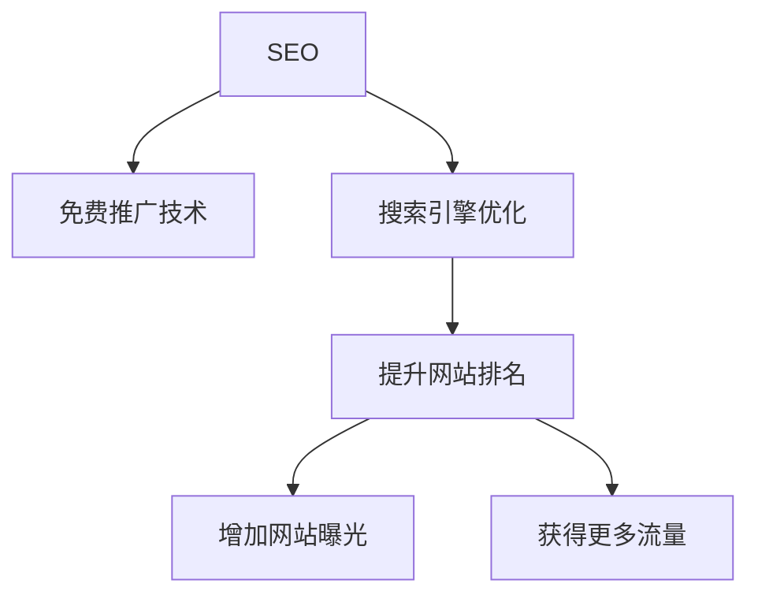
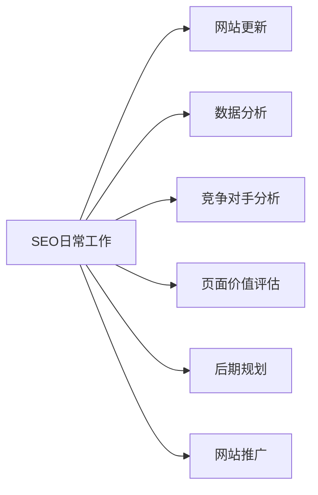

# SEO (搜索引擎优化) 基础

## 定义
SEO(Search Engine Optimization)是一种免费的网站推广技术,通过优化网站内容和结构,提高网站在搜索引擎自然搜索结果中的排名。




## SEO工作内容




### 关键点
1. 前期站点 vs 后期站点
   - 前期站点: 主要面向搜索引擎爬虫
   - 后期站点: 已积累用户基础,可以更自由地调整

2. 排名重要性
   - 首页前三名占据行业60-70%流量
   - 广告位置需要付费,但不一定有好的转化率

## 练习题

### 1. 概念理解
请选择正确的说法:
A. SEO是一种付费推广方式
B. SEO只适用于大型企业
C. SEO是一种长期有效的免费推广技术
D. SEO效果立竿见影

### 2. 代码实践
完成以下函数,该函数用于计算网站在搜索结果中的点击率(CTR):
```javascript
function calculateCTR(position) {
    // 根据位置计算预估CTR
    // 第1位: 30%, 第2位: 20%, 第3位: 15%, 其他位置: 5%
    // 补充代码:
    
}
```


### 3. 实战题
给定一个网页标题,请编写函数优化它使其更符合SEO:
```javascript
function optimizeTitle(title) {
    // 要求:
    // 1. 长度控制在10-60字符之间
    // 2. 包含关键词
    // 3. 去除特殊字符
    // 补充代码:
    
}
```


<details>
<summary>参考答案</summary>

### 概念题答案
正确答案: C

### 代码题1答案
```javascript
function calculateCTR(position) {
    if (position === 1) return 0.30;
    if (position === 2) return 0.20;
    if (position === 3) return 0.15;
    return 0.05;
}
```


### 代码题2答案
```javascript
function optimizeTitle(title) {
    // 去除特殊字符
    let cleaned = title.replace(/[^\w\s\-]/g, '');
    // 控制长度
    cleaned = cleaned.substring(0, 60);
    return cleaned.trim();
}
```

</details>