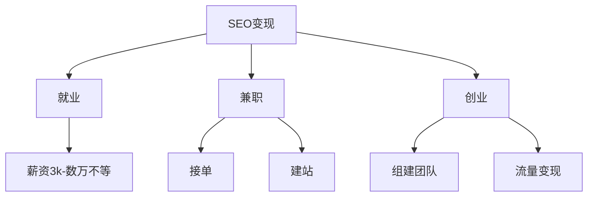

# SEO赚钱方式解析

## 核心概念

SEO(搜索引擎优化)是一种获取免费流量的技术手段。在现代互联网时代:


## 三种主要赚钱方式




### 1. 就业
- 入门级: 3k-4k
- 进阶级: 8k左右
- 专家级: 数万(含提成)

### 2. 兼职
- 接单模式
  - 价格: 8k-数万不等
  - 优势: 一次性收入,无需长期维护
- 建站模式
  - 广告收入: 每个广告位2k-3k
  - 可同时放置多个广告位

### 3. 创业
- 开设工作室
- 流量变现
  - 装修行业案例
  - 淘宝客案例
  - 产品营销案例

## 练习题

### 1. 概念理解
请选择正确的说法:
A. SEO技术需要很强的编程基础
B. SEO只能通过就业一种方式赚钱
C. SEO是一种免费获取流量的技术
D. SEO只适合大公司使用

### 2. 代码实践
完成以下代码,计算一个SEO接单员的月收入(假设每单8000,接了n单):

```javascript
function calculateMonthlyIncome(n) {
    // 补充代码:计算月收入
    
}
```


### 3. 实战思考
一个网站每个广告位月收入3000元,请补充代码计算放置x个广告位的年收入:

```javascript
function calculateYearlyAdIncome(x) {
    // 补充代码:计算年收入
    
}
```


<details>
<summary>参考答案</summary>

1. 概念理解: C

2. 代码实践:
```javascript
function calculateMonthlyIncome(n) {
    return n * 8000;
}
```


3. 实战思考:
```javascript
function calculateYearlyAdIncome(x) {
    return x * 3000 * 12;
}
```

</details>