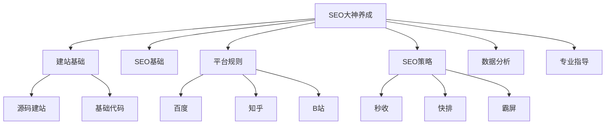

# SEO大神养成指南

## 核心概念

SEO (搜索引擎优化) 是一个系统性的学习过程，需要掌握以下关键要素:



## 关键要点

1. **建站基础**
   - 不需要深入HTML/代码知识
   - 可使用源码建站
   - 网站是信息载体
   
2. **SEO基础**
   - 基本技巧和操作方法
   - 优化网站用户体验

3. **平台规则**
   - 适用于各大平台
   - 通用SEO思维方式
   - 规则挖掘技巧

4. **SEO策略**
   - 秒收：文章快速被收录
   - 快排：文章快速获得排名
   - 霸屏：搜索结果全是自己的内容

5. **数据分析**
   - SEO本质是数据工作
   - 数据化经营思维

6. **专业指导**
   - 避免走弯路
   - 获得正确反馈
   - 持续学习进步

## 练习题

1. 完成以下代码，实现一个简单的SEO标题优化函数：
```javascript
function optimizeTitle(title) {
    // 补充代码：
    // 1. 将标题长度限制在20-60个字符之间
    // 2. 如果标题超过60个字符，在第57个字符位置截断并加上"..."
}
```

2. 实现一个函数检查网页是否符合基本SEO要求：
```javascript
function checkBasicSEO(page) {
    // 补充代码：
    // 检查页面是否包含以下元素：
    // - title标签
    // - description元标签
    // - h1标签
    // 返回一个包含检查结果的对象
}
```

3. 数据分析练习：完成以下代码计算页面的跳出率：
```javascript
function calculateBounceRate(pageViews, bounces) {
    // 补充代码：
    // 计算跳出率 = 跳出次数 / 总访问量 * 100
}
```

<details>
<summary>参考答案</summary>

1. 标题优化函数：
```javascript
function optimizeTitle(title) {
    if (title.length > 60) {
        return title.slice(0, 57) + "...";
    }
    return title;
}
```

2. SEO检查函数：
```javascript
function checkBasicSEO(page) {
    return {
        hasTitle: page.includes("<title>"),
        hasDescription: page.includes("<meta name=\"description\""),
        hasH1: page.includes("<h1>")
    };
}
```

3. 跳出率计算：
```javascript
function calculateBounceRate(pageViews, bounces) {
    return (bounces / pageViews * 100).toFixed(2) + "%";
}
```
</details>