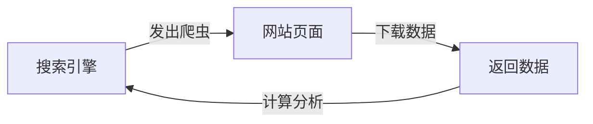
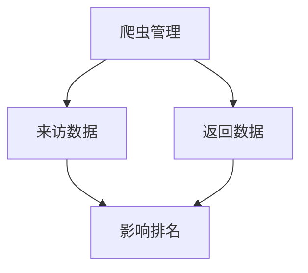

# 搜索引擎爬虫基础

## 什么是爬虫
搜索引擎爬虫是搜索引擎用来下载和收集网页信息的自动化程序。它模拟普通用户访问网站,下载页面内容并将数据返回给搜索引擎进行分析和排名。

## 主要搜索引擎的爬虫名称
- 百度: Baiduspider
- 谷歌: Googlebot  
- 360: 360Spider
- 必应: bingbot

## 爬虫工作流程




## 爬虫特性
1. 模拟普通用户访问
2. 不会抓取需要登录的页面
3. 访问频率取决于网站价值

## 爬虫管理的重要性



## 练习题

### 1. 判断题: 以下哪个说法是正确的?
A. 需要登录的页面可以被百度爬虫抓取
B. 爬虫访问频率与网站价值无关
C. Googlebot是谷歌的爬虫名称
D. 所有搜索引擎的爬虫都叫做"蜘蛛"

### 2. 代码补全: 实现一个简单的函数来判断是否是百度爬虫
```javascript
function isBaiduSpider(userAgent) {
    // 补全代码:判断userAgent中是否包含"Baiduspider"
    
}
```


### 3. 代码补全: 实现一个函数来获取访问者是哪个搜索引擎的爬虫
```javascript
function getSpiderType(userAgent) {
    // 补全代码:根据userAgent判断是哪个搜索引擎的爬虫
    // 返回值为: "baidu", "google", "bing", "360" 或 "unknown"
    
}
```


<details>
<summary>参考答案</summary>

### 判断题答案
正确答案是 C

解释:
- A错误: 需要登录的页面不能被爬虫抓取
- B错误: 爬虫访问频率与网站价值密切相关
- C正确: Googlebot确实是谷歌的爬虫名称
- D错误: 不同搜索引擎的爬虫有不同称呼,比如谷歌叫"机器人"

### 代码题1答案
```javascript
function isBaiduSpider(userAgent) {
    return userAgent.includes('Baiduspider');
}
```


### 代码题2答案
```javascript
function getSpiderType(userAgent) {
    if(userAgent.includes('Baiduspider')) return 'baidu';
    if(userAgent.includes('Googlebot')) return 'google';
    if(userAgent.includes('bingbot')) return 'bing';
    if(userAgent.includes('360Spider')) return '360';
    return 'unknown';
}
```

</details>