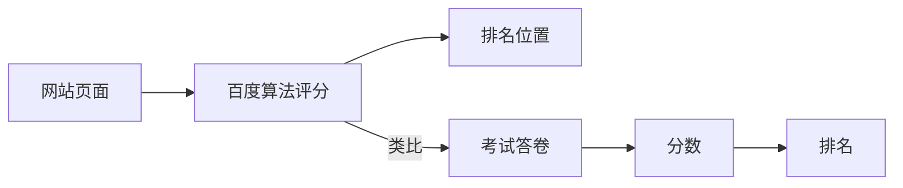
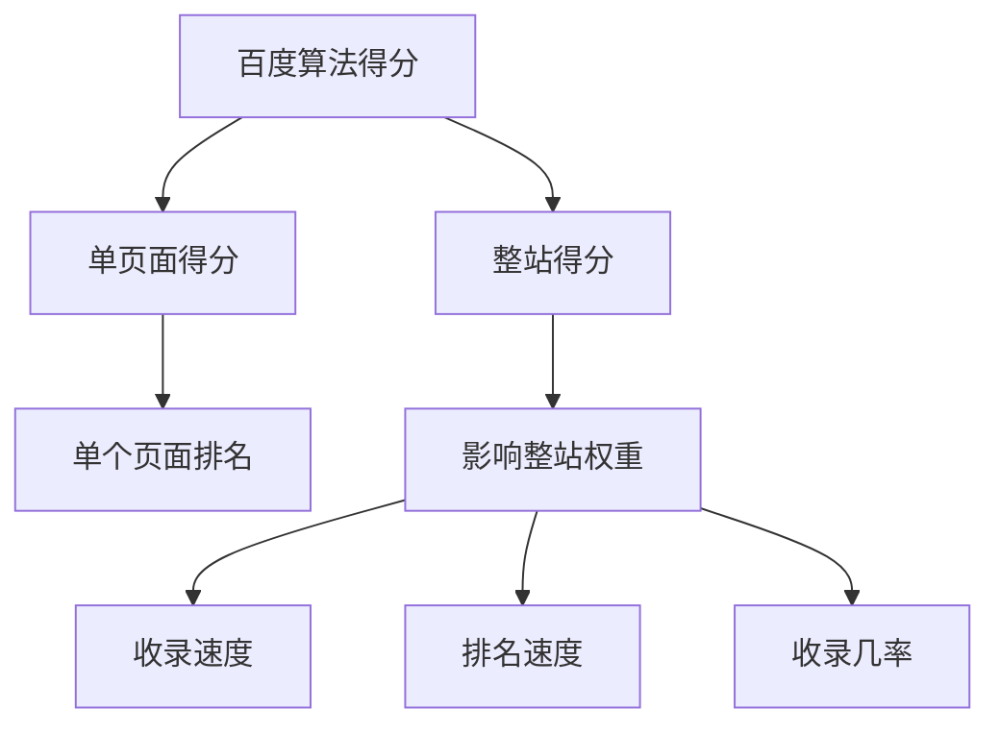

# 百度算法排名规则

## 基本概念

百度搜索引擎使用算法规则来评估和排序网站。这个过程可以类比为:




### 两种得分计算方式




### 竞价排名 vs SEO自然排名
- 竞价排名: 付费直接获得展现位置,但可能缺乏用户体验
- SEO自然排名: 通过优化内容和用户体验来获得排名

## 练习题

### 1. 概念理解
请选择正确的说法:
A. 竞价排名比SEO更注重用户体验
B. 单页面得分只影响该页面的排名
C. 整站得分对网站所有页面都无影响
D. 百度算法只考虑付费因素

### 2. 代码实践
完成以下代码,模拟一个简单的页面评分系统:

```javascript
function calculatePageScore(page) {
    let score = 0;
    // 补充代码：如果页面有标题，加10分
    // 补充代码：如果页面内容大于1000字，加20分
    // 补充代码：如果页面包含图片，加15分
    return score;
}
```


### 3. 应用题
某网站有3个页面,它们的得分分别是98分、92分、85分。请补充代码计算该网站的平均得分:

```javascript
function calculateAverageScore(scores) {
    // 补充代码：计算平均分
}
```


<details>
<summary>参考答案</summary>

1. 概念理解: B

2. 代码实践:
```javascript
function calculatePageScore(page) {
    let score = 0;
    if (page.title) score += 10;
    if (page.content.length > 1000) score += 20;
    if (page.images.length > 0) score += 15;
    return score;
}
```


3. 应用题:
```javascript
function calculateAverageScore(scores) {
    return scores.reduce((sum, score) => sum + score, 0) / scores.length;
}
```

</details>