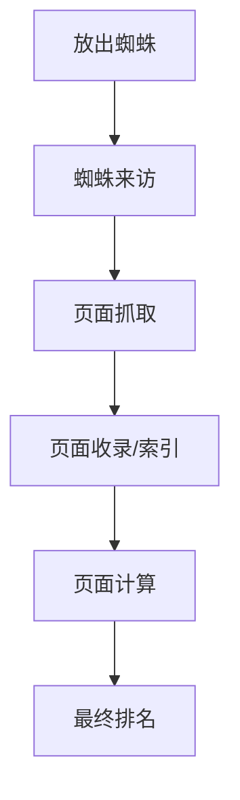
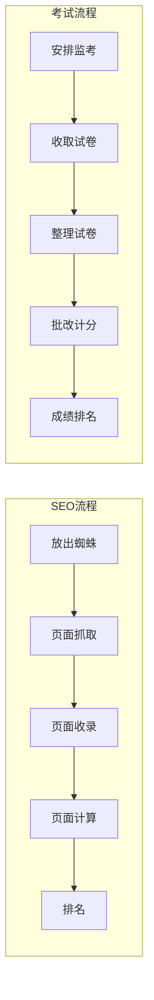

# SEO网站排名流程详解

## 基本概念

SEO(搜索引擎优化)是通过优化网站在搜索引擎中的排名流程来提高网站可见度的技术。

## 排名流程



### 详细说明

1. **放出蜘蛛**: 搜索引擎发送爬虫程序
2. **蜘蛛来访**: 爬虫到达目标网站
3. **页面抓取**: 爬虫获取网站数据
4. **页面收录**: 将网页数据存入搜索引擎数据库
5. **页面计算**: 根据算法对页面进行评分
6. **最终排名**: 基于评分确定搜索结果排名

## 类比解释

考试流程与SEO排名流程的对比：



## 练习题

### 1. 概念理解题
请选择正确的顺序来描述SEO排名流程：
A. 页面计算 -> 放出蜘蛛 -> 页面收录 -> 蜘蛛来访
B. 放出蜘蛛 -> 蜘蛛来访 -> 页面收录 -> 页面计算
C. 页面收录 -> 放出蜘蛛 -> 页面计算 -> 蜘蛛来访
D. 蜘蛛来访 -> 页面收录 -> 放出蜘蛛 -> 页面计算

### 2. 代码补全题
完成以下模拟蜘蛛访问的函数：

```javascript
async function simulateSpiderVisit(url) {
    // 补全代码：检查url是否合法
    if (!url.startsWith('http')) {
        throw new Error('Invalid URL');
    }
    
    try {
        // 补全代码：模拟抓取过程
        const response = _____________________;
        
        // 补全代码：返回抓取结果
        return _____________________;
        
    } catch (error) {
        console.error('Spider visit failed:', error);
        return null;
    }
}
```

### 3. 实践题
创建一个简单的函数来判断页面是否已被收录：

```javascript
function checkIndexStatus(pageUrl) {
    // 补全代码：返回页面是否被收录的状态
    return _____________________;
}
```

<details>
<summary>参考答案</summary>

1. 概念理解题答案：B

2. 代码补全题答案：
```javascript
// 第一处补全
const response = await fetch(url);

// 第二处补全
return response.ok ? await response.text() : null;
```

3. 实践题答案：
```javascript
function checkIndexStatus(pageUrl) {
    return fetch(`https://api.search.engine/index-status?url=${encodeURIComponent(pageUrl)}`)
        .then(response => response.json())
        .then(data => data.isIndexed);
}
```
</details>