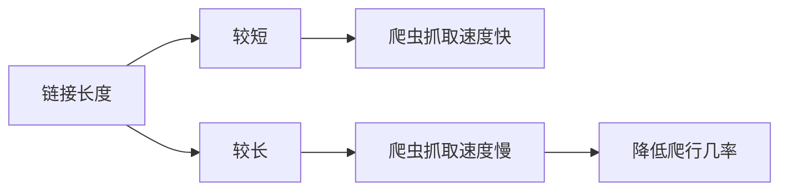
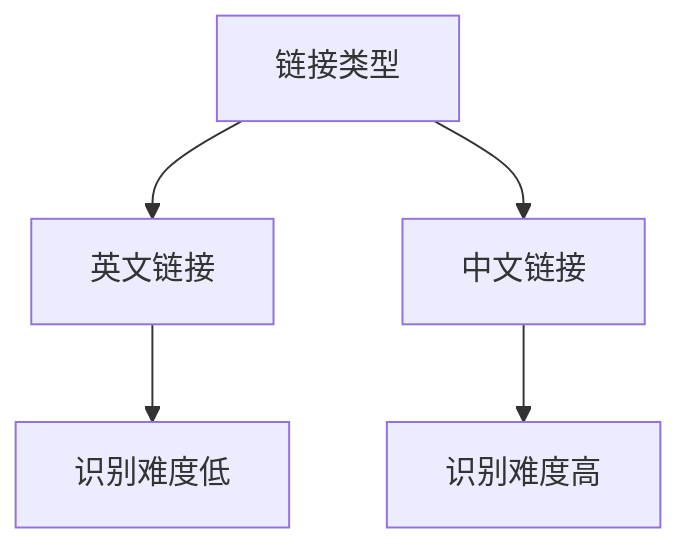
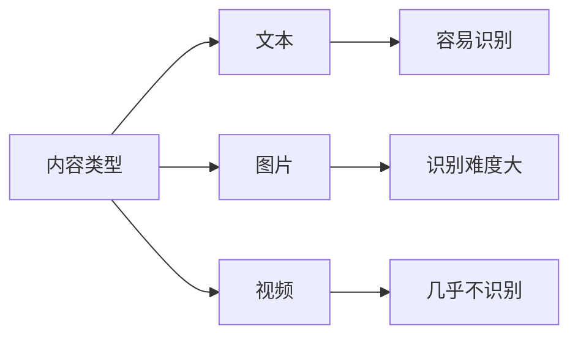
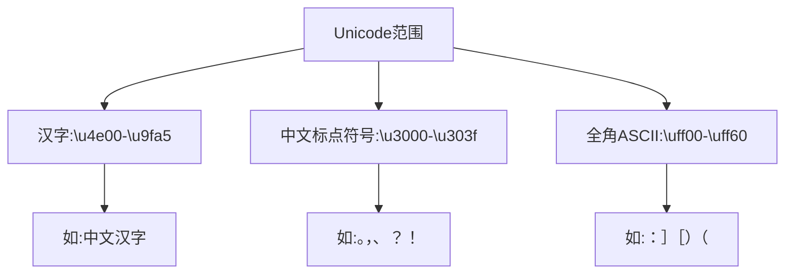

# 网络爬虫管理规则基础

## 1. 链接特性

### 1.1 链接长度
链接长度会直接影响爬虫的抓取效率。




### 1.2 链接类型
分为两种主要类型：
- 英文链接（推荐）：如 `www.yiye.com`
- 中文链接（不推荐）：如 `www.一叶.com`




## 2. 网站识别回访

### 2.1 加载速度
- 建议页面加载时间控制在3秒内
- 超过4-5秒会严重影响用户体验和爬虫抓取

### 2.2 内容识别难度
不同类型内容的识别难度：



## 练习题

### 题目1：链接优化
给定以下链接，请选择最优的SEO友好链接：
A. `www.我的网站.com/文章/2024/03/第一篇`
B. `www.mysite.com/articles/2024/03/first-post`
C. `www.mysite.com/a/b/c/d/e/f/g/article-001`
D. `www.my-site.com/文章-001`

### 题目2：代码实现
完成以下函数，判断一个URL是否包含中文字符：

```javascript
function containsChineseChar(url) {
    // 补充代码：使用正则表达式判断是否包含中文字符
}
```


### 题目3：加载时间计算
完成以下函数，判断页面加载时间是否符合SEO要求：

```javascript
function isLoadTimeAcceptable(loadTimeInMs) {
    // 补充代码：判断加载时间是否在3秒以内
}
```


<details>
<summary>参考答案</summary>

### 题目1答案：
正确答案是 B
原因：
1. 使用全英文字符
2. 链接层级适中
3. 结构清晰易懂

### 题目2答案：
```javascript
function containsChineseChar(url) {
    return /[\u4e00-\u9fa5]/.test(url);
}
```
包含中文标点
```javascript
function containsChineseCharAndPunct(url) {
    return /[\u4e00-\u9fa5\u3000-\u303f\uff00-\uff60]/.test(url);
}
```




### 题目3答案：
```javascript
function isLoadTimeAcceptable(loadTimeInMs) {
    return loadTimeInMs <= 3000;
}
```

</details>