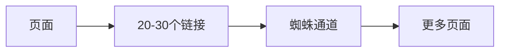
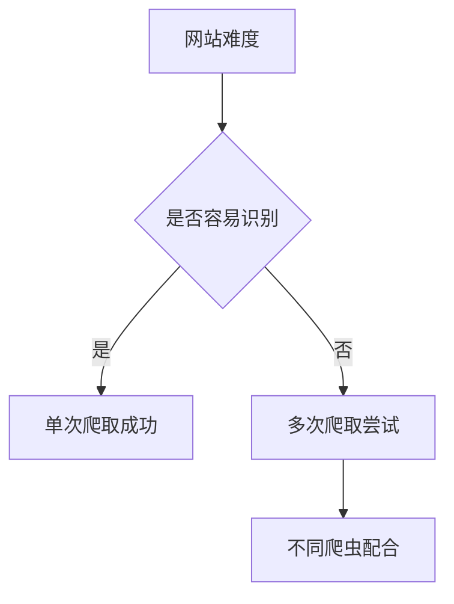

# 网络爬虫管理规则

## 核心概念

### 1. 爬虫眼中的网站
- 爬虫看到的内容可能与用户看到的很不同
- 以B站为例,爬虫看到的页面内容较少,但因为用户流量大,依然有好的排名

### 2. 链接管理



### 3. 有效收录
- 指具有价值的页面内容
- 影响网站质量评估

### 4. 爬虫访问频率



### 5. 访问日志分析
- 位置: 根目录下LOGS文件夹
- 格式: .LOG文件(可转为txt)
- 分析工具: Excel
- 关键字: Baiduspider/2.0

## 优化要点
1. 链接可识别性
2. 页面间相互链接
3. 降低识别难度
   - 增加文字内容
   - 提升加载速度
4. 提高页面价值

## 练习题

### 1. 链接分析
补全下面的代码,统计页面中的链接数量:
```javascript
function countPageLinks() {
    // 补充代码,获取页面所有a标签数量
}
```


### 2. 爬虫日志解析
补全代码,从日志文本中提取Baiduspider的访问记录:
```javascript
function extractBaiduSpiderLogs(logText) {
    // 补充代码,使用正则表达式匹配包含"Baiduspider/2.0"的行
}
```


### 3. 页面识别难度评估
补全代码,计算页面文本内容比例:
```javascript
function calculateTextRatio() {
    // 补充代码,计算页面文本内容与总内容的比例
}
```


<details>
<summary>参考答案</summary>

```javascript
// 1. 链接分析
function countPageLinks() {
    return document.getElementsByTagName('a').length;
}

// 2. 爬虫日志解析
function extractBaiduSpiderLogs(logText) {
    const regex = /.*Baiduspider\/2\.0.*/g;
    return logText.match(regex) || [];
}

// 3. 页面识别难度评估
function calculateTextRatio() {
    const textContent = document.body.textContent.trim().length;
    const totalContent = document.body.innerHTML.length;
    return textContent / totalContent;
}
```

</details>