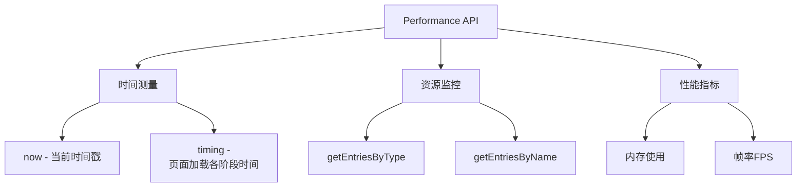
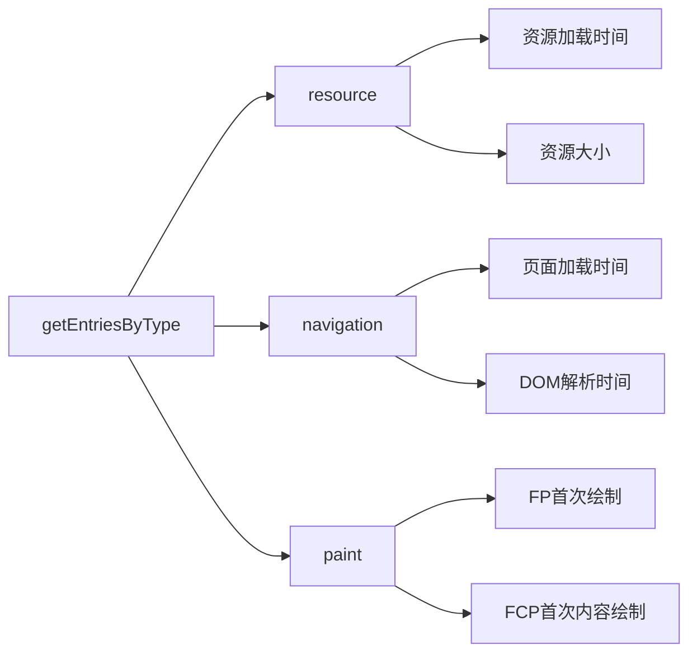
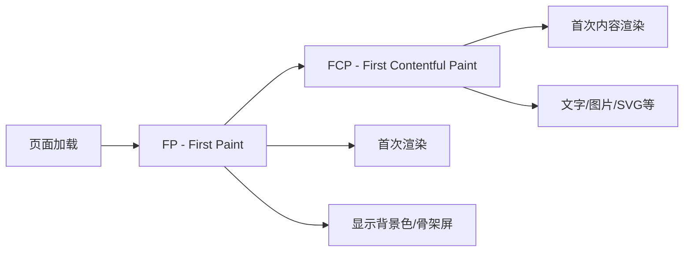

# Performance API介绍

Performance API是浏览器提供的性能监测接口，让我们可以获取到网页性能相关的数据。



主要方法说明：

1. **performance.now()**
   - 返回一个高精度的时间戳（毫秒级）
   - 从页面加载开始计时

2. **performance.getEntriesByType(type)**
   - 获取特定类型的性能数据
   - type可以是:
     - 'resource': 资源加载性能
     - 'navigation': 页面导航性能
     - 'paint': 页面渲染性能

示例代码：

```javascript
// 获取所有资源的加载信息
const resources = performance.getEntriesByType('resource');

// 资源信息包含:
resources.forEach(resource => {
    console.log({
        名称: resource.name,
        类型: resource.initiatorType,
        加载时间: resource.duration,
        开始时间: resource.startTime
    });
});
```

<details>
<summary>练习题</summary>

实现一个函数，统计页面中所有图片资源的平均加载时间：

```javascript
function getAverageImageLoadTime() {
    const resources = performance.getEntriesByType('resource');
    const imageResources = resources.filter(r => r.initiatorType === 'img');
    const totalTime = imageResources.reduce((sum, img) => sum + img.duration, 0);
    return totalTime / imageResources.length;
}
```

</details>


# Performance.getEntriesByType详解

这个API用于获取特定类型的性能数据,返回一个PerformanceEntry对象数组。最常用的三种type:



## Demo 1: 监控资源加载

```javascript
// 获取所有资源加载信息
function checkResources() {
    const entries = performance.getEntriesByType('resource');
    entries.forEach(entry => {
        console.log(`
            资源: ${entry.name}
            类型: ${entry.initiatorType}
            加载耗时: ${entry.duration.toFixed(2)}ms
            大小: ${entry.transferSize} bytes
        `);
    });
}

// 在控制台执行
checkResources();
```

## Demo 2: 页面导航性能

```javascript
// 获取页面加载各阶段时间
function checkNavigation() {
    const navEntry = performance.getEntriesByType('navigation')[0];
    console.log(`
        DNS查询: ${navEntry.domainLookupEnd - navEntry.domainLookupStart}ms
        TCP连接: ${navEntry.connectEnd - navEntry.connectStart}ms
        DOM解析: ${navEntry.domComplete - navEntry.domInteractive}ms
        页面完全加载: ${navEntry.loadEventEnd - navEntry.startTime}ms
    `);
}

// 在控制台执行
checkNavigation();
```

## Demo 3: 绘制时间点

```javascript
// 获取关键渲染时间点
function checkPaint() {
    const paintEntries = performance.getEntriesByType('paint');
    paintEntries.forEach(entry => {
        console.log(`
            指标: ${entry.name}
            时间: ${entry.startTime.toFixed(2)}ms
        `);
    });
}

// 在控制台执行
checkPaint();
```

## Demo 4: 实用监控函数

```javascript
// 监控特定资源类型的加载情况
function monitorResourceType(type) {
    const resources = performance.getEntriesByType('resource');
    const typeResources = resources.filter(r => r.initiatorType === type);
    
    const stats = {
        count: typeResources.length,
        totalSize: 0,
        avgLoadTime: 0
    };
    
    typeResources.forEach(r => {
        stats.totalSize += r.transferSize;
        stats.avgLoadTime += r.duration;
    });
    
    stats.avgLoadTime /= stats.count;
    
    console.log(`
        ${type}资源统计:
        数量: ${stats.count}
        总大小: ${(stats.totalSize / 1024).toFixed(2)}KB
        平均加载时间: ${stats.avgLoadTime.toFixed(2)}ms
    `);
}

// 在控制台执行
monitorResourceType('img');  // 统计图片
monitorResourceType('script');  // 统计脚本
monitorResourceType('css');  // 统计样式表
```

使用方法:
1. 打开任意网页(比如百度)
2. 按F12打开开发者工具
3. 切换到Console面板
4. 复制上述任意demo代码并执行
5. 观察输出结果

<details>
<summary>练习题</summary>

编写一个函数,监控并报告页面中加载时间超过3秒的资源:

```javascript
function reportSlowResources(threshold = 3000) {
    const resources = performance.getEntriesByType('resource');
    const slowResources = resources.filter(r => r.duration > threshold);
    
    console.log(`发现${slowResources.length}个慢资源:`);
    slowResources.forEach(r => {
        console.log(`
            资源: ${r.name}
            类型: ${r.initiatorType}
            加载时间: ${r.duration.toFixed(2)}ms
        `);
    });
}
```

</details>

# FP和FCP性能指标详解



## FP (First Paint) - 首次渲染
- 指浏览器从开始加载到第一次在屏幕上渲染像素的时间点
- 这可能是页面背景色的改变，或者是骨架屏的显示
- 不包含任何实际内容，只是视觉上的第一次变化

## FCP (First Contentful Paint) - 首次内容渲染
- 指浏览器渲染第一个实际内容的时间点
- 实际内容包括：
  - 文本
  - 图片
  - SVG元素
  - 非白色的canvas元素

以下是测量这两个指标的示例代码：

```javascript
// 获取FP和FCP时间
function checkPaintTiming() {
    const paintEntries = performance.getEntriesByType('paint');
    
    paintEntries.forEach(entry => {
        if(entry.name === 'first-paint') {
            console.log(`FP时间：${entry.startTime.toFixed(2)}ms`);
        }
        if(entry.name === 'first-contentful-paint') {
            console.log(`FCP时间：${entry.startTime.toFixed(2)}ms`);
        }
    });
}
```

<details>
<summary>练习题</summary>

编写一个函数来判断页面的FCP性能是否达标（假设标准是1000ms以内）：

```javascript
function checkFCPPerformance(threshold = 1000) {
    const paintEntries = performance.getEntriesByType('paint');
    const fcp = paintEntries.find(entry => entry.name === 'first-contentful-paint');
    
    if (fcp) {
        const fcpTime = fcp.startTime;
        const isGood = fcpTime <= threshold;
        
        console.log(`
            FCP时间：${fcpTime.toFixed(2)}ms
            性能评级：${isGood ? '达标' : '需要优化'}
        `);
        
        return isGood;
    }
    
    return false;
}
```

</details>