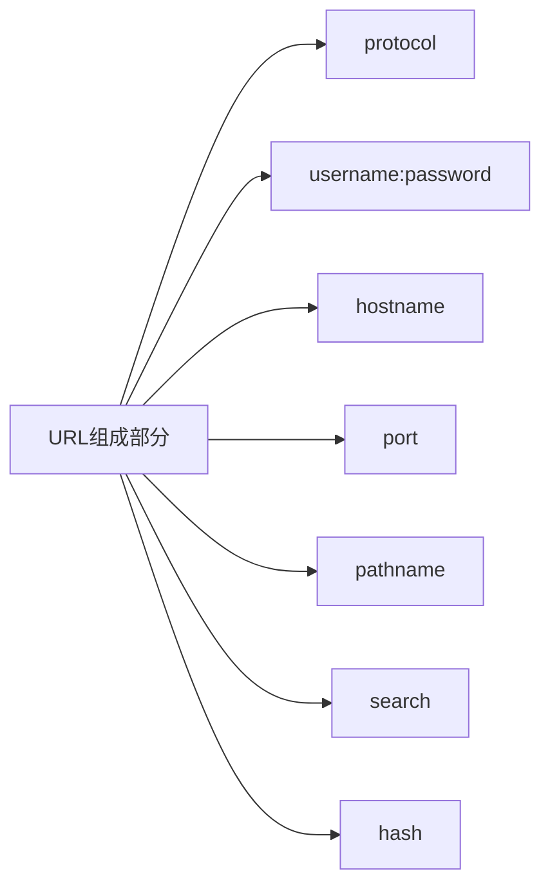
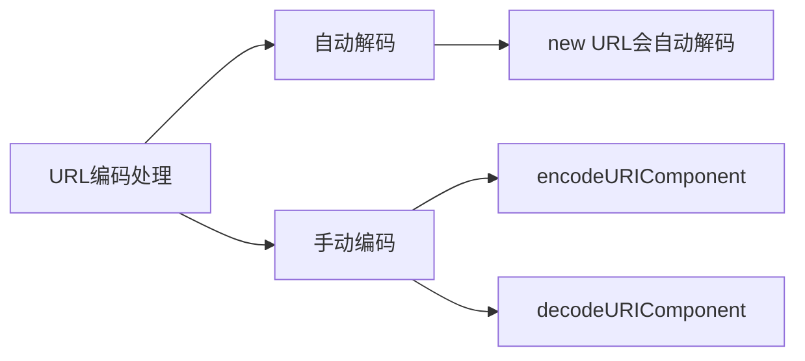

# URL API

## 基本定义
URL API是一个用于处理URL的接口，它提供了解析、构造、规范化和编码URL的功能。

## URL对象的组成部分




## 主要属性
- `href`: 完整URL字符串
- `protocol`: 协议名（如'https:'）
- `host`: 域名+端口
- `hostname`: 域名
- `port`: 端口号
- `pathname`: 路径
- `search`: 查询参数
- `hash`: 片段标识符
- `searchParams`: URLSearchParams对象
- `origin`（只读）: 协议+域名+端口

## 主要方法
- `toString()`: 返回完整URL
- `toJSON()`: 返回完整URL
- `createObjectURL()`（静态方法）: 创建Blob URL
- `revokeObjectURL()`（静态方法）: 释放Blob URL

## 练习题

### 1. URL解析
补全代码，从给定URL中提取hostname和pathname：
```javascript
const url = 'https://example.com/path/to/page?id=123';
// 补全代码，使用URL API解析url，并打印hostname和pathname
const parsedUrl = // 你的代码
console.log(parsedUrl.hostname); // 应输出: example.com
console.log(parsedUrl.pathname); // 应输出: /path/to/page
```


### 2. URL参数处理
补全代码，从URL中获取指定参数值：
```javascript
const url = 'https://example.com/search?name=john&age=25';
// 补全代码，获取name参数的值
const parsedUrl = new URL(url);
const name = // 你的代码
console.log(name); // 应输出: john
```


### 3. URL构造
补全代码，构造一个新的URL，添加参数和hash：
```javascript
// 补全代码，构造URL，添加参数user=alice，hash为profile
const baseUrl = 'https://example.com';
const url = // 你的代码
console.log(url.href); // 应输出: https://example.com?user=alice#profile
```


<details>
<summary>参考答案</summary>

### 1. URL解析
```javascript
const url = 'https://example.com/path/to/page?id=123';
const parsedUrl = new URL(url);
console.log(parsedUrl.hostname);
console.log(parsedUrl.pathname);
```


### 2. URL参数处理
```javascript
const url = 'https://example.com/search?name=john&age=25';
const parsedUrl = new URL(url);
const name = parsedUrl.searchParams.get('name');
console.log(name);
```


### 3. URL构造
```javascript
const baseUrl = 'https://example.com';
const url = new URL(baseUrl);
url.searchParams.set('user', 'alice');
url.hash = 'profile';
console.log(url.href);
```

</details>

## URL编码处理

当URL中包含特殊字符或非ASCII字符时，需要进行编码处理。URL API会自动处理编码和解码：



### 自动解码示例
```javascript
// URL API会自动处理编码的内容
const encodedUrl = 'https://example.com/path?name=' + encodeURIComponent('张三');
const url = new URL(encodedUrl);
console.log(url.searchParams.get('name')); // 输出: 张三
```

### 手动编解码示例
```javascript
// 手动编码
const name = encodeURIComponent('张三');
const url = new URL(`https://example.com/path?name=${name}`);
console.log(url.href); // https://example.com/path?name=%E5%BC%A0%E4%B8%89

// 手动解码
const encodedName = url.searchParams.get('name');
console.log(encodedName); // 张三（URL API自动解码）
console.log(decodeURIComponent('%E5%BC%A0%E4%B8%89')); // 张三
```

### 注意事项
- new URL()会自动解码编码过的参数
- 如果需要保持编码状态，可以使用searchParams.toString()获取编码后的查询字符串
- 对于路径中的特殊字符，建议使用encodeURIComponent进行编码

### 4. URL编码练习
补全代码，处理包含中文字符的URL：
```javascript
// 补全代码，构造一个包含中文参数的URL
const baseUrl = 'https://example.com/search';
const keyword = '编程学习';
const url = // 你的代码
console.log(url.href); // 应输出类似: https://example.com/search?q=%E7%BC%96%E7%A8%8B%E5%AD%A6%E4%B9%A0
```

<details>
<summary>参考答案</summary>

### 4. URL编码练习
```javascript
const baseUrl = 'https://example.com/search';
const keyword = '编程学习';
const url = new URL(baseUrl);
url.searchParams.set('q', keyword);
console.log(url.href);
```

注意：URL API会自动处理参数的编码，所以不需要手动使用encodeURIComponent。如果确实需要获取编码后的形式，可以使用url.searchParams.toString()。

</details>