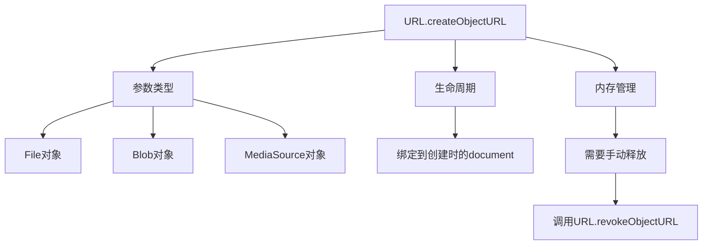

# URL.createObjectURL

## 基本定义
URL.createObjectURL()是一个静态方法，用于创建一个表示指定对象的URL字符串。

## 关键特性


## 使用注意事项
1. 每次调用都会创建新的URL，即使是同一个对象
2. 需要及时释放内存
3. 不建议在Service Worker中使用
4. 对于MediaStream，现代浏览器推荐使用srcObject

## 练习题

### 题目1：内存管理
完成以下代码，实现图片预览功能，并确保proper内存管理：
```javascript
function handleImageUpload(event) {
    const file = event.target.files[0];
    const img = document.createElement('img');
    // 补充代码：创建对象URL并设置给img.src
    
    // 补充代码：图片加载完成后释放对象URL
    
    document.body.appendChild(img);
}
```

### 题目2：文件下载
完成以下代码，实现将文本内容转换为可下载的文件：
```javascript
function createDownloadableFile(text, filename) {
    // 补充代码：创建包含文本内容的Blob对象
    
    const link = document.createElement('a');
    // 补充代码：设置link的href为对象URL，并设置download属性
    
    link.click();
    // 补充代码：释放对象URL
}
```

### 题目3：视频预览
完成以下代码，实现本地视频文件预览（使用现代推荐方式）：
```javascript
function previewVideo(event) {
    const file = event.target.files[0];
    const video = document.createElement('video');
    video.controls = true;
    // 补充代码：使用现代方式设置视频源
    
    document.body.appendChild(video);
}
```

<details>
<summary>参考答案</summary>

### 题目1答案：
```javascript
function handleImageUpload(event) {
    const file = event.target.files[0];
    const img = document.createElement('img');
    const objectUrl = URL.createObjectURL(file);
    img.src = objectUrl;
    img.onload = () => URL.revokeObjectURL(objectUrl);
    document.body.appendChild(img);
}
```

### 题目2答案：
```javascript
function createDownloadableFile(text, filename) {
    const blob = new Blob([text], { type: 'text/plain' });
    const objectUrl = URL.createObjectURL(blob);
    const link = document.createElement('a');
    link.href = objectUrl;
    link.download = filename;
    link.click();
    URL.revokeObjectURL(objectUrl);
}
```

### 题目3答案：
```javascript
function previewVideo(event) {
    const file = event.target.files[0];
    const video = document.createElement('video');
    video.controls = true;
    video.srcObject = file;
    document.body.appendChild(video);
}
```

</details>