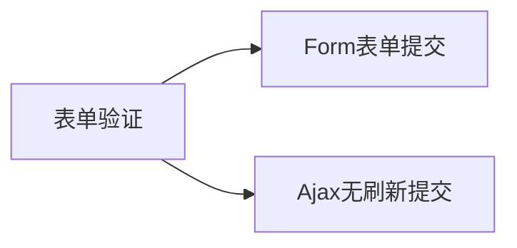
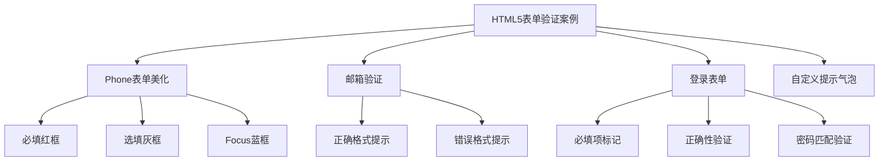

# HTML5 表单验证基础

## 表单验证的两种方式




## HTML5 原生表单验证特性

### 验证效果类型
1. 气泡提示
2. 边框变色
3. 自定义提示文本

### 基本案例展示




## 练习题

### 题目1: 实现必填输入框的样式
补全以下CSS代码，实现必填输入框的红色边框效果：

```css
input {
    /* 补全代码：添加2px宽度的实线边框，颜色为#ff0000 */
}
```


### 题目2: 邮箱验证
补全以下HTML代码，为input添加邮箱验证：

```html
<input type="___" name="email" ___="请输入有效的邮箱地址">
```


### 题目3: JS表单验证
补全以下JavaScript代码，实现密码匹配验证：

```javascript
function validatePassword() {
    const password1 = document.getElementById('password1').value;
    const password2 = document.getElementById('password2').value;
    
    // 补全代码：判断两个密码是否相同，如果不同则返回false
    
}
```


<details>
<summary>参考答案</summary>

题目1:
```css
input {
    border: 2px solid #ff0000;
}
```


题目2:
```html
<input type="email" name="email" required="required">
```


题目3:
```javascript
function validatePassword() {
    const password1 = document.getElementById('password1').value;
    const password2 = document.getElementById('password2').value;
    
    return password1 === password2;
}
```

</details>