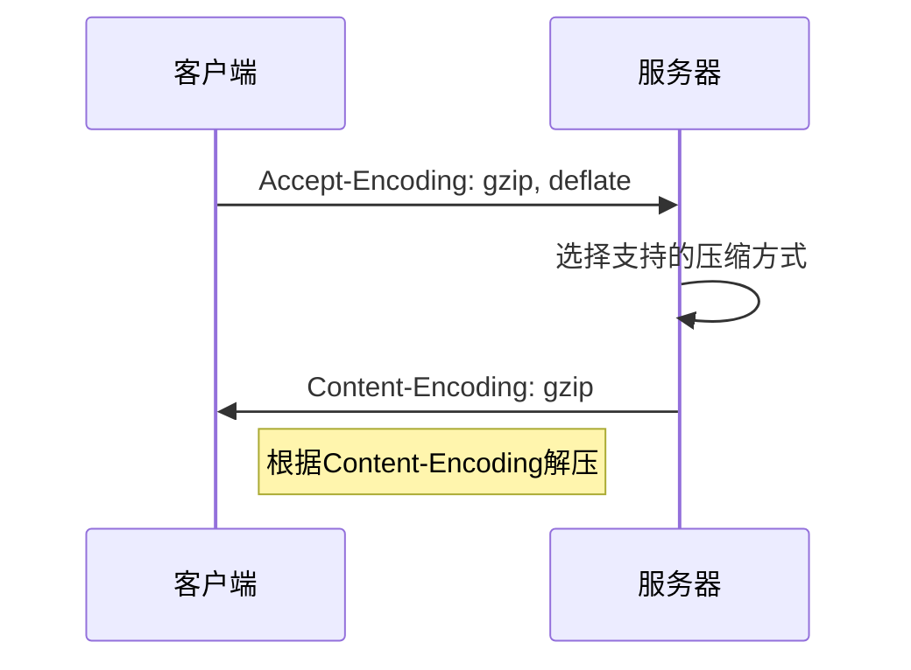

# HTTP 内容压缩

## 基本概念

HTTP 内容压缩是一种提高网页传输效率的技术。主要通过在服务器端压缩内容,客户端解压的方式来减少传输数据量。

### 常见压缩方式
- gzip
- deflate 
- compress
- br (Brotli)
- sdch (Google Chrome推出)

### 压缩流程


### 压缩协商过程




## 实践要点

1. 服务器配置(以Apache为例):
```apache
<IfModule mod_deflate.c>
    DeflateCompressionLevel 6
    AddOutputFilterByType DEFLATE text/plain
    AddOutputFilterByType DEFLATE text/html
    AddOutputFilterByType DEFLATE text/xml
</IfModule>
```


2. 只压缩文本类型文件:
- text/plain
- text/html
- text/css
- text/javascript
- application/json
- application/xml

不建议压缩的文件:
- 图片
- 视频
- 音频
- 已压缩的文件(zip等)

## 练习题

1. 补全代码：实现一个检测浏览器是否支持gzip的函数

```javascript
function checkGzipSupport() {
    // 补充代码：获取请求头中的Accept-Encoding并检查是否包含gzip
}
```


2. 补全代码：实现一个计算压缩节省流量的函数

```javascript
function calculateSavedBandwidth(originalSize, compressedSize) {
    // 补充代码：计算压缩节省的百分比
}
```


3. 判断题：以下哪些说法是正确的？
- A. 所有类型的文件都适合使用gzip压缩
- B. 浏览器通过Accept-Encoding头告诉服务器支持的压缩方式
- C. Content-Length在压缩前后保持不变
- D. 图片文件适合使用gzip压缩

<details>
<summary>参考答案</summary>

1. 检测gzip支持:
```javascript
function checkGzipSupport() {
    const acceptEncoding = request.headers['accept-encoding'] || '';
    return acceptEncoding.includes('gzip');
}
```


2. 计算节省流量:
```javascript
function calculateSavedBandwidth(originalSize, compressedSize) {
    return ((originalSize - compressedSize) / originalSize * 100).toFixed(2) + '%';
}
```


3. 判断题答案:
- A: ❌ 错误，不是所有文件都适合压缩
- B: ✅ 正确
- C: ❌ 错误，压缩后Content-Length会变小
- D: ❌ 错误，图片已经是压缩格式，不适合再压缩

</details>