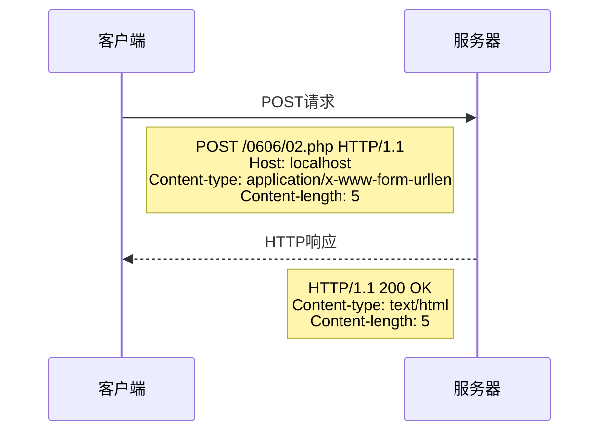
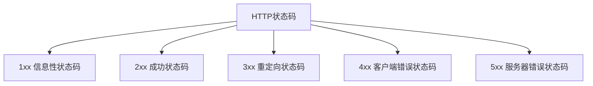

# HTTP协议之方法与状态码

## 一、HTTP请求方法

常见的HTTP请求方法包括:

- GET: 获取资源
- POST: 提交数据
- HEAD: 获取报文首部
- OPTIONS: 询问支持的方法
- TRACE: 追踪路径
- DELETE: 删除资源
- PUT: 上传文件

### 请求示例




## 二、重要的HTTP方法详解

### 1. HEAD方法
- 与GET基本相同
- 只返回报文首部,不返回报文主体
- 用于确认URI的有效性及资源更新的日期时间等

### 2. OPTIONS方法
- 用于查询服务器支持的方法
- 返回服务器允许的通信选项


### 3. TRACE方法
- 让服务器端将之前的请求通信环回给客户端
- 用于追踪请求的传输路径
- 多用于测试或诊断

## 三、HTTP状态码

常见状态码分类:



### 重要状态码说明

- 200 OK: 请求成功
- 301/302: 永久/临时重定向
- 304: 资源未修改,使用缓存
- 307: 临时重定向(保留原有请求方法)

### 缓存相关判断流程

## 四、实际应用示例

### PHP中的重定向示例
```php
header("Location: http://www.baidu.com"); // 默认是302重定向
header("Location: http://www.baidu.com", true, 301); // 指定301永久重定向
```

### 状态码使用建议
- 301/302重定向要谨慎使用
- 307用于保留原有请求方法和数据
- 合理使用304状态码可以优化网站性能
