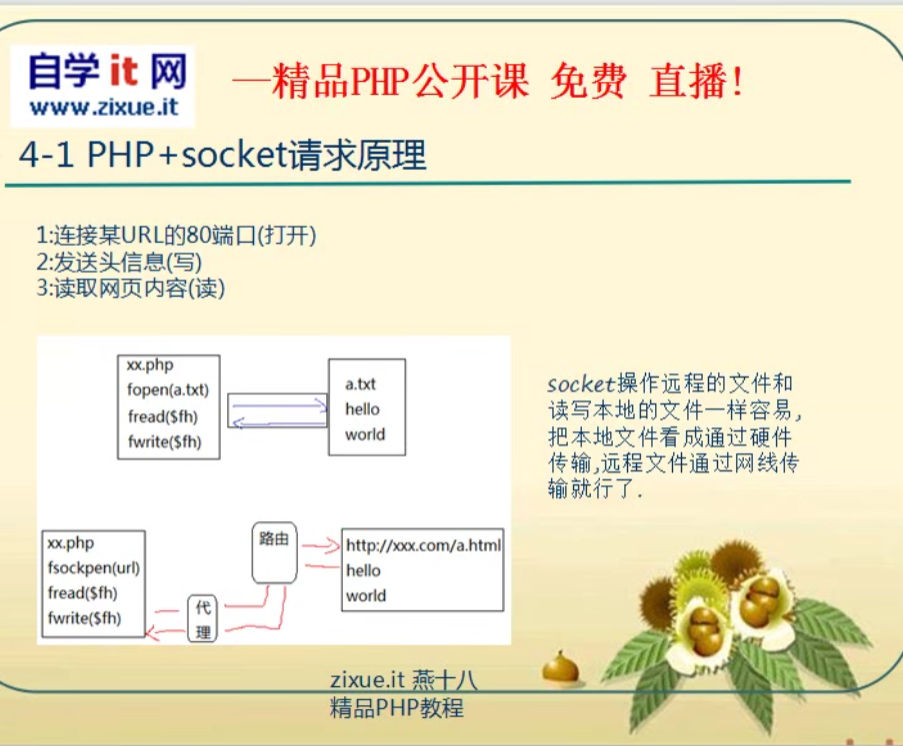
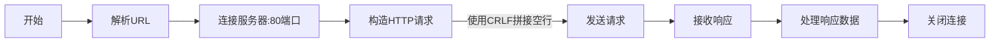
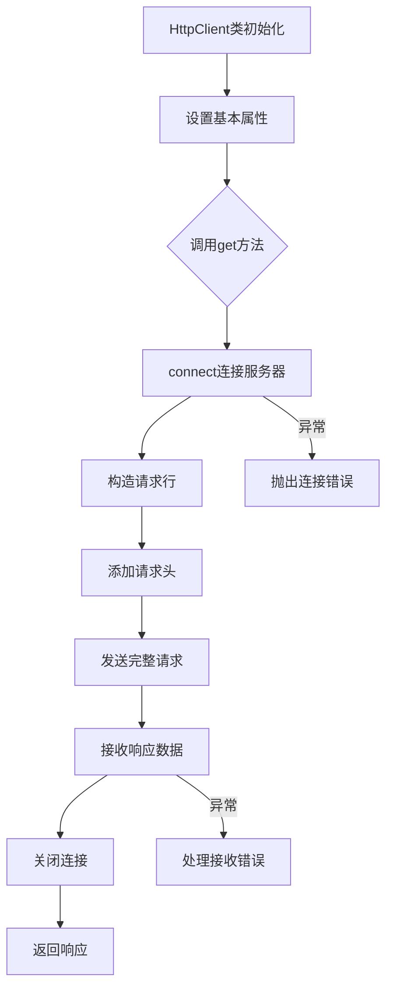

# 使用Socket实现HTTP客户端

## 1. HTTP请求原理
HTTP请求的基本原理包含三个步骤:
1. 连接目标URL的80端口
2. 发送头信息(写)
3. 读取网页内容(读)



Socket操作远程文件就像操作本地文件一样简单,只是通过网络传输。

## 2. PHP实现分析
PHP版本使用面向对象方式实现,核心代码如下:
```php
class Http implements Proto {
    protected $url = null;
    protected $version = 'HTTP/1.1';
    protected $fh = null;
    protected $line = array();
    protected $header = array();
    protected $body = array();
    protected $response = '';

    // 构造函数初始化连接
    public function __construct($url) {
        $this->conn($url);
        $this->setHeader('Host: ' . $this->url['host']);
    }

    // 连接服务器
    public function conn($url) {
        $this->url = parse_url($url);
        if(!isset($this->url['port'])) {
            $this->url['port'] = 80;
        }
        $this->fh = fsockopen($this->url['host'], $this->url['port']);
    }

    // 设置请求行
    protected function setLine($method) {
        $this->line[0] = $method . ' ' . $this->url['path'] . ' ' . $this->version;
    }

    // 设置头信息
    protected function setHeader($headerLine) {
        $this->header[] = $headerLine;
    }

    // 设置主体信息
    protected function setBody() {
        // POST请求时实现
    }

    // 构造GET请求
    public function get() {
        $this->setLine('GET');
        return $this->request();
    }

    // 构造POST请求
    public function post() {
        // 待实现
    }

    // 发送请求并获取响应
    public function request() {
        // 合并请求行、头信息、空行、主体信息
        $req = array_merge($this->line, $this->header, array(''), $this->body, array(''));
        
        // 使用CRLF拼接
        $req = implode(self::CRLF, $req);
        
        // 发送请求
        fwrite($this->fh, $req);
        
        // 读取响应
        while(!feof($this->fh)) {
            $this->response .= fread($this->fh, 1024);
        }
        
        return $this->response;
    }

    // 关闭连接
    public function close() {
        if($this->fh) {
            fclose($this->fh);
        }
    }
}
```



## 3. Python实现

Python实现的代码请参考 [http_client.py](./http_client.py)。



要运行Python版本的实现,直接执行:

```bash
python http_client.py
```

这将测试对几个示例URL的HTTP请求。

## 4. 功能说明

### 4.1 核心功能
1. **URL解析**
   - 使用`urlparse`解析URL
   - 获取主机名、端口等信息
   - 默认使用80端口

2. **Socket连接**
   - 创建TCP连接
   - 自动设置Host请求头
   - 异常处理机制

3. **请求构造**
   - 支持自定义请求头
   - 标准HTTP请求格式
   - 使用`\r\n`分隔符

4. **响应处理**
   - 1024字节缓冲区
   - 自动拼接响应数据

### 4.2 改进特点
1. 使用了Python类型提示
2. 简化了接口设计
3. Pythonic编程风格
4. 完善的异常处理
5. 清晰的命名规范

## 5. 注意事项

### 5.1 使用限制
1. 仅用于学习演示
2. 生产环境推荐使用`requests`库
3. 仅实现基本GET请求
4. 不支持HTTPS
5. 无超时机制

### 5.2 可能的改进方向
1. 添加HTTPS支持
2. 实现POST等其他HTTP方法
3. 添加请求超时机制
4. 支持大文件流式传输
5. 添加响应解析功能

## 6. 总结
这个实现主要用于学习HTTP协议原理和Socket编程基础。通过对比PHP和Python两种实现，可以更好地理解HTTP请求的构造过程和网络通信的基本原理。在实际项目中，建议使用成熟的HTTP客户端库以��得更好的性能和安全性。