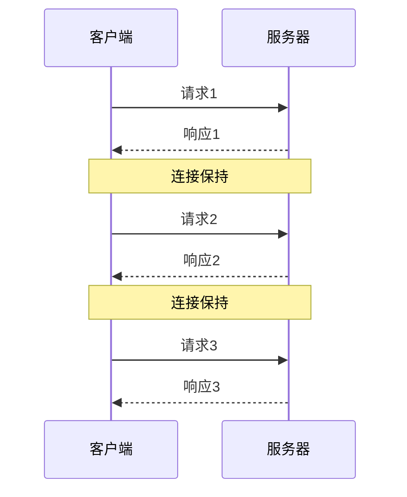
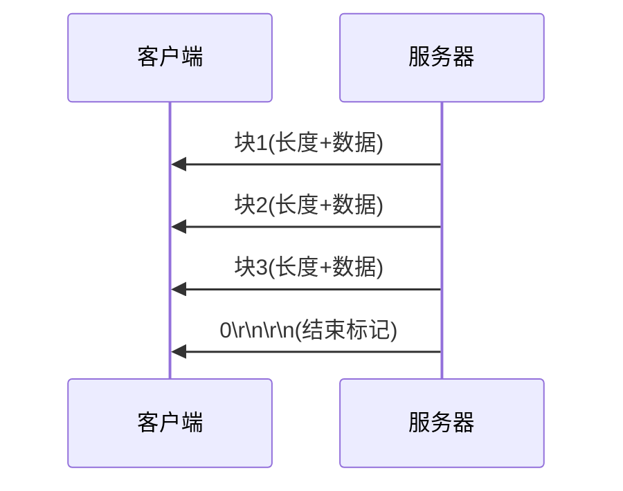
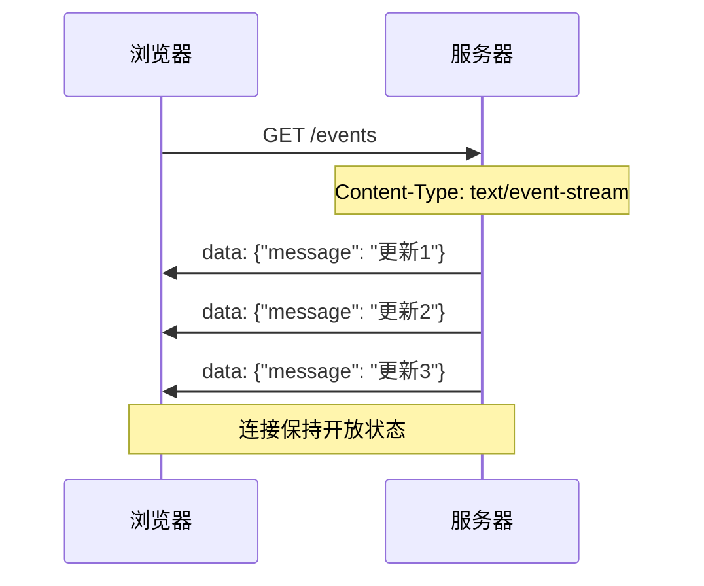

# HTTP持久连接与反向AJAX

## 基本概念

### HTTP持久连接
HTTP持久连接(HTTP persistent connection)也称为HTTP keep-alive或HTTP connection reuse,允许在单个TCP连接上发送多个HTTP请求/响应,而不是为每个请求/响应对创建新的连接。

### 反向AJAX
反向AJAX(Reverse AJAX)是一种服务器推送技术,允许服务器主动向客户端推送数据。主要实现方式包括:
- 长轮询(Long Polling)
- 服务器发送事件(Server-Sent Events, SSE)
- WebSocket
- Comet

## 工作原理

### HTTP持久连接原理


### 分块传输
当服务器不知道要发送的内容总长度时,可以使用分块传输编码(Chunked Transfer Encoding):



### SSE工作原理


## SSE示例代码

前端代码:
```javascript
// 前端代码
const source = new EventSource('/events');

// 接收服务器消息
source.onmessage = function(event) {
    const data = JSON.parse(event.data);
    if (data.type === 'stockPrice') {
        updateStockPrice(data.price);
    }
};
```

后端代码:
```javascript
// 后端代码 (Node.js示例)
app.get('/events', (req, res) => {
    res.setHeader('Content-Type', 'text/event-stream');
    
    // 每秒发送一次股票价格更新
    const timer = setInterval(() => {
        res.write(`data: {"type":"stockPrice","price":${getRandomPrice()}}\n\n`);
    }, 1000);
});
```

## SSE常见使用场景
1. 实时股票价格更新
2. 社交媒体新消息提醒
3. 实时日志查看
4. 在线游戏状态更新

## SSE vs WebSocket
1. SSE更简单,只需要服务器到客户端的单向通信
2. 基于HTTP,更容易通过防火墙
3. 自动重连机制
4. 支持自定义事件类型

## 练习题

### 题目1: 补全代码
实现一个基本的长轮询函数:

```javascript
function longPolling(url) {
    // 补全下面的代码
    return fetch(url).then(response => {
        // 处理响应后立即发起下一次请求
        return response.json().then(data => {
            console.log(data);
            // 补充这行代码,实现持续轮询
            return longPolling(url);
        });
    });
}
```

### 题目2: 判断题
以下关于HTTP持久连接的说法,判断对错:
1. HTTP/1.1默认所有连接都是持久连接 
2. 持久连接可以提高性能,但会占用服务器资源
3. Connection: close 头部表示要关闭持久连接

### 题目3: 补全代码
实现一个简单的SSE客户端:

```javascript
function connectSSE() {
    // 补全下面的代码,创建EventSource实例
    const source = new EventSource('/events');
    
    // 补全事件监听代码
    source.addEventListener('message', function(e) {
        // 补充这行代码,处理服务器发送的消息
        console.log(JSON.parse(e.data));
    });
}
```

<details>
<summary>参考答案</summary>

题目1:
```javascript
function longPolling(url) {
    return fetch(url).then(response => {
        return response.json().then(data => {
            // 处理接收到的数据
            console.log(data);
            // 立即发起下一次长轮询请求
            return longPolling(url);
        });
    }).catch(error => {
        // 处理错误情况
        console.error('长轮询出错:', error);
        // 发生错误时延迟一段时间后重试
        setTimeout(() => longPolling(url), 5000);
    });
}
```

题目2:
1. ✓ 正确
2. ✓ 正确
3. ✓ 正确

题目3:
```javascript
function connectSSE() {
    // 创建EventSource实例
    const source = new EventSource('/events');
    
    // 连接建立时的处理
    source.onopen = function() {
        console.log('SSE连接已建立');
    };
    
    // 接收消息的处理
    source.addEventListener('message', function(e) {
        const data = JSON.parse(e.data);
        console.log('收到服务器消息:', data);
    });
    
    // 错误处理
    source.onerror = function(e) {
        console.error('SSE连接错误:', e);
        source.close();
    };
}
```
</details>