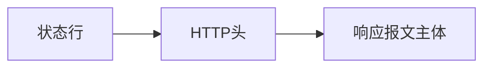
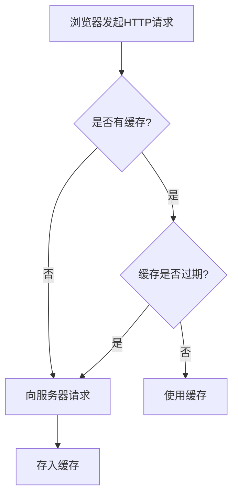
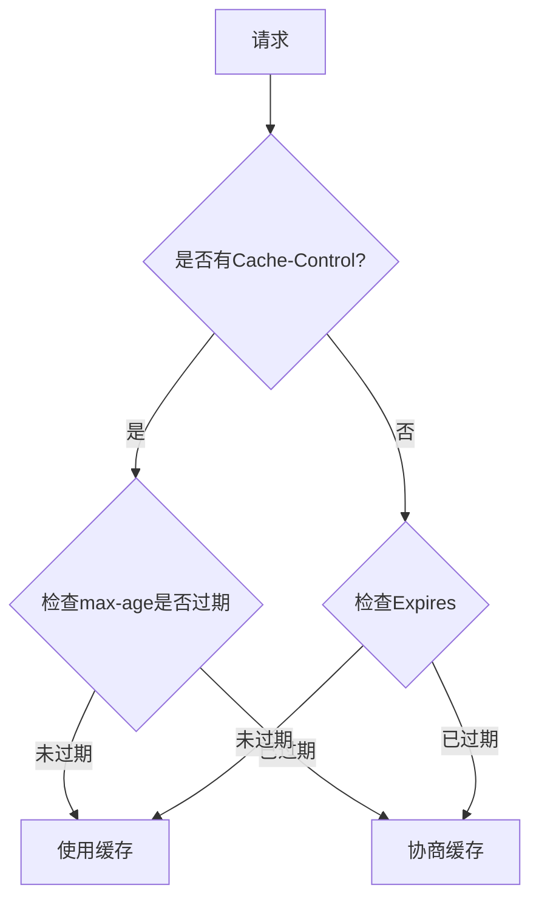
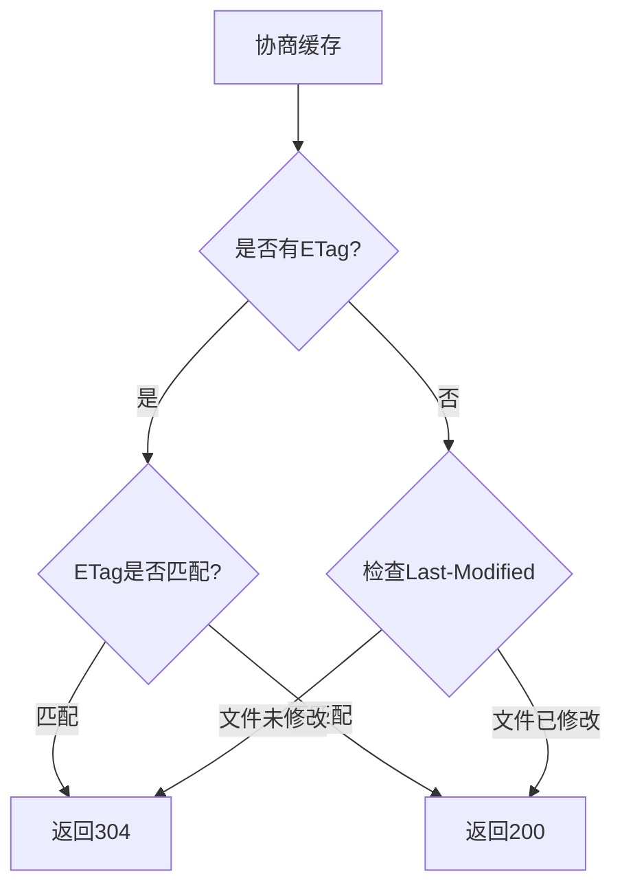
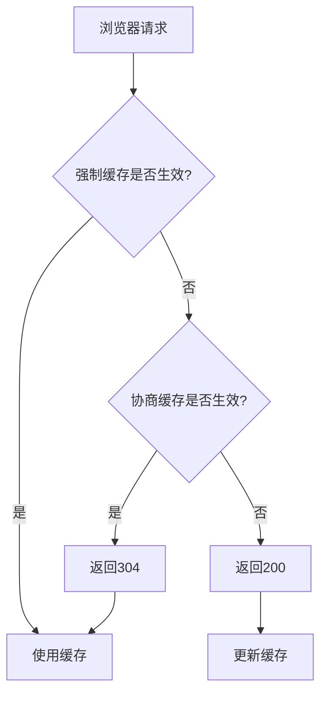

# 浏览器缓存机制详解

## 目录
- [浏览器缓存机制详解](#浏览器缓存机制详解)
  - [目录](#目录)
  - [概述](#概述)
  - [缓存过程分析](#缓存过程分析)
  - [强制缓存](#强制缓存)
  - [协商缓存](#协商缓存)
  - [总结](#总结)

## 概述

浏览器缓存机制是基于HTTP缓存机制实现的。在分析之前,我们需要了解HTTP报文的基本结构:

1. HTTP请求(Request)报文结构:

2. HTTP响应(Response)报文结构:

## 缓存过程分析

浏览器缓存的基本流程如下:

## 强制缓存

强制缓存主要通过以下两个HTTP头部字段控制:

1. Expires(HTTP 1.0)
2. Cache-Control(HTTP 1.1)

其中Cache-Control的优先级更高,主要取值包括:

- public: 所有内容都将被缓存
- private: 只有客户端可以缓存
- no-cache: 需要经过协商缓存验证
- no-store: 不使用任何缓存
- max-age=xxx: xxx秒后失效

## 协商缓存

协商缓存主要通过以下两对HTTP头部字段控制:

1. Last-Modified/If-Modified-Since
2. ETag/If-None-Match(优先级更高)

## 总结

浏览器缓存完整流程:

 

 

缓存位置:
- from memory cache: 内存缓存,读取快但进程关闭后失效
- from disk cache: 硬盘缓存,读取较慢但可持久保存

[原文链接](https://mp.weixin.qq.com/s/d2zeGhUptGUGJpB5xHQbOA)