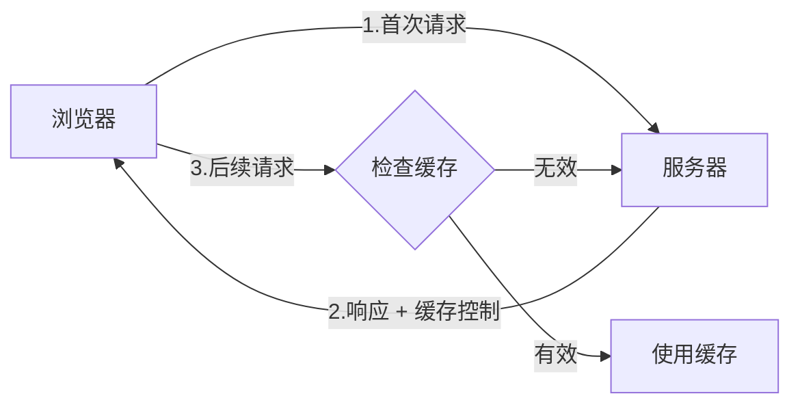
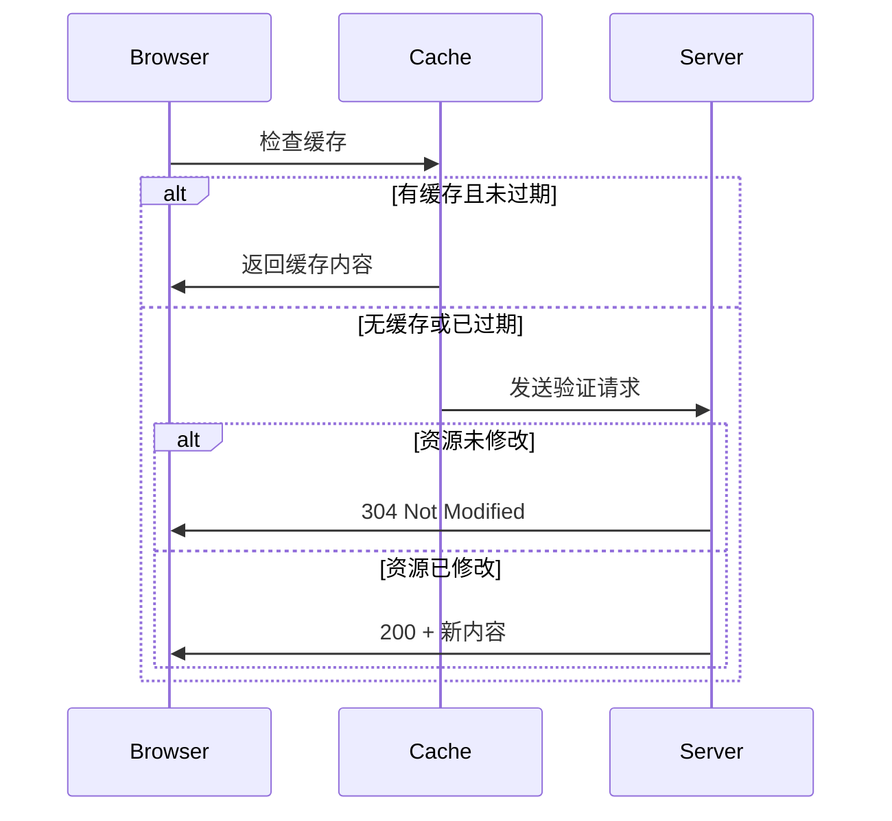

# HTTP缓存详解





### 题目1: 补全代码

```javascript
function checkCache(etag, lastModified) {
    const headers = {};
    // 补全代码：添加用于验证缓存的请求头
    headers['If-None-Match'] = _____;
    headers['If-Modified-Since'] = _____;
    return headers;
}
```

### 题目2: 判断题

给定以下响应头, 这个资源会被缓存多久?

```
Cache-Control: max-age=3600
Expires: Wed, 21 Oct 2015 07:28:00 GMT
```

### 题目3: 代码实现

```javascript
function isCacheValid(cacheAge, maxAge) {
    // 补全代码：判断缓存是否有效
    return _____;
}
```

### 题目4: 实践题

如何设置一个资源在浏览器中缓存1小时, 但必须每次都向服务器验证? 请写出对应的响应头设置。

<details>
<summary>参考答案</summary>
题目1:

```javascript
headers['If-None-Match'] = etag;
headers['If-Modified-Since'] = lastModified;
```

题目2:
Cache-Control的优先级高于Expires, 所以资源会被缓存3600秒(1小时)。

题目3:

```javascript
return cacheAge < maxAge;
```

题目4:

```http
Cache-Control: max-age=3600, must-revalidate
```

或

```http
Cache-Control: no-cache, max-age=3600
```

</details>
