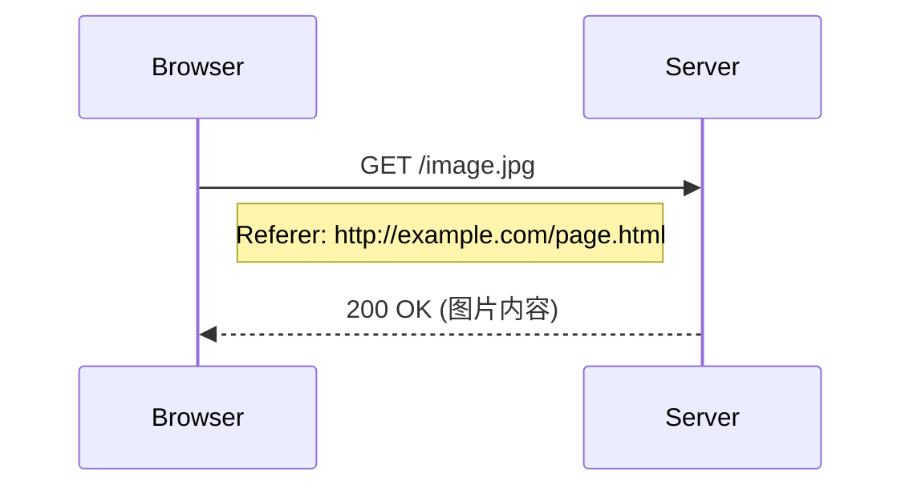
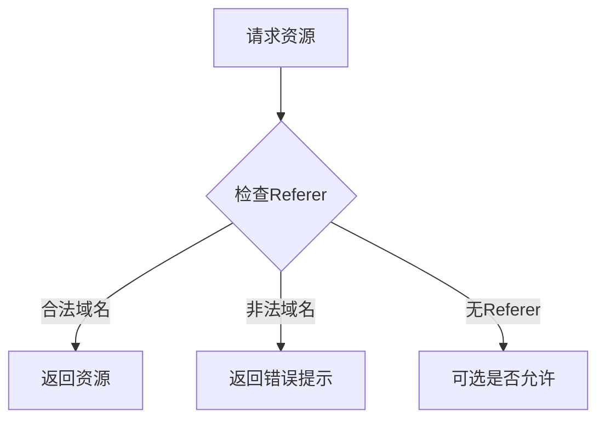
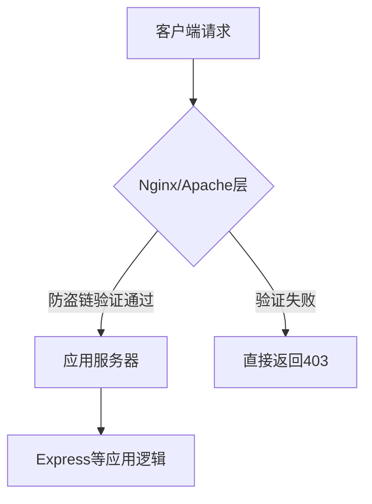
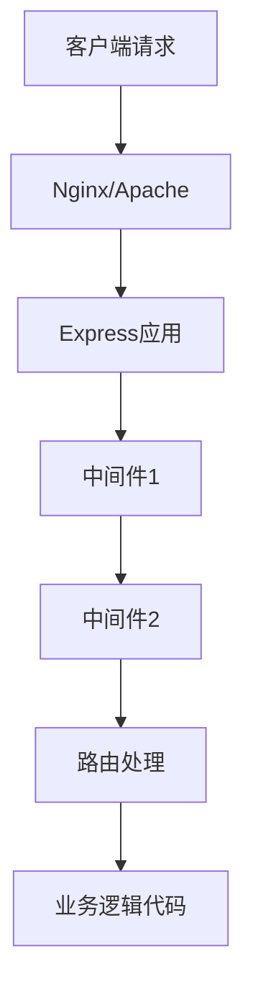

# HTTP Referer与防盗链详解

## 1. 基本概念

### 1.1 什么是 Referer

Referer是HTTP请求头中的一个字段, 用来标识请求来源页面的地址。当浏览器向web服务器发送请求时, 一般会带上Referer, 告诉服务器该请求是从哪个页面链接过来的。



### 1.2 Referer的特点

* 直接在地址栏输入URL不会携带Referer
* 从HTTPS跳转到HTTP页面不会携带Referer
* 点击链接、加载图片等资源会携带Referer


### HTTPS到HTTP的跳转场景

````mermaid
sequenceDiagram
    participant A as 用户浏览器
    participant B as HTTPS页面<br/>(https://secure.com)
    participant C as HTTP页面<br/>(http://normal.com)
    
    A->>B: 1. 访问HTTPS页面
    Note over B: 安全页面
    B->>A: 2. 返回页面内容
    A->>C: 3. 点击链接跳转到HTTP页面<br/>（不携带Referer）
    Note over C: 不安全页面
````


### 具体示例

1. **安全场景**
```html
<!-- https://secure.com/index.html -->
<a href="https://another-secure.com/page">跳转到其他HTTPS页面</a>
<!-- 跳转时会携带Referer: https://secure.com/index.html -->
```

2. **不安全场景**
```html
<!-- https://secure.com/index.html -->
<a href="http://normal.com/page">跳转到HTTP页面</a>
<!-- 跳转时不会携带Referer -->
```


### 原因解释

- 这是浏览器的安全机制
- 目的是防止通过Referer泄露HTTPS页面的敏感信息到不安全的HTTP环境
- 因为HTTP请求是明文传输，如果携带了HTTPS的Referer，可能会暴露用户之前访问的安全页面的URL

### 实际影响
- 如果你的网站同时使用了HTTPS和HTTP
- 从HTTPS页面引用HTTP资源（如图片）时
- 可能会导致基于Referer的防盗链失效


### 解决方案

1. **全站HTTPS**
   - 最佳解决方案
   - 避免混合内容
  
2. **Referrer-Policy设置**
   - 可以通过设置更宽松的策略来允许传递Referer
   - 但不推荐降低安全性

### 1.3 什么是防盗链

防盗链是基于HTTP协议的Referer机制, 通过检查请求的Referer是否来自规定的域名, 来判断是否是合法请求。



## 2. 实现防盗链的方式

### 2.1 推荐: Web服务器配置方式

* Apache配置示例

```apache
RewriteEngine On
RewriteCond %{HTTP_REFERER} !^http://allowed-domain.com/.$ [NC]
RewriteRule \.(jpg|jpeg|png|gif)$ - [F]
```

* Nginx配置示例

```nginx
location ~ \.(gif|jpg|png)$ {
valid_referers none blocked server_names .allowed-domain.com;
if ($invalid_referer) {
return 403;
}
}
```

### 2.2 备选: 应用层实现方式

```javascript
app.use((req, res, next) => {
    const referer = req.get('referer');
    const allowedDomains = ['allowed-domain.com'];
    if (!referer || allowedDomains.some(domain => referer.includes(domain))) {
        next();
    } else {
        res.status(403).send('Access Denied');
    }
});
```
### 主要区别

#### 1. Nginx/Apache配置方式
- 在web服务器层面就完成过滤
- 不消耗应用服务器资源
- 性能更好,原因如下:
  - 不需要启动应用程序
  - 不需要加载框架
  - 不需要解析请求体等

#### 2. Express中间件方式
- 请求会先经过web服务器
- 到达应用服务器后才进行验证
- 消耗更多资源,原因如下:
  - 需要完整的请求处理流程
  - 要经过Express框架解析
  - 可能还需要加载其他中间件




### 处理流程对比



### 主要区别

#### Express中间件
- 在请求到达具体路由之前执行
- 可以处理所有或指定路径的请求
- 主要用于：
  - 请求预处理
  - 权限验证
  - 日志记录等通用功能

```javascript
// 中间件示例
app.use((req, res, next) => {
    const referer = req.get('referer');
    if (!isValidReferer(referer)) {
        return res.status(403).send('访问被拒绝');
    }
    next();
});
```

#### 后端业务代码
- 在具体的路由处理函数中执行
- 只处理特定路由的请求
- 主要用于：
  - 具体业务逻辑处理
  - 数据库操作
  - 返回特定响应
```javascript
// 路由处理函数示例
app.get('/api/images/:id', (req, res) => {
    const referer = req.get('referer');
    if (!isValidReferer(referer)) {
        return res.status(403).send('访问被拒绝');
    }
    // 获取图片逻辑...
});
```

### 防盗链实现建议

* 最佳：Nginx/Apache配置
* 其次：Express中间件
  * 统一处理所有资源请求
  * 代码复用性好
* 最后：路由业务代码
  * 需要在每个相关路由中重复编写
  * 不利于维护

因此，如果必须在应用层实现防盗链，推荐使用中间件方式而不是在每个路由中单独实现。

## 3. 练习题

### 题目1: 基础概念

补全下面代码中的Referer检查逻辑:

```javascript
function checkReferer(referer) {
    // 补全代码:如果referer为空或者包含"mysite.com",返回true,否则返回false
    //
}
```

### 题目2: 防盗链实现

完成以下Express中间件代码:

```javascript
function antiLeechMiddleware(allowedDomains) {
    return (req, res, next) => {
        const referer = req.get('referer');
        // 补全代码:实现防盗链逻辑
        //
    }
}
```

### 题目3: 图片防盗链处理

补全代码, 实现一个替换防盗链图片的函数:

```javascript
function replaceBlockedImage(imgElement) {
    // 补全代码:当图片加载失败时替换为默认图片
    //
}
```

<details>
<summary>参考答案</summary>

题目1:

```javascript
function checkReferer(referer) {
    return !referer || referer.includes('mysite.com');
}
```

题目2:

```javascript
function antiLeechMiddleware(allowedDomains) {
    return (req, res, next) => {
        const referer = req.get('referer');
        if (!referer || allowedDomains.some(domain => referer.includes(domain))) {
            next();
        } else {
            res.status(403).send('Access Denied');
        }
    }
}
```

题目3:

```javascript
function replaceBlockedImage(imgElement) {
    imgElement.onerror = function() {
        this.src = '/path/to/default-image.png';
    }
}
```

</details>
