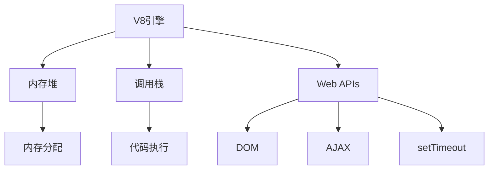
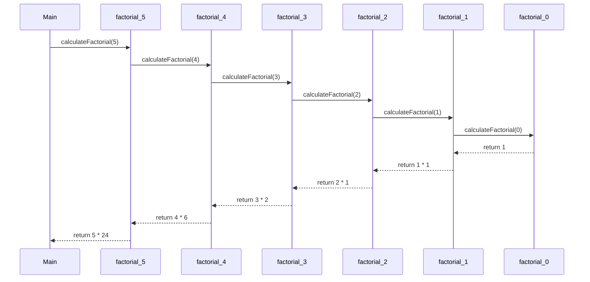
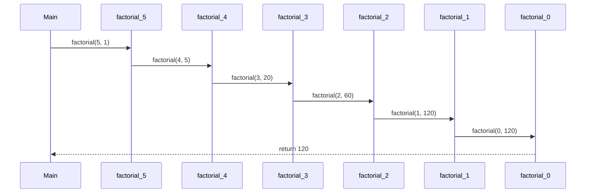
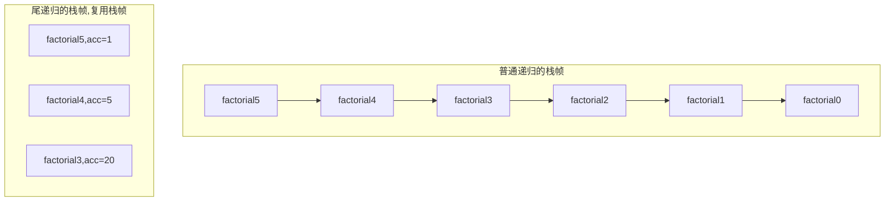
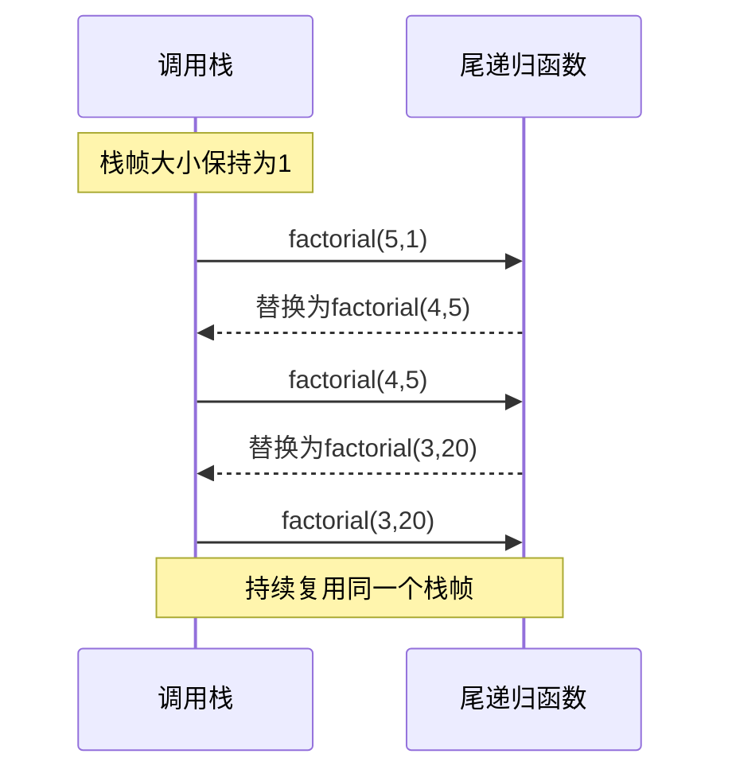
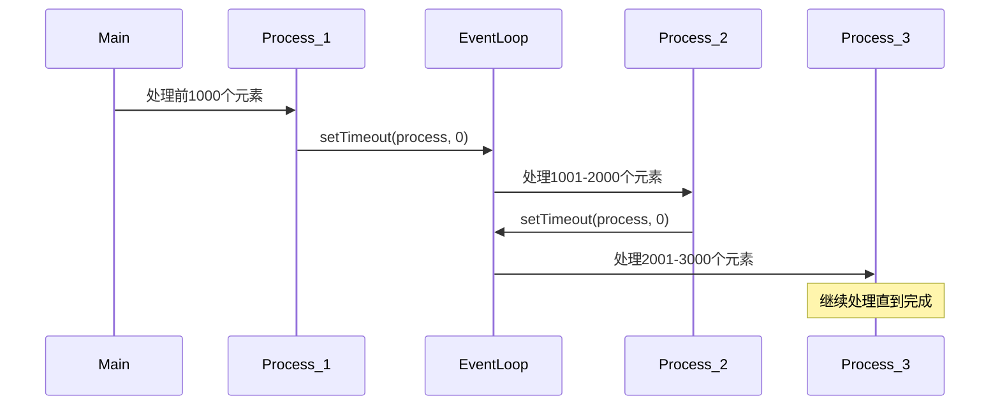
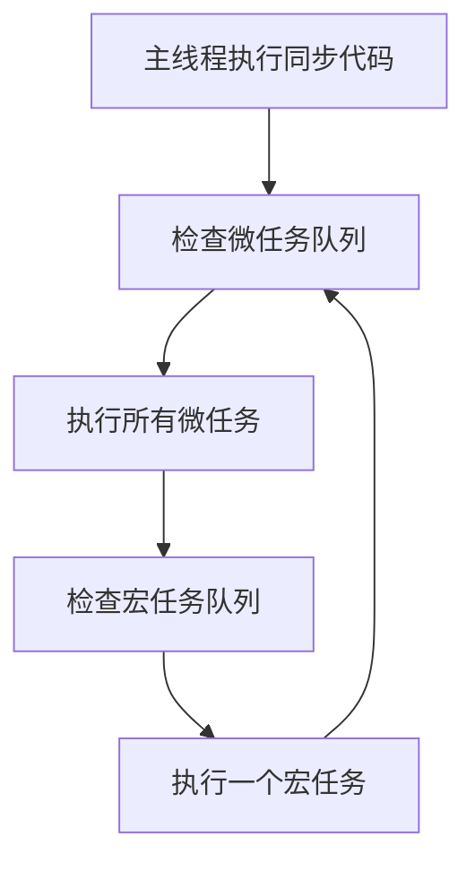
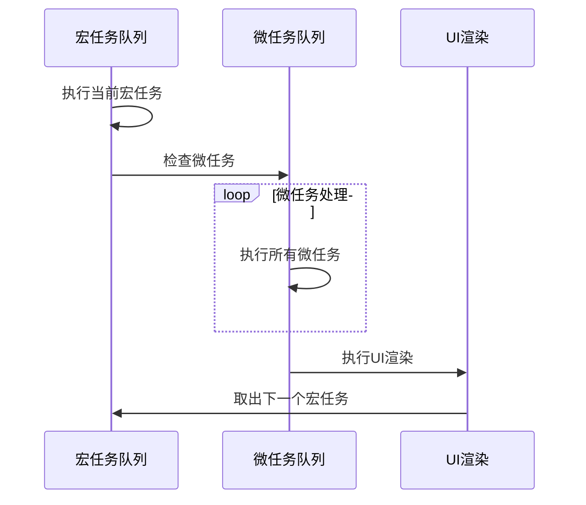
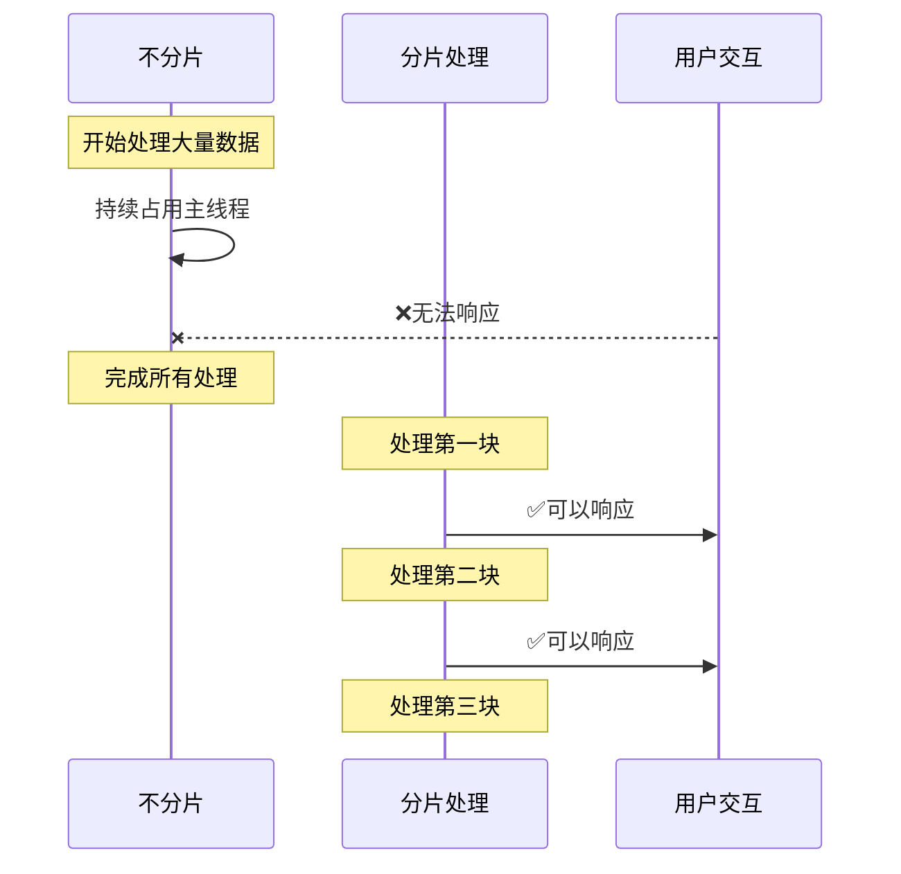
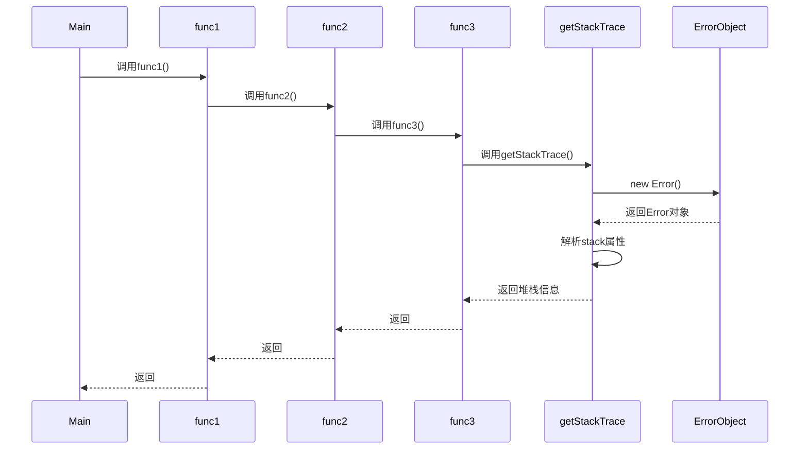

# JavaScript 调用栈进阶练习题

## 题目1: V8引擎架构
请解释 V8 引擎的主要组成部分及其作用,并用 mermaid 图表示它们之间的关系。



## 题目2: 执行环境分析
分析以下代码在浏览器环境中的执行过程,包括调用栈和Web API的交互:

```javascript
console.log('开始');

setTimeout(() => {
    console.log('定时器1');
}, 0);

Promise.resolve().then(() => {
    console.log('Promise1');
});

setTimeout(() => {
    console.log('定时器2');
}, 0);

Promise.resolve().then(() => {
    console.log('Promise2');
});

console.log('结束');
```

## 题目3: 调用栈溢出优化
以下是一个可能导致栈溢出的递归代码,请优化它:

```javascript
function calculateFactorial(n) {
    if (n === 0) return 1;
    return n * calculateFactorial(n - 1);
}

console.log(calculateFactorial(10000));
```

## 题目4: 性能分析
以下代码可能会导致浏览器卡顿,请解释原因并提供优化方案:

```javascript
function processData(items) {
    for(let i = 0; i < items.length; i++) {
        // 复杂计算
        items[i] = items[i].toString(2).split('').reverse().join('');
    }
}

const largeArray = new Array(10000000).fill(1234567);
processData(largeArray);
```

## 题目5: 异常处理追踪
编写一个函数,能够准确捕获并输出完整的调用栈信息:

```javascript
function getStackTrace() {
    // 待实现
}

function func1() {
    func2();
}

function func2() {
    func3();
}

function func3() {
    getStackTrace();
}

func1();
```

## 参考答案

<details>
<summary>点击查看答案</summary>

### 答案1
V8引擎主要组成:
- 内存堆: 负责内存分配
- 调用栈: 负责执行代码
- Web APIs: 由浏览器提供的API接口
这些组件协同工作,共同构成了JavaScript的运行时环境。

### 答案2
输出顺序将会是:
```
开始
结束
Promise1
Promise2
定时器1
定时器2
```
原因:
1. 同步代码直接执行
2. Promise属于微任务,优先于宏任务执行
3. setTimeout回调会被放入宏任务队列

### 答案3
优化后的代码:
```javascript
function calculateFactorial(n) {
    let result = 1;
    while(n > 0) {
        result *= n;
        n--;
    }
    return result;
}
// 或使用尾递归优化
function factorial(n, accumulator = 1) {
    if (n === 0) return accumulator;
    return factorial(n - 1, n * accumulator);
}
```

### 答案4
优化方案:
```javascript
function processData(items) {
    // 使用分片处理
    const chunk = 1000;
    let index = 0;
    
    function process() {
        let count = 0;
        while(index < items.length && count < chunk) {
            items[index] = items[index].toString(2).split('').reverse().join('');
            index++;
            count++;
        }
        if (index < items.length) {
            setTimeout(process, 0);
        }
    }
    process();
}
```

### 答案5
实现方案:
```javascript
function getStackTrace() {
    const stack = new Error().stack;
    console.log(stack.split('\n').slice(1).map(line => line.trim()));
    return stack;
}
```

</details>

## 注意事项
- 理解调用栈与事件循环的关系
- 注意区分同步任务、微任务和宏任务
- 大量计算时要考虑分片处理
- 递归调用要注意优化和终止条件
- 异常处理要包含完整的调用栈信息

# JavaScript调用栈详解

## 1. 递归与尾递归对比 (题目3)

### 普通递归调用过程


### 尾递归调用过程



```javascript
// 普通递归
function factorial1(n) {
    if (n === 0) return 1;
    return n * factorial1(n - 1);  // 需要等待子调用返回后再计算
}

// 尾递归
function factorial2(n, acc = 1) {
    if (n === 0) return acc;
    return factorial2(n - 1, n * acc);  // 直接返回递归调用，无需保存中间状态
}
```
## 2. 分片处理流程 (题目4)







## 3. 错误堆栈追踪 (题目5)



## 关键点总结

1. **尾递归优化**
   - 避免保存中间计算结果
   - 减少内存使用
   - 防止栈溢出

2. **分片处理**
   - 将大任务分解为小任务
   - 通过事件循环调度执行
   - 避免阻塞主线程

3. **堆栈追踪**
   - 利用Error对象获取完整调用栈
   - 帮助调试和错误定位
   - 展示函数调用链路