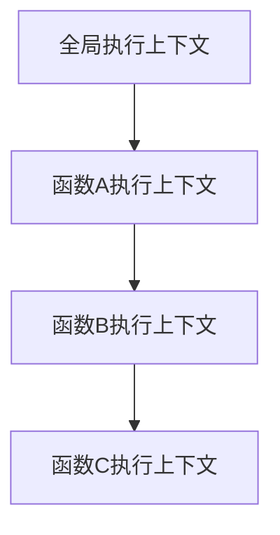
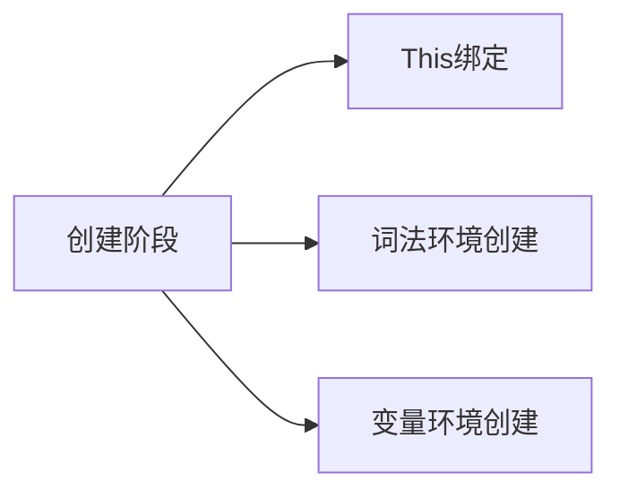
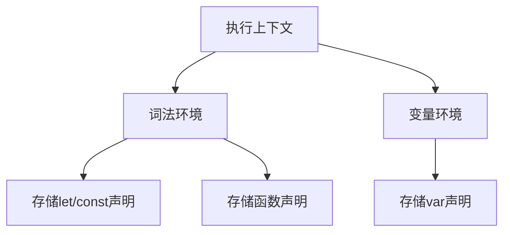
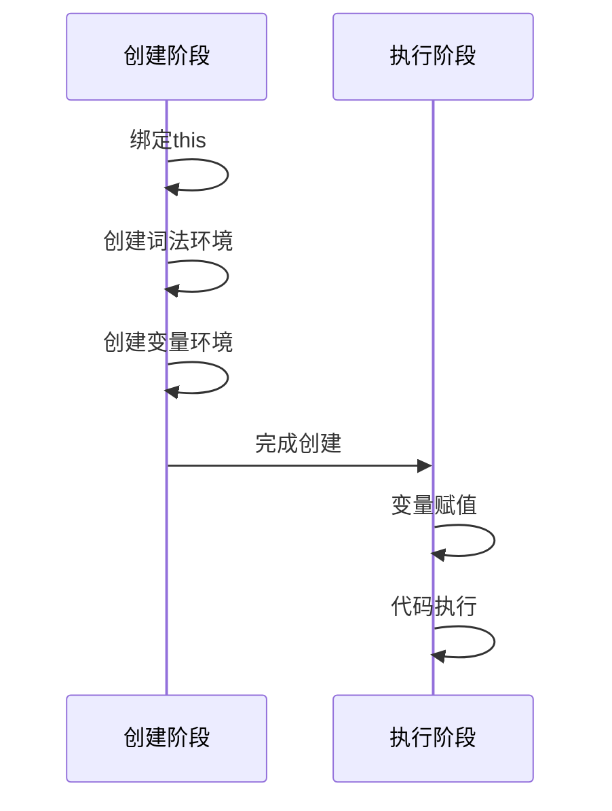
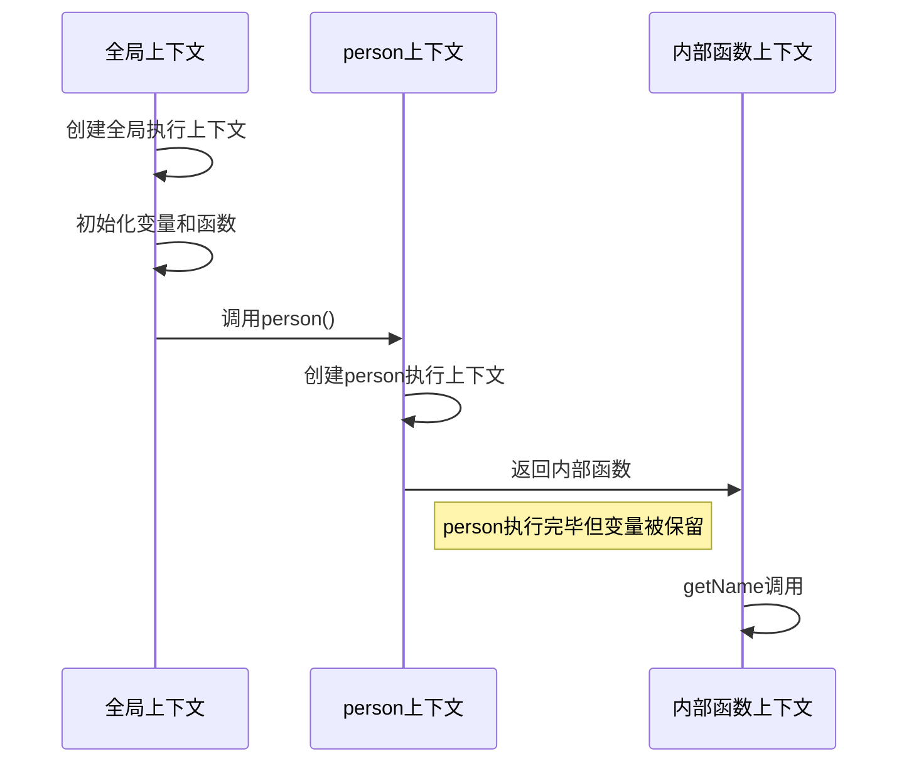
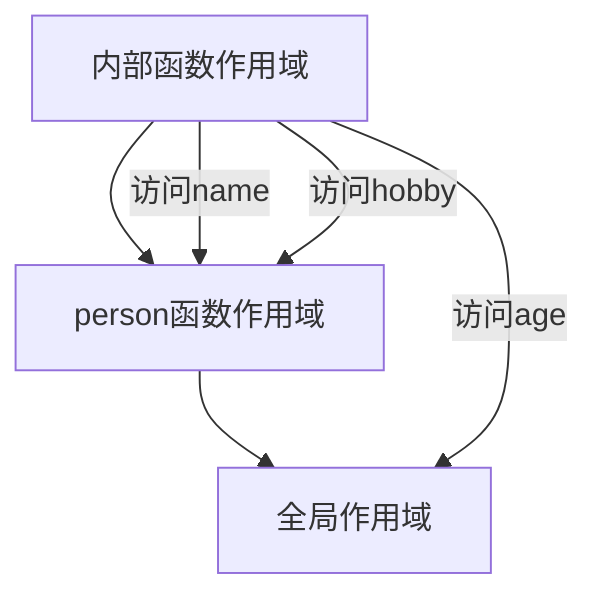
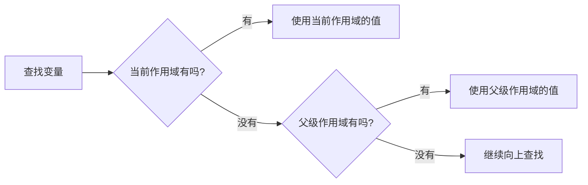

# JavaScript执行上下文详解

## 1. 执行上下文的类型
- 全局执行上下文
- 函数执行上下文
- Eval函数执行上下文

## 2. 执行栈的工作原理


## 3. 执行上下文的创建过程



## 4. 变量环境vs词法环境



## 5. 执行上下文生命周期示例



## 练习题

1. 分析下面代码的执行上下文创建和执行过程:
```javascript
let x = 10;
function foo() {
let y = 20;
function bar() {
console.log(x + y);
}
bar();
}
foo();
```

2. 解释以下代码的this指向:
```
javascript
const person = {
name: 'John',
greet: function() {
setTimeout(function() {
console.log(this.name);
}, 1000);
}
};
person.greet();
```


3. 说明var和let在以下代码中的行为差异:
```javascript
console.log(a);
console.log(b);
var a = 1;
let b = 2;
```

# 参考答案

<details>
<summary>点击查看答案</summary>


1. 执行上下文分析:
- 创建全局执行上下文,声明x和foo
- 调用foo(),创建foo函数执行上下文
- 在foo中声明y和bar函数
- 调用bar(),创建bar函数执行上下文
- bar中访问x和y,通过作用域链找到值
- 输出30
- bar执行完毕,上下文弹出
- foo执行完毕,上下文弹出

2. this指向分析:
- setTimeout中的函数是普通函数调用
- 此时this指向全局对象(非严格模式)或undefined(严格模式)
- 输出undefined
- 解决方案:使用箭头函数或bind

3. var和let区别:
- 第一个console.log(a)输出undefined(变量提升)
- 第二个console.log(b)报ReferenceError(暂时性死区)
- var在创建阶段被初始化为undefined
- let在声明前处于未初始化状态

</details>

# 闭包详解 - 通过执行上下文分析

## 1. 代码回顾
```javascript
var name = 'global';
let age = 20;
function person() {
var name = 'local';
let hobby = 'coding';
return function() {
console.log(name, hobby, age);
}
}
const getName = person();
getName();
```


## 2. 执行过程分析



## 3. 作用域链分析



## 4. 各个阶段的执行上下文详解

### 4.1 全局执行上下文
```javascript
GlobalExecutionContext = {
VariableEnvironment: {
name: 'global',
getName: <function>
},
LexicalEnvironment: {
age: 20,
person: <function>
}
}
```


### 4.2 person函数执行上下文
```javascript
GlobalExecutionContext = {
VariableEnvironment: {
name: 'global',
getName: <function>
},
LexicalEnvironment: {
age: 20,
person: <function>
}
}
```


### 4.2 person函数执行上下文
```javascript
PersonExecutionContext = {
VariableEnvironment: {
name: 'local'
},
LexicalEnvironment: {
hobby: 'coding'
},
outer: <GlobalExecutionContext>
}
```


### 4.3 内部函数执行上下文
```javascript
InnerFunctionExecutionContext = {
LexicalEnvironment: {
// 没有自己的变量声明
},
outer: <PersonExecutionContext>
}
```


## 5. 闭包形成的关键点

1. **作用域链保持**
```javascript
// 虽然person函数执行完毕，但内部函数依然可以访问：
name // 来自person作用域
hobby // 来自person作用域
age // 来自全局作用域
```


2. **变量查找顺序**


## 6. 实践练习

1. 修改上述代码，观察不同作用域的变量访问：
```javascript
var name = 'global';
let age = 20;
function person() {
var name = 'local';
let hobby = 'coding';
return function() {
let name = 'inner'; // 添加内部变量
console.log(name, hobby, age);
}
}
const getName = person();
getName();
// 输出: "inner" "coding" 20
```


2. 闭包常见使用场景：
```javascript
function counter() {
let count = 0;
return {
increase: function() {
return ++count;
},
decrease: function() {
return --count;
},
getCount: function() {
return count;
}
}
}
const myCounter = counter();
console.log(myCounter.increase()); // 1
console.log(myCounter.increase()); // 2
console.log(myCounter.decrease()); // 1
console.log(myCounter.getCount()); // 1
```


## 7. 闭包的特点总结

1. **变量访问**
- 内部函数可以访问外部函数的变量
- 即使外部函数已经返回，这些变量仍然可以被访问

2. **变量生命周期**
- 闭包中的变量不会被垃圾回收机制回收
- 会一直保存在内存中，直到闭包函数被销毁

3. **作用域隔离**
- 可以创建私有变量和方法
- 避免全局作用域污染

4. **注意事项**
- 合理使用闭包，避免内存泄漏
- 不再需要的闭包，要及时解除引用