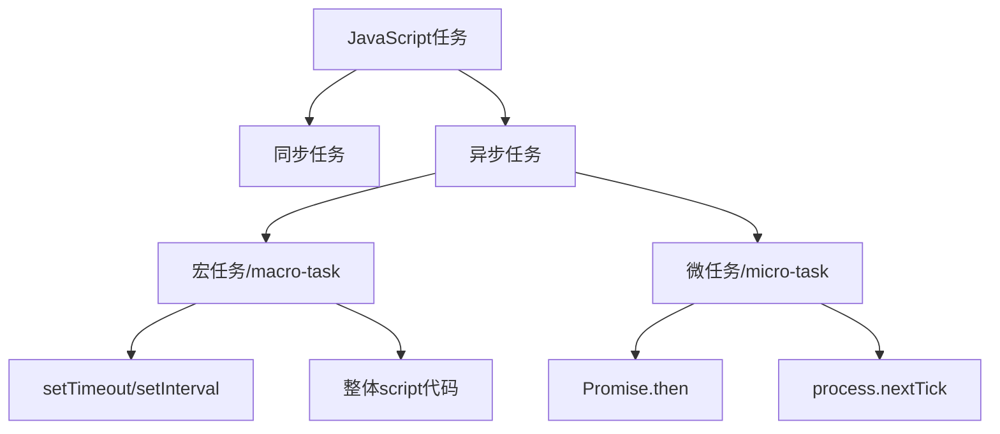
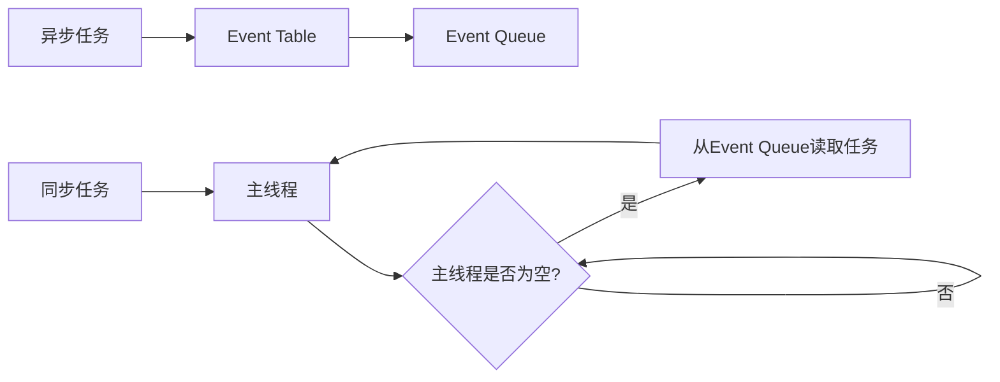
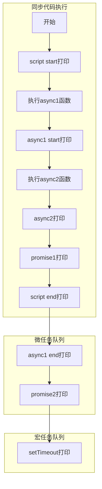

# JavaScript执行机制详解

## 1. 基本概念

JavaScript是一门单线程语言，即使在HTML5引入了Web-Worker，这个核心特性仍未改变。


### 1.1 任务类型



## 2. 事件循环(Event Loop)


### 2.1 执行流程



### 2.2 执行顺序规则

1. 执行同步代码（宏任务）
2. 执行微任务队列
3. 执行下一个宏任务
4. 重复2-3步骤


## 3. 常见异步API详解

### 3.1 setTimeout/setInterval

```javascript
// 最小延迟时间是4ms
setTimeout(() => {
    console.log('延时执行');
}, 0);
```

特点：

- setTimeout(fn, 0) 不会立即执行
- setInterval 可能会出现间隔不准的情况

### 3.2 Promise

```javascript
new Promise((resolve) => {
    console.log('1'); // 同步执行
    resolve();
}).then(() => {
    console.log('2'); // 微任务
});
```

## 4. 经典面试题示例

### 4.1 基础题型

```javascript
console.log('1');
setTimeout(() => {
    console.log('2');
}, 0);
Promise.resolve().then(() => {
    console.log('3');
});
console.log('4');

// 输出: 1 4 3 2
```
### 4.2 复杂题型

```javascript
async function async1() {
    console.log('async1 start');
    await async2();
    console.log('async1 end');
}

async function async2() {
    console.log('async2');
}

console.log('script start');
setTimeout(() => {
    console.log('setTimeout');
}, 0);
async1();
new Promise((resolve) => {
    console.log('promise1');
    resolve();
}).then(() => {
    console.log('promise2');
});
console.log('script end');

// 输出顺序：
// script start
// async1 start
// async2
// promise1
// script end
// async1 end
// promise2
// setTimeout
```
## 4. 注意事项

1. **async/await 确实是 Promise 的语法糖**，每个 async 函数都会返回一个 Promise 对象。

2. **await 的执行机制**：
   - await 右边的表达式会立即执行（同步执行）
   - await 后面的代码会被转换成 Promise.then 的回调函数（变成微任务）
  ```javascript
  async function async1() {
    console.log('async1 start');  // 同步执行
    await async2();               // async2()立即执行
    // 下面这行相当于 Promise.resolve(async2()).then(() => console.log('async1 end'))
    console.log('async1 end');    // 变成微任务
}
  ```
等价于
```javascript
  function async1() {
    console.log('async1 start');
    return Promise.resolve(async2())
        .then(() => {
            console.log('async1 end');
        });
}
```

