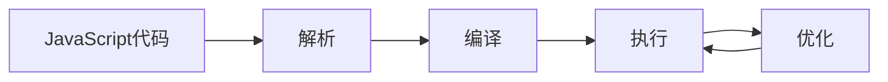
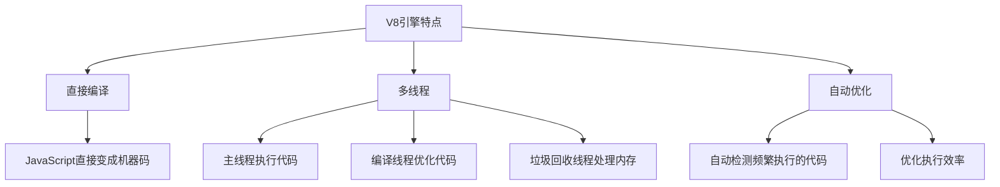
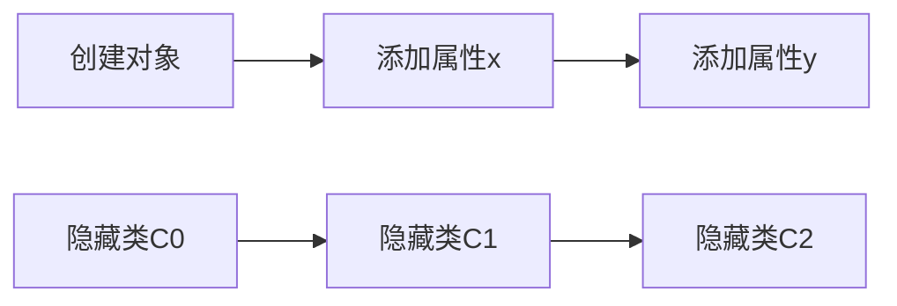
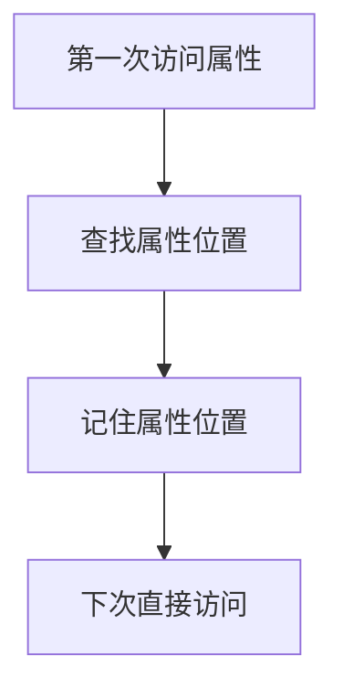

# JavaScript引擎工作原理

## 参考链接
https://www.oschina.net/translate/how-does-javascript-actually-work-part-2


## 1. JavaScript引擎是什么?

简单来说,JavaScript引擎就是一个程序,用来执行JavaScript代码。最著名的就是Chrome浏览器使用的V8引擎。

## 2. V8引擎的工作流程



## 3. V8引擎的主要特点



## 4. 对象属性访问优化

V8使用两个重要概念来优化对象属性的访问:

1. 隐藏类



2. 内联缓存



## 5. 简单示例
```javascript
// 创建一个Point类
function Point(x, y) {
this.x = x; // 创建隐藏类C1
this.y = y; // 创建隐藏类C2
}
// 好的写法 - 属性添加顺序一致
let p1 = new Point(1, 2);
let p2 = new Point(3, 4);
// 不好的写法 - 属性添加顺序不一致
let p3 = new Point(5, 6);
p3.a = 1;
p3.b = 2;
let p4 = new Point(7, 8);
p4.b = 3; // 顺序不同
p4.a = 4; // 会创建不同的隐藏类
```


## 6. 关键点总结

1. V8引擎直接把JavaScript编译成机器码运行,不需要中间步骤
2. 使用隐藏类和内联缓存来加速对象属性访问
3. 多个线程协同工作:
   - 主线程运行代码
   - 编译线程优化代码
   - 垃圾回收线程处理内存
4. 创建对象时,保持属性添加顺序一致可以提高性能