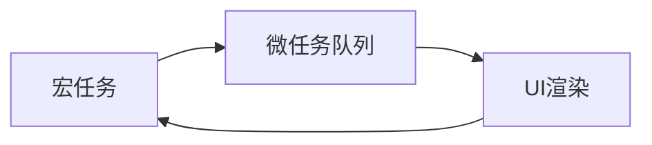
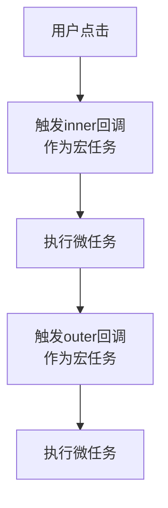
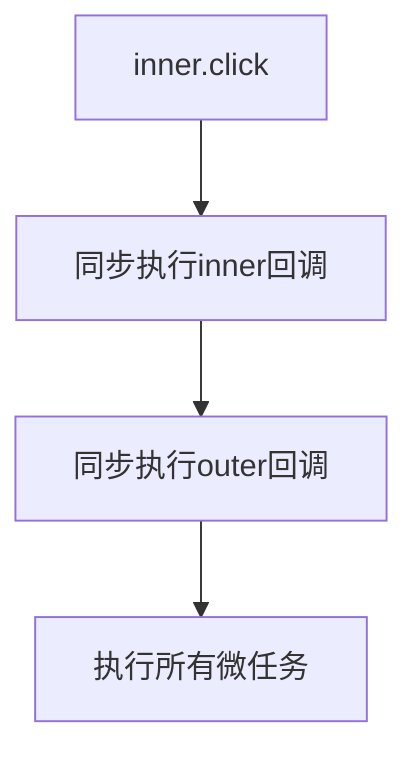

# JavaScript事件循环与任务队列

## 参考链接
https://jakearchibald.com/2015/tasks-microtasks-queues-and-schedules/

## 1. 基本概念

### 1.1 事件循环(Event Loop)
事件循环是JavaScript运行时的核心机制,负责执行代码、收集和处理事件以及执行队列中的子任务。



### 1.2 任务类型

#### 宏任务(Macrotask)
- setTimeout/setInterval
- script(整体代码)
- UI rendering/UI事件
- I/O
- setImmediate(Node.js)

#### 微任务(Microtask)
- Promise.then/catch/finally
- MutationObserver
- process.nextTick(Node.js)

## 2. 执行顺序示例

### 2.1 基础示例

```javascript
console.log('start');
setTimeout(() => {
console.log('timeout');
}, 0);
Promise.resolve().then(() => {
console.log('promise');
});
console.log('end');
```

输出顺序:
```javascript
start
end
promise
timeout
```

### 2.2 事件触发的不同情况

#### 用户点击触发




#### 脚本调用触发




## 3. 关键规则

1. 宏任务按顺序执行,执行完一个宏任务后可能会进行UI渲染
2. 微任务会在以下情况执行:
   - 当前宏任务结束后
   - 每个回调结束后(如果JavaScript执行栈为空)
3. 微任务队列必须清空才会执行下一个宏任务
4. 用户交互会创建新的宏任务,而脚本调用则在当前执行栈中同步处理
