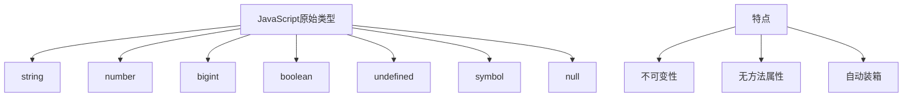
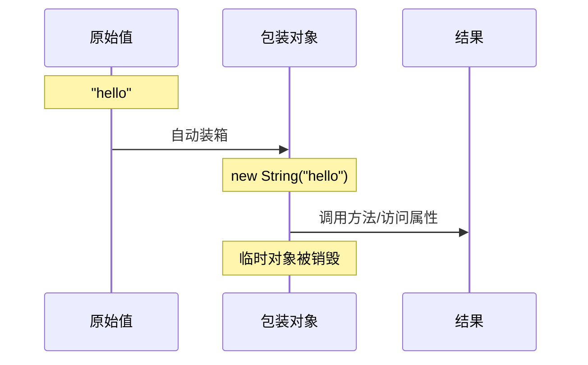

# JavaScript原始类型练习题

## 概念图示



## 练习题

1. 以下代码输出什么？解释原因。
```javascript
let str = "hello";
str.foo = 1;
console.log(str.foo);
```

2. 判断对错：原始类型的值可以被修改。

3. 下面代码中，`str2`的值是什么？为什么？
```javascript
let str1 = "hello";
let str2 = str1;
str1 = "world";
```

4. 解释为什么以下代码能够正常工作：
```javascript
let str = "hello";
console.log(str.toUpperCase());
```

5. 以下代码输出什么？为什么？
```javascript
console.log(typeof null);
```

## 参考答案
<details>
<summary>点击查看答案</summary>
1. 输出：`undefined`
   原因：原始类型string不能添加属性。当执行`str.foo = 1`时，实际上是在临时创建的包装对象上添加属性，该对象随即被销毁。

2. 错误。原始类型的值是不可变的，只能重新赋值，不能修改原有值。

3. `str2`的值是`"hello"`
   原因：原始类型的赋值是值复制，`str1`的修改不会影响`str2`。

4. 代码能够正常工作是因为JavaScript的自动装箱机制。当我们调用`str.toUpperCase()`时，JavaScript会临时创建一个String对象包装器，然后在这个包装器上调用方法。

5. 输出：`"object"`
   这是JavaScript的一个历史遗留bug。虽然`null`是原始类型，但`typeof null`返回`"object"`。

</details>

# JavaScript自动装箱机制详解

## 概念图示



## 什么是自动装箱？

自动装箱是JavaScript引擎在原始值调用方法时自动将其转换为对应的包装对象的过程。

主要包装对象类型：
- String()
- Number()
- Boolean()

## 示例说明

1. 字符串自动装箱过程
```javascript
let str = "hello";
// 当我们调用str.length时，实际上发生了以下步骤：
// 1. 创建包装对象：new String("hello")
// 2. 在包装对象上获取length属性
// 3. 销毁包装对象
console.log(str.length); // 5
```

2. 为什么原始值不能添加属性
```javascript
let str = "hello";
str.foo = 1;  // 看似在添加属性
// 实际过程：
// 1. 创建临时包装对象 new String("hello")
// 2. 在临时对象上添加foo属性
// 3. 临时对象被销毁
console.log(str.foo); // undefined
```

## 验证自动装箱

```javascript
// 手动创建包装对象
let strObj = new String("hello");
console.log(typeof strObj); // "object"

// 原始字符串
let strPrimitive = "hello";
console.log(typeof strPrimitive); // "string"

// 但两者都能调用String的方法
console.log(strObj.toUpperCase()); // "HELLO"
console.log(strPrimitive.toUpperCase()); // "HELLO"
```

## 注意事项

1. 自动装箱是隐式的，开发者通常不需要手动创建包装对象
2. 临时包装对象会在使用后立即被销毁
3. 每次访问原始值的属性或方法时，都会创建新的包装对象
4. 这个过程对性能有轻微影响，但通常可以忽略不计

## 练习题

1. 以下代码输出什么？为什么？
```javascript
let num = 123;
num.prop = "test";
console.log(num.prop);
```

## 参考答案
<details>
<summary>点击查看答案</summary>
1. 输出：`undefined`
   原因：当给`num.prop`赋值时，会创建一个临时的Number包装对象，属性被添加到这个临时对象上。
   但这个临时对象立即被销毁。当后面尝试读取`num.prop`时，会创建一个新的Number包装对象，
   这个新对象上没有prop属性，所以返回undefined。
</details>
