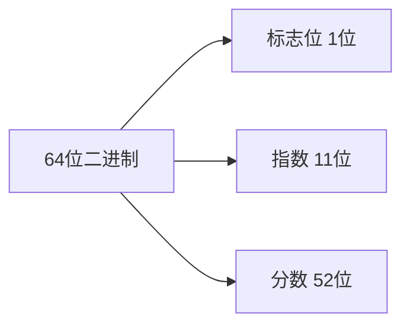

### JavaScript浮点数测试题

1. JavaScript中的数字是按照什么标准存储的？
   A. IEEE 753
   B. IEEE 754
   C. IEEE 755
   D. IEEE 756

2. JavaScript中一个数字总共使用多少位来存储？
   A. 32位
   B. 48位
   C. 64位
   D. 128位

3. 以下哪个表达式的结果是 true？
   A. 0.1 + 0.2 === 0.3
   B. Math.pow(2, 53) + 1 > Math.pow(2, 53)
   C. Math.pow(2, 53) + 2 > Math.pow(2, 53)
   D. 0.1 + 1 - 1 === 0.1

4. 在JavaScript的数字存储中，分数(fraction)占用多少位？
   A. 51位
   B. 52位
   C. 53位
   D. 54位

5. 以下关于JavaScript数字的说法，哪个是错误的？
   A. 所有的数字都是浮点数
   B. 可以精确表示所有的十进制小数
   C. 标志位用1位表示
   D. 指数部分用11位表示

6. 下面哪个运算会返回Infinity？
   A. Math.pow(2, 53) + 1
   B. Math.pow(2, 2048)
   C. Math.pow(2, -2048)
   D. Math.sqrt(-1)

### JavaScript数字的位分布

参考答案及详细解释

1. 正确答案：B - IEEE 754
   - A错误：IEEE 753不存在，这是虚构的标准
   - C错误：IEEE 755不存在，这是虚构的标准
   - D错误：IEEE 756不存在，这是虚构的标准
   > 解释：JavaScript严格遵循IEEE 754标准的双精度浮点数规范。这是一个国际标准，用于定义浮点数的表示和运算规则。

2. 正确答案：C - 64位
   - A错误：32位是单精度浮点数的位数，JavaScript使用双精度
   - B错误：48位不是标准的浮点数位数
   - D错误：128位是四倍精度浮点数的位数，超出JavaScript的范围
   > 解释：JavaScript使用双精度浮点数格式，固定使用64位：1位符号位 + 11位指数 + 52位分数 = 64位

3. 正确答案：C - Math.pow(2, 53) + 2 > Math.pow(2, 53)
   - A错误：0.1 + 0.2实际等于0.30000000000000004，因为二进制无法精确表示这些十进制小数
   - B错误：Math.pow(2, 53) + 1等于Math.pow(2, 53)，因为超出了精确表示范围
   - D错误：0.1 + 1 - 1实际等于0.10000000000000009
   > 解释：在2^53这个范围内，只能表示偶数增量，这是因为最低有效位的限制。所以加2可以被正确表示，而加1则无法区分。

4. 正确答案：B - 52位
   - A错误：51位不足以提供JavaScript需要的精度
   - C错误：虽然可以表示53位有效数字，但实际存储只用52位
   - D错误：54位超出了双精度浮点数的规范
   > 解释：IEEE 754双精度格式规定使用52位存储分数部分。第53位精度是通过规格化（隐含的前导1）实现的。

5. 正确答案：B - 可以精确表示所有的十进制小数
   - A正确：JavaScript确实将所有数字都作为浮点数处理
   - C正确：标志位就是用1位表示正负
   - D正确：11位指数是IEEE 754双精度的标准
   > 解释：JavaScript不能精确表示所有十进制小数，因为它使用二进制存储。只有分母是2的幂的小数才能被精确表示。要修正这个说法应该是："JavaScript只能精确表示部分十进制小数"。

6. 正确答案：B - Math.pow(2, 2048)
   - A错误：这个结果是9007199254740992，不会溢出
   - C错误：这个结果是0（下溢），不会返回Infinity
   - D错误：这个结果是NaN，表示无效运算
   > 解释：当指数超过1024时会发生溢出并返回Infinity。2048远超过这个限制，因此Math.pow(2, 2048)会返回Infinity。

### 重要概念总结：
1. 数值范围：
   - 最大安全整数：2^53 - 1 (Number.MAX_SAFE_INTEGER)
   - 最小安全整数：-(2^53 - 1) (Number.MIN_SAFE_INTEGER)
   - 最大数值：1.7976931348623157e+308 (Number.MAX_VALUE)
   - 最小数值：5e-324 (Number.MIN_VALUE)

2. 精度特点：
   - 整数：精确表示范围在±2^53之间
   - 小数：只能精确表示分母是2的幂的小数

3. 特殊值处理：
   - NaN：表示计算错误
   - Infinity：表示溢出
   - 0：可以是+0和-0
  
4. IEEE 754的5种异常情况：
   - 无效操作（返回NaN）
   - 除以零（返回Infinity或-Infinity）
   - 溢出（返回Infinity或-Infinity）
   - 下溢（返回0或非规范化数字）
   - 不精确（返回舍入后的结果）

