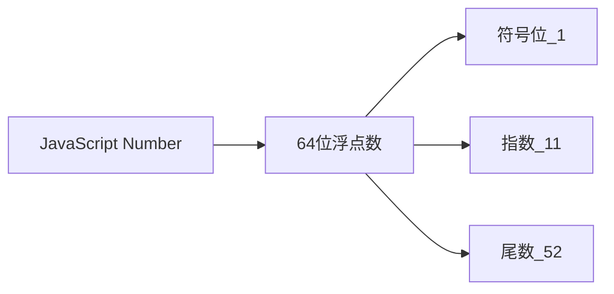

# JavaScript浮点数练习题

## 1. 基础概念
以下关于JavaScript中的数字描述,哪些是正确的? AD
A. JavaScript中的所有数字都是64位浮点数
B. JavaScript中的整数和小数使用不同的数据类型
C. JavaScript中的数字可以精确表示所有的小数
D. JavaScript中的数字采用IEEE-754标准

## 2. 代码输出 
false 0.30000000000000004
```javascript
console.log(0.1 + 0.2 === 0.3);
console.log(0.1 + 0.2);
```

请问以上代码输出什么?

## 3. 浮点数存储
在IEEE-754双精度浮点数格式中,64位二进制按照什么方式分配? A
A. 1位符号位, 11位指数, 52位尾数
B. 2位符号位, 10位指数, 52位尾数
C. 1位符号位, 52位指数, 11位尾数
D. 没有固定分配方式

## 4. 实际应用
在开发一个购物车功能时,需要进行价格计算,以下哪种方案更合理? B
A. 直接使用浮点数进行计算
B. 将金额转换为整数(单位分)进行计算
C. 使用字符串进行拼接计算
D. 使用BigDecimal进行计算

## 5. 代码分析
string
```javascript
function formatPrice(price) {
return price.toFixed(2);
}
console.log(typeof formatPrice(0.1));
```
这段代码可能存在什么问题?


<details>
<summary>参考答案</summary>

1. 正确答案: A、D
解释: JavaScript中所有数字确实都是64位浮点数,并且采用IEEE-754标准。不存在整数和小数的区分,也不能精确表示所有小数。

2. 输出:
```javascript
false
0.30000000000000004
```

解释: 由于浮点数精度问题,0.1+0.2的结果实际上略大于0.3。

3. 正确答案: A
解释: IEEE-754双精度浮点数使用1位符号位表示正负,11位表示指数,52位表示尾数。

4. 正确答案: B
解释: 在处理货币计算时,最好将金额转换为整数(分)进行计算,避免浮点数精度问题。

5. 问题分析:
- formatPrice返回的是字符串类型,而不是数字类型
- 如果需要继续进行数学运算,需要将结果转回数字类型
- toFixed方法可能存在精度问题

建议改进:
```javascript
function formatPrice(price) {
return Number(Math.round(price*100) / 100).toFixed(2);
}
```
</details>


## 自定义的四舍五入方法
解决toFixed会有"四舍六入五看奇偶"的问题 | 该方法返回number, toFixed是string

```javascript
function javaStyleFix(number, precision = 2) {
  // 处理精度
  const multiplier = Math.pow(10, precision);
  
  // 处理负数情况
  const sign = number < 0 ? -1 : 1;
  const absNumber = Math.abs(number);
  
  // 标准四舍五入
  const rounded = Math.round(absNumber * multiplier) / multiplier;
  
  return sign * rounded;
}

// 使用示例
console.log(javaStyleFix(1.255, 2)); // 1.26
console.log(javaStyleFix(1.254, 2)); // 1.25
console.log(javaStyleFix(-1.255, 2)); // -1.
```