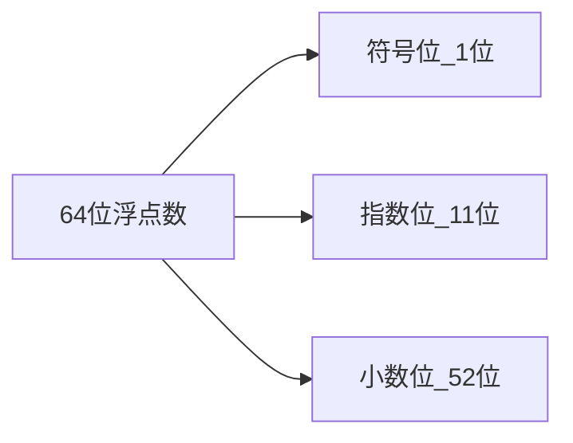
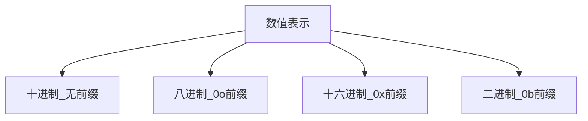

# JavaScript数值类型详解

## 基本概念

JavaScript中所有数字都是64位浮点数(IEEE 754标准)。

### 数值的内部表示



### 精度范围
- 整数：精确表示范围在-2^53 + 1到2^53 - 1之间
- 最大值：Number.MAX_VALUE (约1.8e+308)
- 最小值：Number.MIN_VALUE (约5e-324)

### 特殊值
1. NaN (Not a Number)
2. Infinity/-Infinity
3. +0/-0

## 常见进制表示


## 练习题

### 题目1: 判断是否为安全整数
补全代码:
```js
function isSafeInteger(n) {
  // 补充代码：判断n是否在安全整数范围内
  // 提示：使用Number.MAX_SAFE_INTEGER
}
```

### 题目2: 修复浮点数计算
补全代码:
```js
function accurateAdd(a, b) {
  // 补充代码：实现0.1 + 0.2 = 0.3
  // 提示：可以先转换为整数计算
}
```

### 题目3: 进制转换
补全代码:
```js
function convertBase(num, fromBase, toBase) {
  // 补充代码：将num从fromBase进制转换为toBase进制
  // 提示：使用parseInt和toString
}
```

<details>
<summary>参考答案</summary>

```js
// 题目1
function isSafeInteger(n) {
  return Number.isSafeInteger(n);
  // 或: return Math.abs(n) <= Number.MAX_SAFE_INTEGER;
}

// 题目2
function accurateAdd(a, b) {
  return (a * 10 + b * 10) / 10;
}

// 题目3
function convertBase(num, fromBase, toBase) {
  return parseInt(num, fromBase).toString(toBase);
}
```

</details>