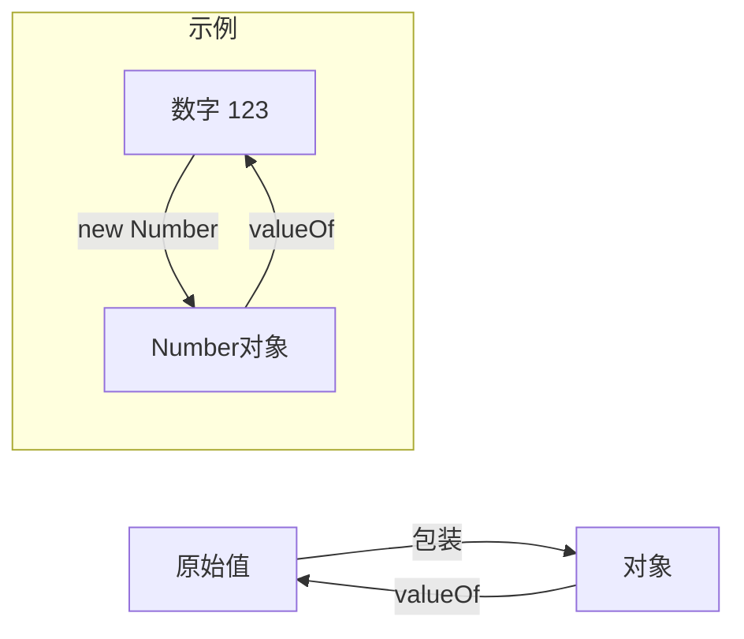

# JavaScript 原始值详解

## 基本定义
JavaScript 中有5种原始类型（primitive types）：
- undefined
- null
- boolean
- string
- number

除此之外的所有类型都是对象（object）。

## 原始值与对象的关系



## 关键特性
1. 原始值没有属性
2. 当我们试图访问原始值的属性时，JavaScript会临时将其包装成对象
3. 包装对象会在使用后立即被垃圾回收
4. 原始值是不可变的

## 练习题

### 题目1：类型判断
补全代码，判断变量x的类型是否为原始类型：
```javascript
function isPrimitive(x) {
    return _____________________;
}
```

### 题目2：包装对象转换
补全代码，将包装对象转换为原始值：
```javascript
const strObj = new String("hello");
const primitiveStr = _______________;
```

### 题目3：属性访问理解
解释以下代码的输出结果：
```javascript
let str = "hello";
str.custom = 123;
console.log(str.custom); // 输出是什么？为什么？
```

<details>
<summary>参考答案</summary>

### 题目1答案：
```javascript
function isPrimitive(x) {
    return typeof x !== 'object' && typeof x !== 'function';
}
```

### 题目2答案：
```javascript
const strObj = new String("hello");
const primitiveStr = strObj.valueOf();
```

### 题目3答案：
输出：`undefined`

原因：当我们尝试给原始字符串`str`添加属性时，JavaScript会临时创建一个String包装对象，属性被添加到这个临时对象上。但这个临时对象随即被销毁。当我们试图读取`str.custom`时，又会创建一个新的临时包装对象，这个新对象自然没有之前设置的custom属性。
</details>