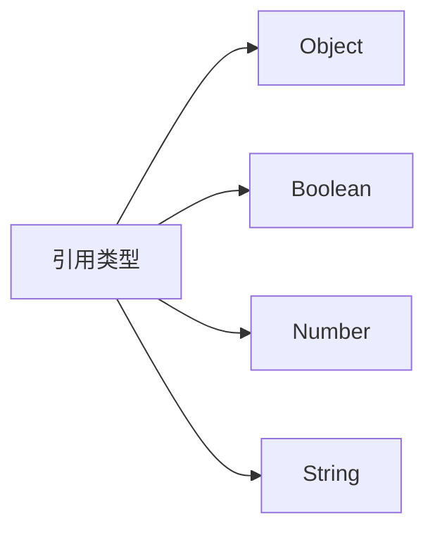

# ECMAScript引用类型

## 基本概念

引用类型可以看作是类(class)的实例。ECMAScript中主要包含以下几种引用类型:




## 创建对象

使用new运算符来创建引用类型的实例:

```js
var obj = new Object();
var str = new String("hello");
var num = new Number(123);
var bool = new Boolean(true);
```


## 主要引用类型特点

### Object
- 所有引用类型的基础
- 具有constructor、prototype等基本属性
- 提供hasOwnProperty()、toString()等基础方法

### Boolean对象
- Boolean原始类型的引用类型包装器
- valueOf()返回原始布尔值
- 在布尔运算中可能产生困惑,建议使用原始值

### Number对象 
- 提供数值相关的方法
- toFixed() - 指定小数位数
- toExponential() - 科学计数法
- toPrecision() - 指定精度

### String对象
- 提供字符串操作的丰富方法
- length属性表示字符长度
- charAt()、indexOf()等位置相关方法
- slice()、substring()等截取方法
- 大小写转换方法

## 练习题

### 题目1: 基础类型判断
补全代码,判断变量类型:
```js
function checkType(val) {
  if(/* 补全代码 */) {
    return "string object";
  }
  return "other type";
}
```


### 题目2: 字符串处理
补全代码,实现首字母大写:
```js
function capitalize(str) {
  // 补全下面一行代码
  return /* 使用String对象方法将首字母大写 */;
}
```


### 题目3: 数值格式化
补全代码,将数字格式化为固定2位小数:
```js
function formatNumber(num) {
  let number = new Number(num);
  // 补全代码
  return /* 使用Number对象方法格式化 */;
}
```


<details>
<summary>参考答案</summary>

题目1:
```js
if(val instanceof String)
```


题目2:
```js
return str.charAt(0).toUpperCase() + str.slice(1);
```


题目3:
```js
return number.toFixed(2);
```

</details>