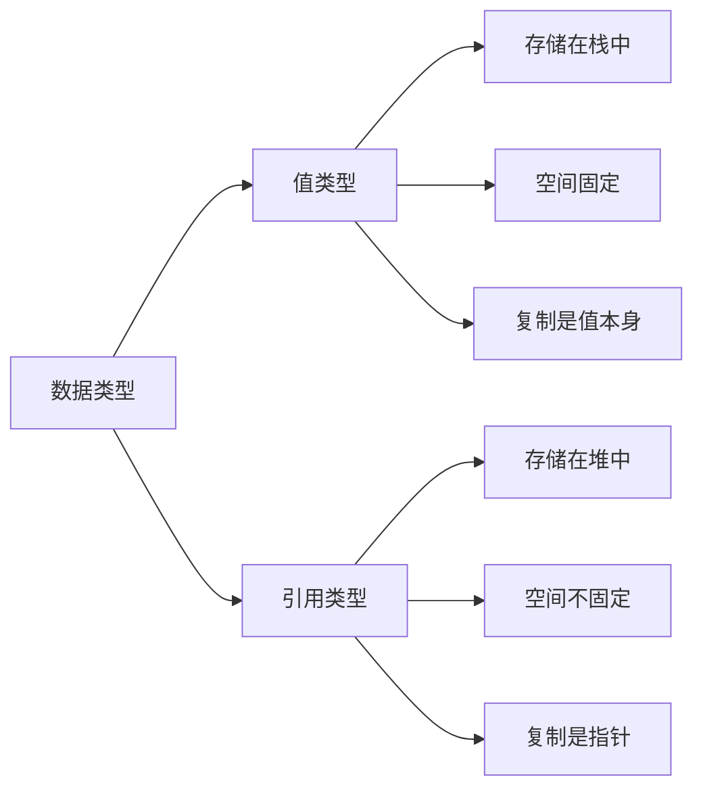
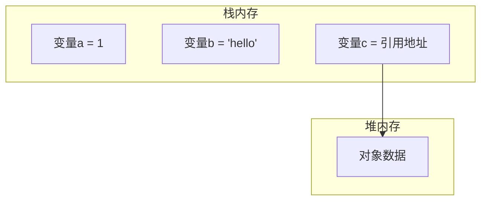

# JavaScript中的数据类型

## 基本数据类型(值类型)
- string
- number 
- boolean
- undefined
- null
- symbol (ES2016新增)

## 引用类型
- Object
- Array  
- Function

## 两种类型的主要区别




### 内存分配示意图




## 练习题

1. 判断输出结果:
```javascript
let a = {name: 'test'}
let b = a
b.name = 'changed'
console.log(a.name) // 请填写输出结果
```


2. 补全代码,实现深拷贝一个对象:
```javascript
function deepClone(obj) {
  // 请补全代码
  
}
```


3. 判断变量类型:
```javascript
let a = []
let b = null
let c = () => {}

// 请补全代码判断三个变量的类型
console.log(typeof __)
console.log(__ instanceof __)
```


<details>
<summary>参考答案</summary>

1. 输出: `changed` (因为是引用类型,b和a指向同一个对象)

2. 深拷贝实现:
```javascript
function deepClone(obj) {
  if(typeof obj !== 'object' || obj === null) return obj
  let result = Array.isArray(obj) ? [] : {}
  for(let key in obj) {
    result[key] = deepClone(obj[key])
  }
  return result
}
```


3. 类型判断:
```javascript
let a = []
let b = null
let c = () => {}

// typeof 判断
console.log(typeof a)  // 'object'
console.log(typeof b)  // 'object'
console.log(typeof c)  // 'function'

// instanceof 判断
console.log(a instanceof Array)  // true
console.log(a instanceof Object) // true
console.log(b instanceof Object) // false
console.log(c instanceof Function) // true
console.log(c instanceof Object)   // true
```

</details>