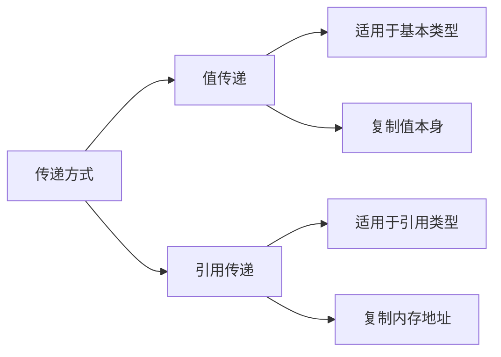
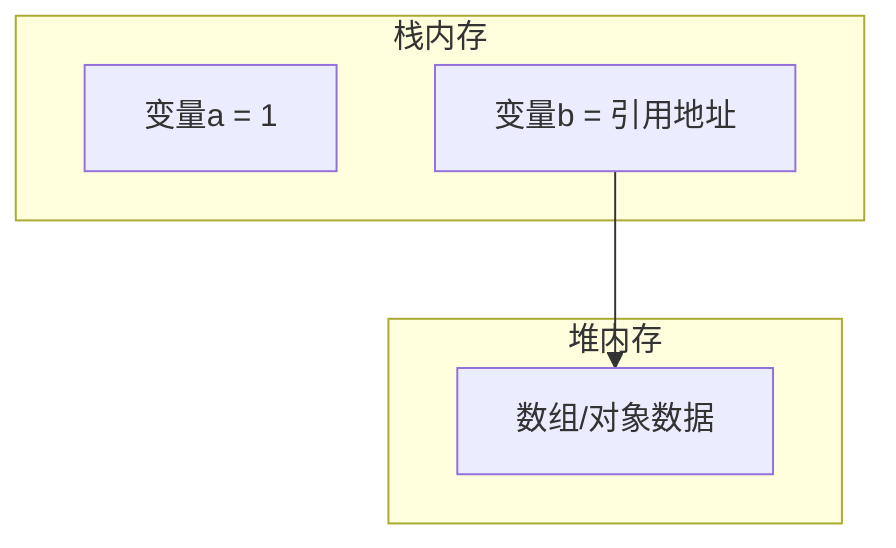

# JavaScript的值传递和引用传递

## 基本概念



### 值传递

* 适用于基本数据类型(string, number, boolean, null, undefined, symbol)
* 复制时会创建新的内存空间, 互不影响

### 引用传递

* 适用于引用类型(Object, Array, Function)
* 复制时只复制内存地址, 指向同一数据

## 内存模型示意



## 练习题

1. 判断以下代码输出:

```javascript
let arr1 = [1, 2];
let arr2 = arr1;
arr2.push(3);
console.log(arr1); // 请填写输出结果
```

2. 完成函数,实现基本类型的交换:

```javascript
function swap(a, b) {
    // 请补全代码,交换a和b的值

}

let x = 1,
    y = 2;
swap(x, y);
console.log(x, y); // 应输出: 2 1
```

3. 判断以下代码输出:

```javascript
let obj = {
    count: 1
};

function update(o) {
    o.count = 2;
    o = {
        count: 3
    };
}
update(obj);
console.log(obj.count); // 请填写输出结果
```

<details>
<summary>参考答案</summary>

1. 输出: `[1, 2, 3]` (因为arr1和arr2指向同一个数组)

2. 交换实现:

```javascript
function swap(a, b) {
    let temp = a;
    a = b;
    b = temp;
}
```

3. 输出: `2` (函数内第一行修改了原对象, 第二行的重新赋值不影响原对象)

</details>
