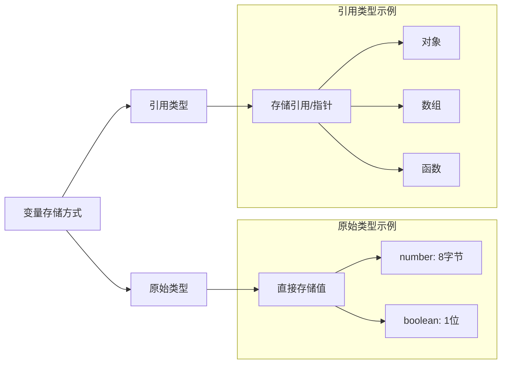
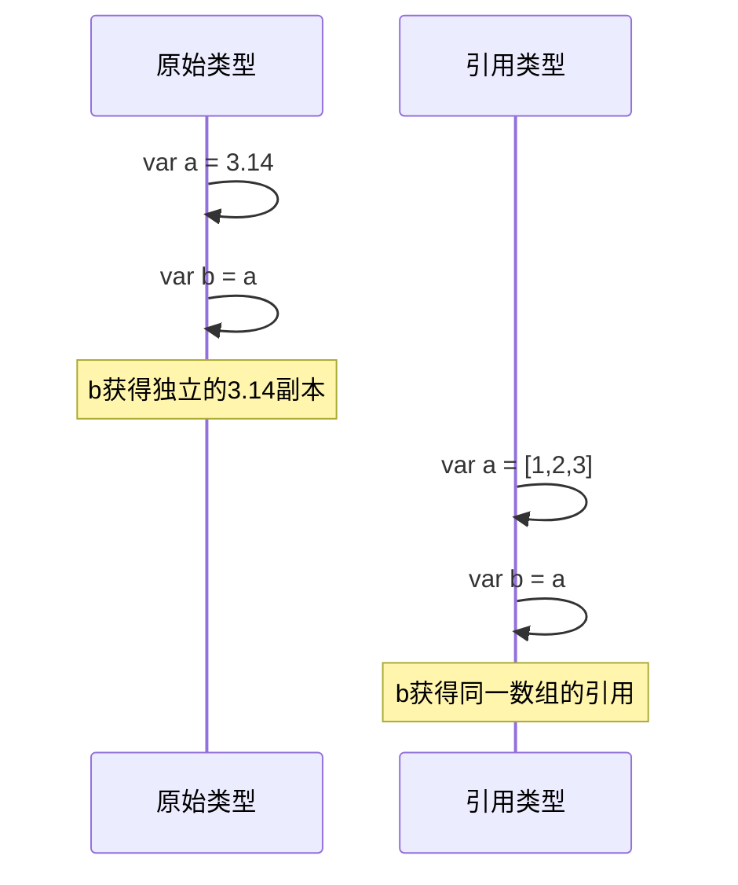
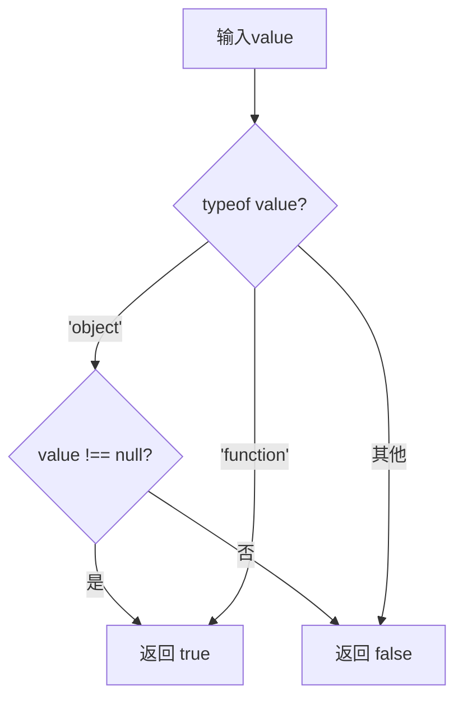

# JavaScript 中的原始类型和引用类型

## 基本概念

### 原始类型 (Primitive Types)

* 具有固定内存大小
* 包括：数字、布尔值、null 和 undefined
* 变量直接存储值本身

### 引用类型 (Reference Types)

* 没有固定内存大小
* 包括：对象、数组和函数
* 变量存储的是引用（指针或内存地址）

### 特殊情况：字符串

* 具有可变大小
* 行为类似原始类型
* 是不可变的（immutable）



## 值传递示例



## 练习题

### 1. 补全代码

```javascript
// 判断传入的参数是否为引用类型
function isReferenceType(value) {
    // 补全代码：使用 typeof 和 null 检查
    return _____________________;
}
```

### 2. 代码输出预测

```javascript
let num1 = 100;
let num2 = num1;
num1 = 200;
// num2 的值是多少？为什么？

let obj1 = {
    value: 100
};
let obj2 = obj1;
obj1.value = 200;
// obj2.value 的值是多少？为什么？
```

### 3. 补全代码

```javascript
// 实现深拷贝一个简单对象的函数（只考虑对象包含原始类型的情况）
function deepClone(obj) {
    // 补全代码
    let newObj = {};
    ______________________
    return newObj;
}
```

<details>
<summary>参考答案</summary>

1. 判断引用类型：

```javascript
function isReferenceType(value) {
    return (typeof value === 'object' && value !== null) || typeof value === 'function';
}
```



2. 代码输出预测：
* num2 的值是 100，因为原始类型复制的是值本身
* obj2.value 的值是 200，因为引用类型复制的是引用，obj1 和 obj2 指向同一个对象

3. 深拷贝实现：

```javascript
function deepClone(obj) {
    // 处理null或非对象情况
    if (obj === null || typeof obj !== 'object') {
        return obj;
    }

    // 处理数组情况
    if (Array.isArray(obj)) {
        return obj.map(item => deepClone(item));
    }

    // 处理普通对象
    let newObj = {};
    for (let key in obj) {
        if (obj.hasOwnProperty(key)) {
            newObj[key] = deepClone(obj[key]);
        }
    }
    return newObj;
}
```

</details>
