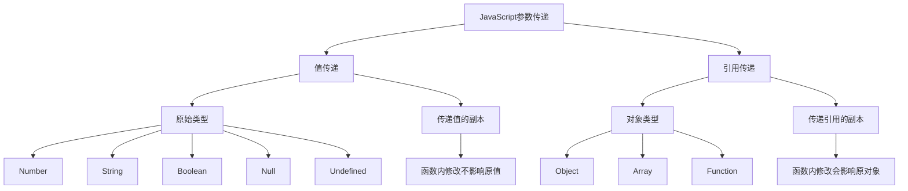
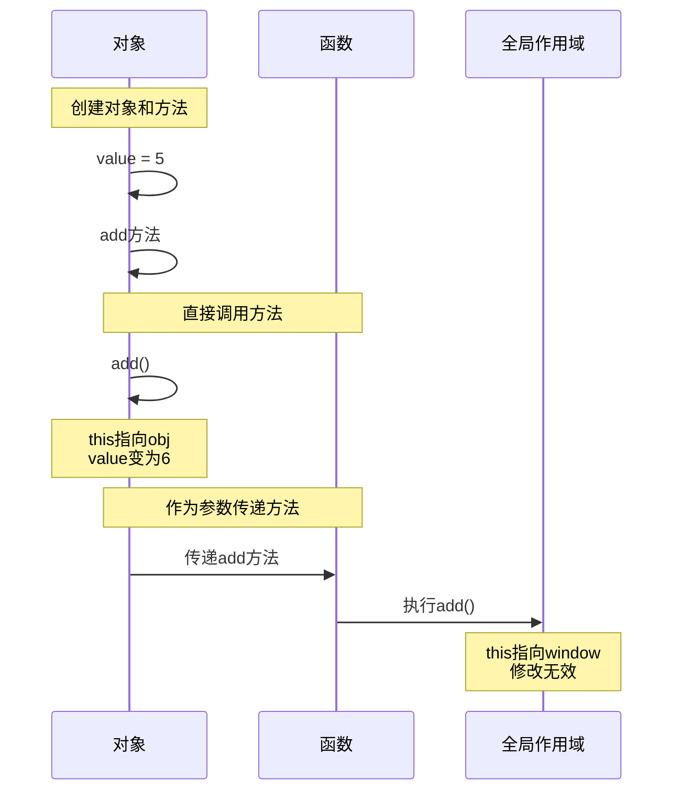
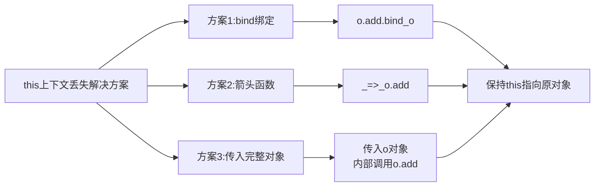
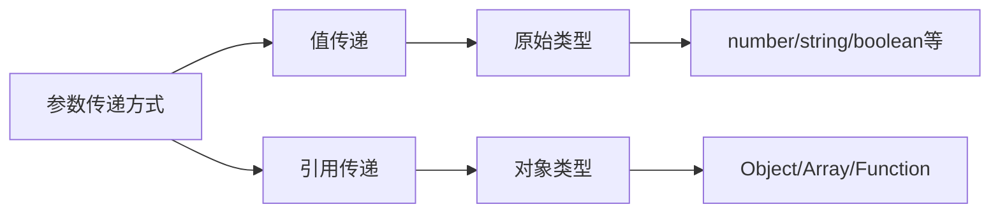
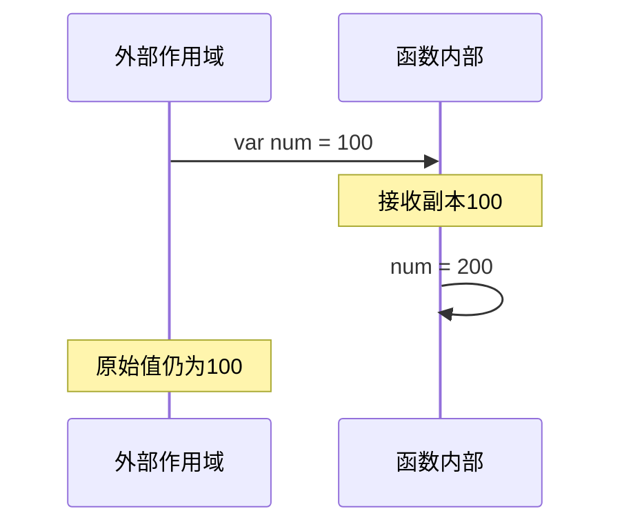
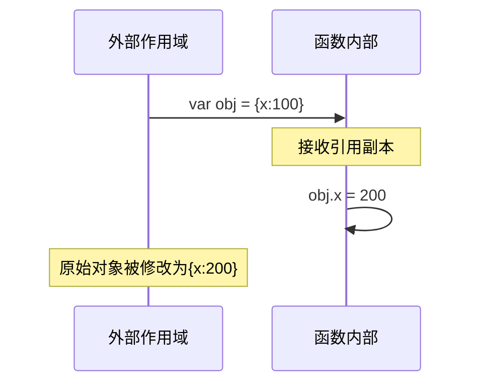
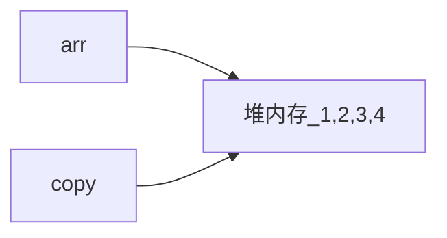
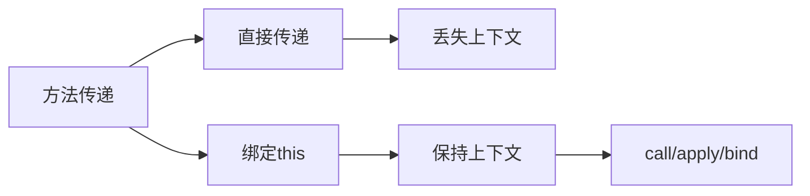
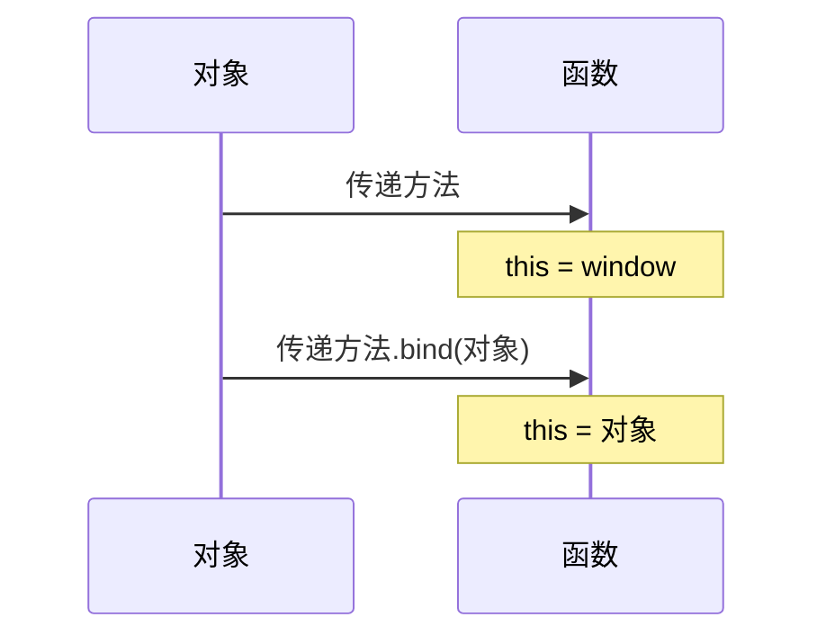
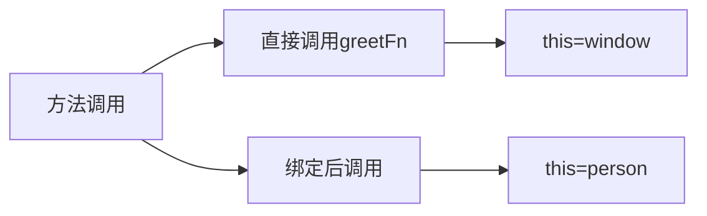

# JavaScript中的值传递和引用传递详解

> 参考文章: [@Snook.ca - JavaScript: Passing by Value or by Reference](https://snook.ca/archives/javascript/javascript_pass)

## 基本概念图解



```javascript
function myobject() {
    this.value = 5;
}
myobject.prototype.add = function() {
    this.value++;
}
var o = new myobject();
alert(o.value); // o.value = 5
o.add();
alert(o.value); // o.value = 6
function objectchanger(fnc) {
    fnc(); // runs the function being passed in
    alert(this.value); // NaN 因为这里的this指向window
}
objectchanger(o.add);
alert(o.value); // sorry, still just 6
```

## 方法传递和this上下文



## 解决方案图解



## 代码示例

### 值传递示例

```javascript
function changeValue(x) {
    x = 100;
}
let num = 1;
changeValue(num);
console.log(num); // 仍然是1
```

### 引用传递示例

```javascript
function changeObject(obj) {
    obj.value = 100;
}
let myObj = {
    value: 1
};
changeObject(myObj);
console.log(myObj.value); // 变为100
```

### this上下文问题修复

```javascript
// 原始代码
function myobject() {
    this.value = 5;
}
myobject.prototype.add = function() {
    this.value++;
}
var o = new myobject();

// 修复方案1: 使用bind
objectchanger(o.add.bind(o));

// 修复方案2: 使用箭头函数
objectchanger(() => o.add());

// 修复方案3: 传入完整对象
objectchanger(function() {
    o.add.call(o);
});
```

## 关键要点

1. JavaScript中的参数传递分为:
   - 值传递(原始类型)
   - 引用传递(对象类型)

2. 方法作为参数传递时会丢失this上下文
   - 默认this指向全局window对象
   - 需要通过bind/箭头函数等方式保持正确的this指向

3. 解决this上下文问题的三种方案:
   - 使用bind绑定this
   - 使用箭头函数
   - 传递完整对象

# JavaScript 中的值传递和引用传递

## 基本概念

### 值传递 (Pass by Value)

* 适用于原始类型(primitive types)
* 函数接收的是值的副本
* 函数内部的修改不会影响原始值
* 包括: number、string、boolean、null、undefined

### 引用传递 (Pass by Reference)

* 适用于对象类型(object types) 
* 函数接收的是引用的副本
* 函数内部可以修改原始对象
* 包括: Object、Array、Function



## 值传递示例



## 引用传递示例



## 练习题

### 1. 补全代码

```javascript
// 实现一个函数,判断传入的参数是否为原始类型
function isPrimitive(param) {
    // 补全代码
    return ____________________;
}
```

### 2. 补全代码

```javascript
// 实现一个函数,可以修改对象的指定属性值
function updateProperty(obj, key, value) {
    // 补全代码
    ______________________
}

// 使用示例:
let person = {
    name: 'Tom',
    age: 20
};
updateProperty(person, 'age', 21);
console.log(person.age); // 应输出 21
```

### 3. 代码预测输出

```javascript
let arr = [1, 2, 3];
let copy = arr;
arr.push(4);

// copy 数组的内容是什么?为什么?
```

<details>
<summary>参考答案</summary>

1. 判断原始类型:

```javascript
function isPrimitive(param) {
    return param === null ||
        typeof param !== 'object' &&
        typeof param !== 'function';
}
```

2. 修改对象属性:

```javascript
function updateProperty(obj, key, value) {
    obj[key] = value;
}
```

3. 数组引用预测:
* copy 数组的内容是 [1, 2, 3, 4]
* 因为 copy 获得的是 arr 的引用, 而不是值的副本
* 所以对 arr 的修改会影响到 copy



</details>

<br>

# JavaScript 中的方法传递和 this 上下文

## 基本概念

### 方法传递

* 当把对象的方法作为参数传递时，方法会失去原始的上下文
* this 关键字将指向调用环境，而不是原始对象
* 常见的 this 指向:
  + 全局调用时指向 window
  + 事件处理时指向 event 对象
  + 对象方法中指向该对象



### 解决方案

1. 传递整个对象
2. 使用 call/apply/bind 绑定上下文



## 练习题

### 1. 补全代码

```javascript
// 实现一个函数，确保传入的方法在执行时 this 指向原始对象
function executeMethod(obj, methodName) {
    // 补全代码，调用 obj 的 methodName 方法
    return ________________________;
}

// 使用示例:
let user = {
    name: 'Tom',
    sayHi() {
        console.log('Hi, ' + this.name);
    }
};
executeMethod(user, 'sayHi'); // 应输出: Hi, Tom
```

### 2. 补全代码

```javascript
// 修复这段代码，使得 this 指向正确
class Counter {
    constructor() {
        this.count = 0;
        this.increase = this.increase.bind(____);
    }

    increase() {
        this.count++;
    }
}
```

### 3. 代码预测输出

```javascript
const person = {
    name: '张三',
    greet() {
        console.log('你好, ' + this.name);
    }
};

const greetFn = person.greet;
greetFn();

// 输出是什么？为什么？如何修复？
```

<details>
<summary>参考答案</summary>

1. 执行对象方法:

```javascript
function executeMethod(obj, methodName) {
    // call会直接执行方法，并返回执行结果
    return obj[methodName].call(obj);
}
```

2. 绑定 this:

```javascript
constructor() {
    this.count = 0;
    this.increase = this.increase.bind(this);
}
```

3. 代码预测:
* 输出: "你好, undefined"
* 原因: greetFn 是在全局环境下调用的，this 指向 window
* 修复方法:

```javascript
const greetFn = person.greet.bind(person);
greetFn(); // 输出: 你好, 张三
```



</details>
