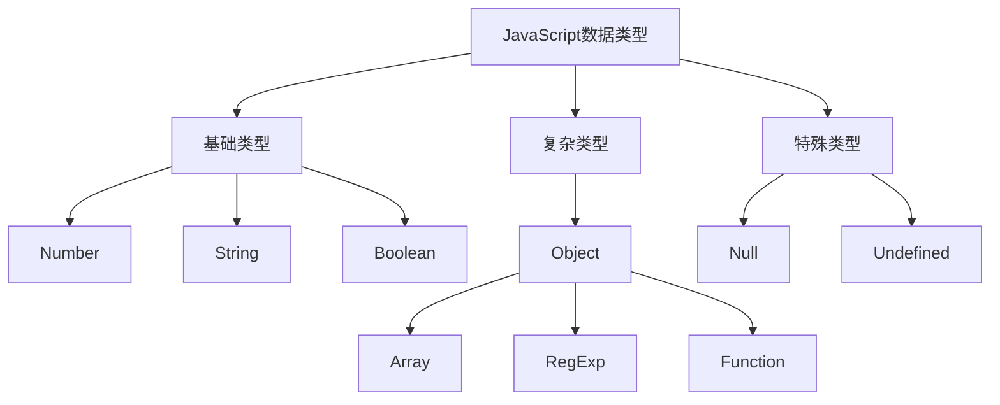
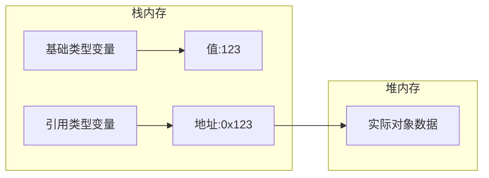
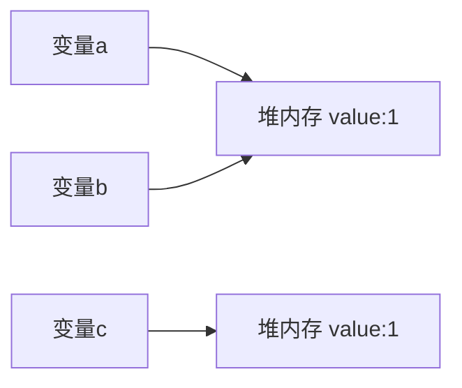

# JavaScript中的值类型和引用类型详解

## 基本概念



## 存储方式

### 基础类型
- 直接存储在栈内存中
- 存储的是实际的值
- 赋值操作会创建新的副本

### 复杂类型
- 存储在堆内存中
- 栈内存中存储的是指向堆内存的引用
- 赋值操作会复制引用地址



## 赋值操作的区别

### 基础类型赋值
```javascript
let a = 1;
let b = a; // 复制值
b = 2;     // a仍然是1
```

### 引用类型赋值
```javascript
let obj1 = {x: 1};
let obj2 = obj1;    // 复制引用
obj2.x = 2;         // obj1.x也变成2
```

## 练习题

### 1. 补全代码
```javascript
// 实现一个函数,判断传入的参数是否为引用类型
function isReference(value) {
    // 补全下面的代码
    return _________________;
}

// 测试用例
console.log(isReference({}));      // true
console.log(isReference([]));      // true
console.log(isReference(1));       // false
console.log(isReference("str"));   // false
```

### 2. 补全代码
```javascript
// 实现一个深拷贝函数的简单版本(只考虑对象和数组)
function simpleDeepCopy(obj) {
    // 补全下面的代码
    if (typeof obj !== 'object' || obj === null) {
        return obj;
    }
    
    let copy = Array.isArray(obj) ? [] : {};
    
    // 补全这里的代码
    _________________________

    return copy;
}
```

### 3. 判断输出
```javascript
let a = {value: 1};
let b = a;
let c = {value: 1};

console.log(a === b);  // ?
console.log(a === c);  // ?
console.log(b === c);  // ?
```

<details>
<summary>参考答案</summary>

1. 判断引用类型:
```javascript
function isReference(value) {
    return typeof value === 'object' && value !== null;
}
```

2. 简单深拷贝:
```javascript
function simpleDeepCopy(obj) {
    if (typeof obj !== 'object' || obj === null) {
        return obj;
    }
    
    let copy = Array.isArray(obj) ? [] : {};
    
    for (let key in obj) {
        copy[key] = simpleDeepCopy(obj[key]);
    }
    
    return copy;
}
```

3. 判断输出:
- `a === b` 输出 `true` (因为b引用了a的地址)
- `a === c` 输出 `false` (虽然值相同,但是是不同的对象)
- `b === c` 输出 `false` (同上)



</details>