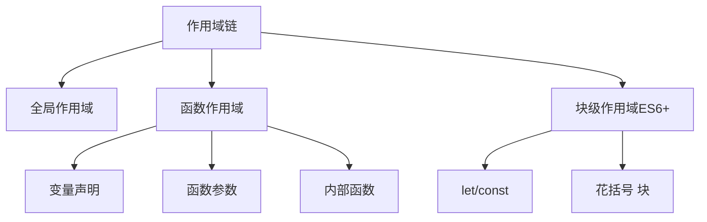
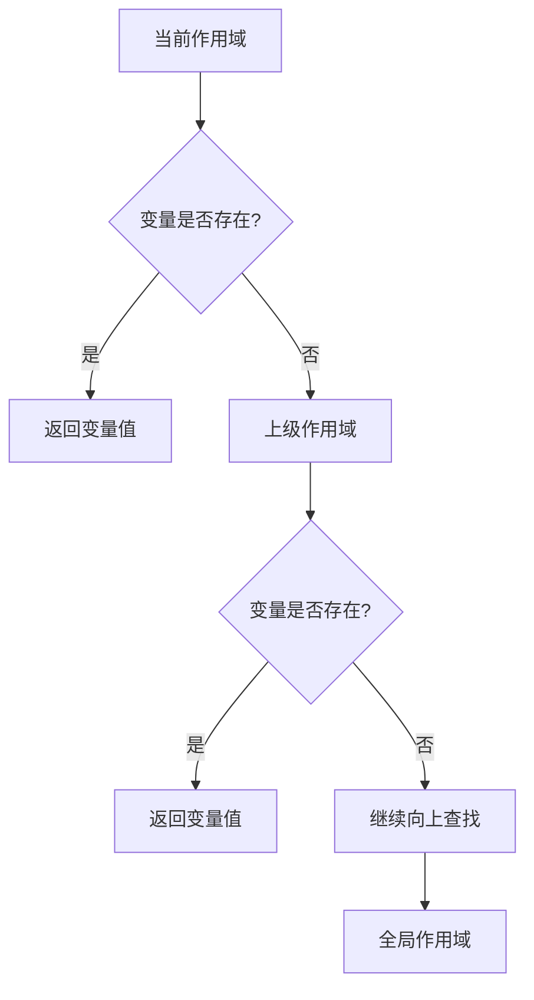
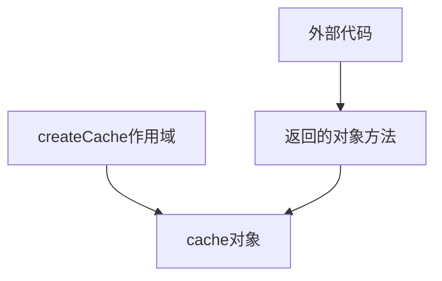

# JavaScript作用域链详解

## 基本概念

作用域链是JavaScript中用于变量查找的一个机制，它由当前执行环境的变量对象及其所有父级变量对象组成。



## 作用域链查找规则

1. 首先在当前作用域查找变量
2. 如果找不到，则向上级作用域查找
3. 直到找到全局作用域，如果还是找不到则返回undefined



## 代码示例

```javascript
let global = 'global';

function outer() {
    let outerVar = 'outer';
    
    function inner() {
        let innerVar = 'inner';
        console.log(innerVar);  // 当前作用域
        console.log(outerVar);  // 上级作用域
        console.log(global);    // 全局作用域
    }
    
    inner();
}
```

## 练习题

### 1. 补全代码
```javascript
// 实现一个函数，使内部函数可以访问到正确的索引值
function createFunctions(n) {
    let functions = [];
    
    for(let i = 0; i < n; i++) {
        // 补全下面的代码，使得数组中的每个函数都能打印出正确的索引值
        functions.push(________________);
    }
    
    return functions;
}

// 测试
let fns = createFunctions(3);
fns[0](); // 应该打印 0
fns[1](); // 应该打印 1
fns[2](); // 应该打印 2
```

### 2. 判断输出
```javascript
let value = 1;

function foo() {
    console.log(value);
}

function bar() {
    let value = 2;
    foo();
}

bar(); // 输出是什么？为什么？
```

### 3. 补全代码
```javascript
// 实现一个简单的缓存函数
function createCache() {
    let cache = {};
    
    return {
        // 补全下面的代码，实现获取和设置缓存的方法
        get: function(key) {
            return ________________;
        },
        set: function(key, value) {
            ________________;
        }
    };
}

// 测试
let cache = createCache();
cache.set('name', 'John');
console.log(cache.get('name')); // 应该输出: "John"
```

<details>
<summary>参考答案</summary>

1. 创建函数数组:
```javascript
functions.push(function() {
    console.log(i);
});
```
注意：这里使用let声明的i会为每次循环创建新的绑定，所以能正确捕获索引值。

2. 输出值判断:
输出为 `1`
因为函数的作用域链是在函数定义时就确定的，而不是在调用时。foo函数定义在全局作用域中，所以它的作用域链中能访问到的value是全局的value。

3. 缓存函数实现:
```javascript
get: function(key) {
    return cache[key];
},
set: function(key, value) {
    cache[key] = value;
}
```



</details>

## 注意事项

1. 作用域链在函数定义时就已确定，而不是在调用时
2. 内部函数可以访问外部函数的变量，但外部函数不能访问内部函数的变量
3. let/const声明的变量具有块级作用域，而var声明的变量不具有
4. 闭包会保持对其外部作用域的引用

## 参考链接
- [MDN - 作用域](https://developer.mozilla.org/zh-CN/docs/Glossary/Scope)
- [JavaScript深入之作用域链](https://github.com/mqyqingfeng/Blog/issues/6)