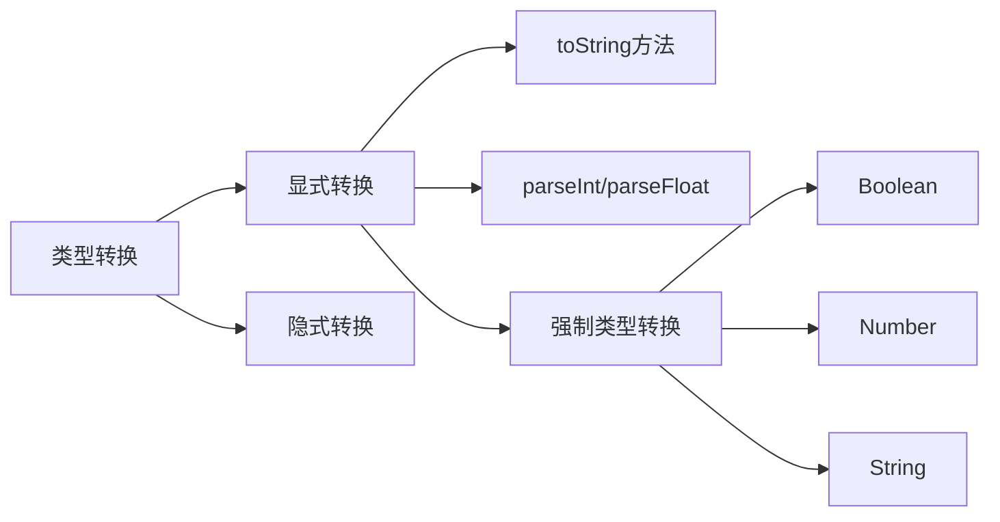
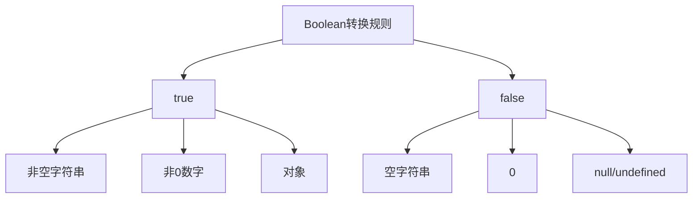

# JavaScript类型转换详解

## 基本概念

JavaScript提供了多种类型转换的方式:




### 1. toString()方法
- 可用于Boolean、Number和String类型
- Number的toString()可接受进制参数

### 2. parseInt/parseFloat
- parseInt解析整数,可指定进制
- parseFloat解析浮点数,只支持十进制
- 从左向右解析,遇到非法字符停止

### 3. 强制类型转换
- Boolean(): 转换为布尔值
- Number(): 转换为数字
- String(): 转换为字符串




## 练习题

### 题目1: 进制转换
补全代码,将数字10转换为二进制字符串:
```javascript
let num = 10;
let binary = num.________(2);
console.log(binary); // 应输出 "1010"
```


### 题目2: 字符串解析
补全代码,解析字符串中的整数部分:
```javascript
let str = "123.45abc";
let num = ________(str);
console.log(num); // 应输出 123
```


### 题目3: 类型判断
补全代码,判断变量是否可以转为true:
```javascript
let val = "hello";
let result = ________(val);
console.log(result); // 应输出 true
```


<details>
<summary>参考答案</summary>

题目1:
```javascript
toString
```


题目2:
```javascript
parseInt
```


题目3:
```javascript
Boolean
```

</details>