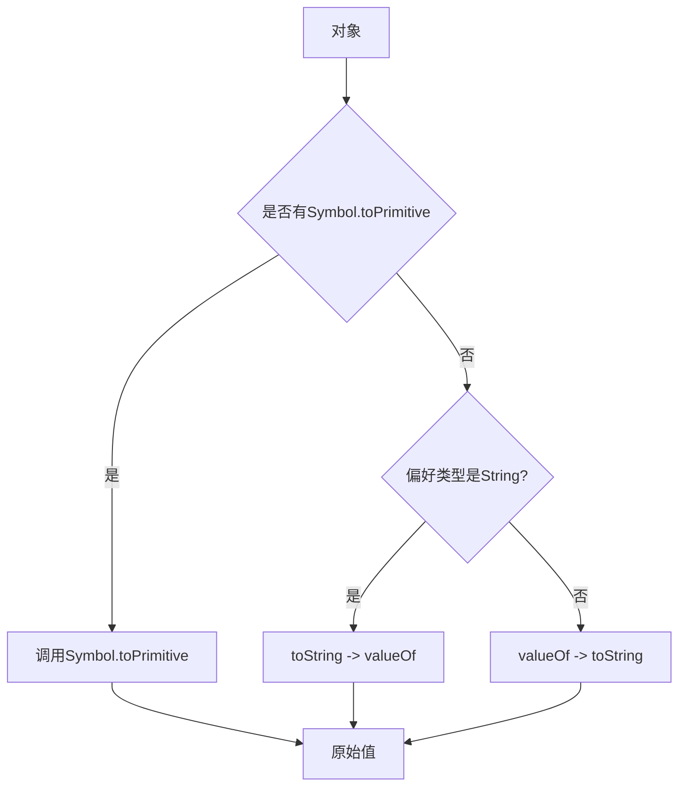
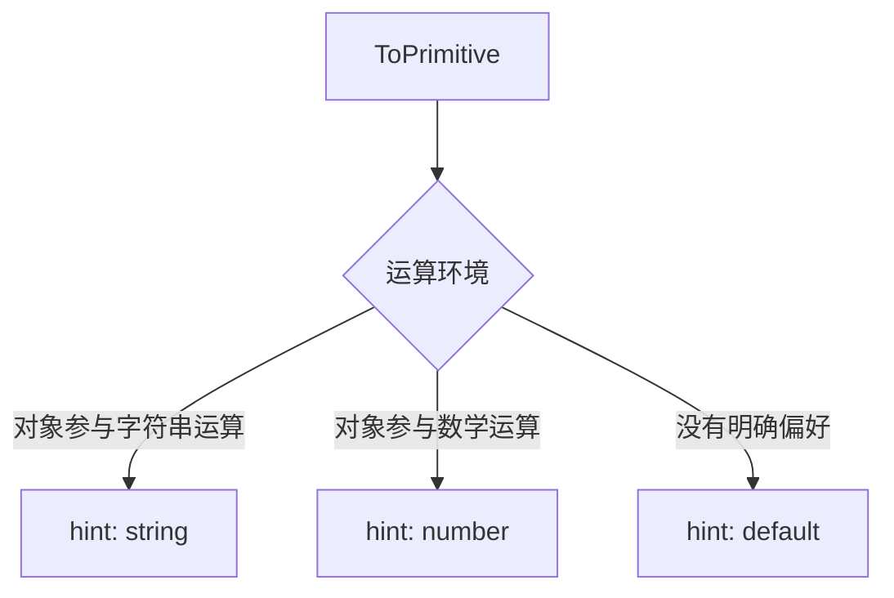
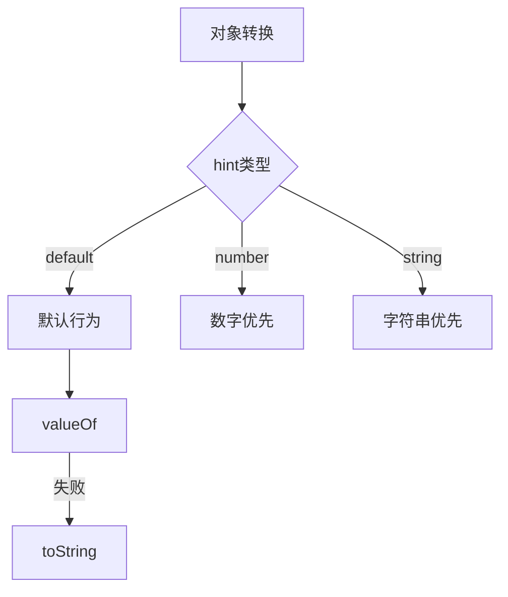

# JavaScript 运算符规则与隐式类型转换

## 基本概念

### 隐式类型转换
JavaScript 在进行运算时会自动进行类型转换,这种转换称为隐式类型转换。主要发生在:
- 比较运算 (==, !=, >, <)
- 算术运算 (+, -, *, /)

### ToPrimitive 转换流程



### 类型转换规则表
- 数值转换: Number()
- 字符串转换: String()
- 布尔值转换: Boolean()

## 练习题

### 1. 完成函数,实现数组求和
```javascript
function sumArray(arr) {
  // 补全代码,将数组所有元素转换为数字并求和
  return arr.reduce((sum, curr) => _____, 0);
}
```

### 2. 实现一个函数判断两个值是否宽松相等(==)
```javascript
function looseEqual(a, b) {
  // 补全代码,模拟 == 的行为
  if (a === null && b === _____) return true;
  if (typeof a === 'object' && typeof b === '_____') {
    return a.toString() == b;
  }
  return a == b;
}
```

### 3. 完成对象的 ToPrimitive 转换
```javascript
const obj = {
  value: 100,
  // 补全代码,让 obj + 1 = 101
  valueOf() {
    return _____;
  }
};
```

<details>
<summary>参考答案</summary>

1. 数组求和
```javascript
function sumArray(arr) {
  return arr.reduce((sum, curr) => sum + Number(curr), 0);
}
```

2. 宽松相等判断
```javascript
function looseEqual(a, b) {
  if (a === null && b === undefined) return true;
  if (typeof a === 'object' && typeof b === 'number') {
    return a.toString() == b;
  }
  return a == b;
}
```

3. ToPrimitive 转换
```javascript
const obj = {
  value: 100,
  valueOf() {
    return this.value;
  }
};
```
</details>


# JavaScript ToPrimitive 转换中的偏好类型判断



## 偏好类型判断规则

1. **hint: "string"** 的情况：
- 使用 `String(obj)` 进行显式转换
- 对象作为属性键时
- 使用模板字符串时 `` `${obj}` ``
- 使用 `obj.toString()` 时

2. **hint: "number"** 的情况：
- 使用 `Number(obj)` 进行显式转换
- 数学运算（除了 + 运算符）：`-`, `*`, `/`, `%`
- 比较运算：`>`, `<`, `<=`, `>=`
- `obj - 0` 这类运算

3. **hint: "default"** 的情况：
- 二元 `+` 运算符
- `==` 相等比较
- 大多数情况下的行为与 "number" 相同

## 示例代码

```javascript
const obj = {
  toString() {
    return "字符串值";
  },
  valueOf() {
    return 42;
  }
};

// hint: string
String(obj);                    // "字符串值"
`${obj}`;                      // "字符串值"

// hint: number
obj - 1;                       // 41
Number(obj);                   // 42

// hint: default
obj + 1;                       // 43
```

<details>
<summary>更多示例</summary>

```javascript
const date = new Date();
// Date 对象特殊处理
// toString 优先于 valueOf
alert(date);        // hint: string
date + 1;          // hint: default
date - 1;          // hint: number

const obj2 = {
  [Symbol.toPrimitive](hint) {
    console.log(`hint: ${hint}`);
    return hint === 'string' ? '字符串' : 123;
  }
};

String(obj2);       // 输出 "hint: string"
obj2 + 2;          // 输出 "hint: default"
obj2 / 2;          // 输出 "hint: number"
```
</details>


# JavaScript中的 "default" hint 详解

## ToPrimitive 转换流程



## 触发场景

### 1. 二元加法运算
```javascript
let obj + "hello";    // default hint
let obj1 + obj2;      // default hint
```

### 2. 宽松相等比较
```javascript
let obj == 1;         // default hint
let obj == "1";       // default hint
```

## 转换示例

```javascript
const obj = {
  toString() {
    return "字符串";
  },
  valueOf() {
    return 42;
  }
};

// default hint 示例
obj + 1;      // 43 (使用valueOf)
obj + "1";    // "421" (使用valueOf)
obj == 42;    // true (使用valueOf)

// 对比其他hint
`${obj}`;     // "字符串" (string hint, 使用toString)
obj - 1;      // 41 (number hint, 使用valueOf)
```

<details>
<summary>完整实现示例</summary>

```javascript
const complexObj = {
  [Symbol.toPrimitive](hint) {
    console.log(`hint是: ${hint}`);
    switch(hint) {
      case 'string':
        return '字符串值';
      case 'number':
        return 123;
      default:
        return 42;
    }
  },
  valueOf() {
    return 100;
  },
  toString() {
    return '字符串';
  }
};

// default hint 测试
console.log(complexObj + 1);    // 43
console.log(complexObj == 42);  // true
```
</details>