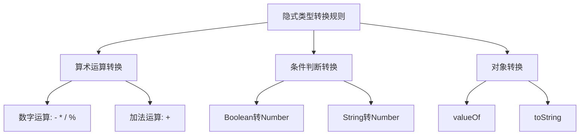
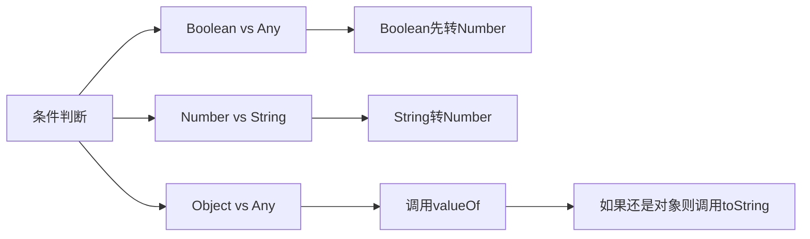
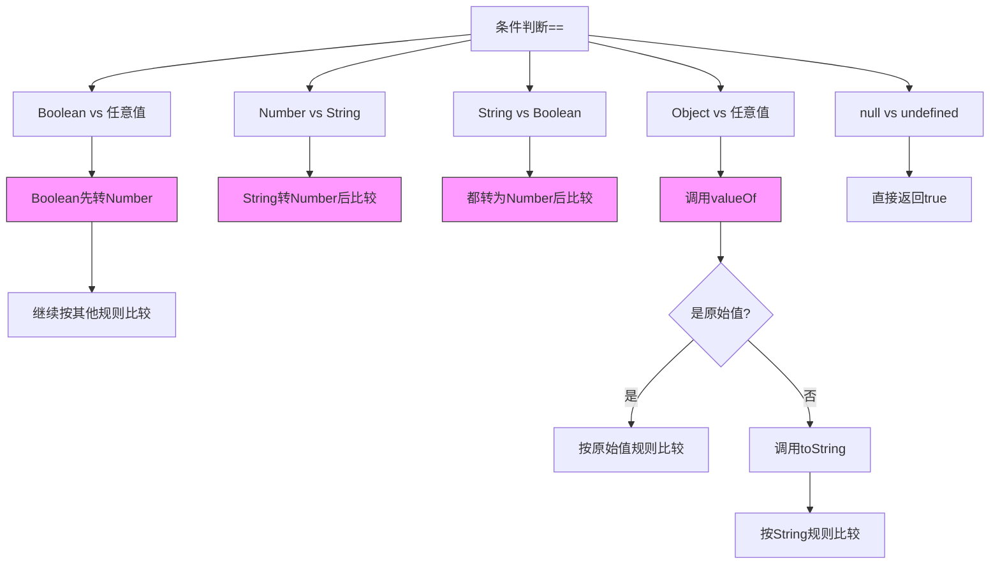
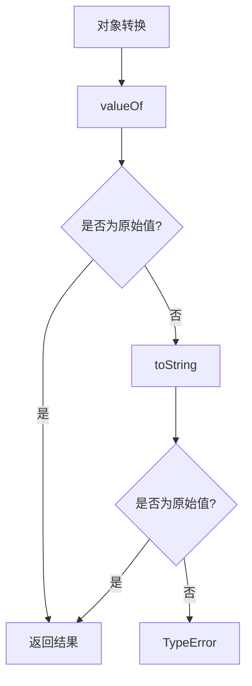

# JavaScript 隐式类型转换详解

## 什么是隐式类型转换?

隐式类型转换是JavaScript在运算时,自动将操作数转换为期望的数据类型的过程。

## 主要转换规则



### 1. 算术运算符转换
- `-`, `*`, `/`, `%`: 操作数转为数字
  - `undefined` -> `NaN`
  - `null` -> `0`
  - `true` -> `1`
  - `false` -> `0`
  - `string` -> 按数字语法解析,失败则`NaN`
- `+`: 
  - 有字符串则进行字符串连接
  - 无字符串时:
    - `undefined` + `undefined` = `NaN`
    - `null` + `null` = `0`
    - `true` + `true` = `2`
    - `false` + `false` = `0`

### 2. 条件判断转换(==)


具体规则:
1. `null == undefined` 结果为 `true`
2. 如果一个是 Boolean,先转 Number
3. 如果一个是 String,一个是 Number,String 转 Number
4. 如果一个是 Object,先调用 valueOf(),如果结果还是对象则调用 toString()

例子:
```js
[] == false   // true, 过程: [] -> "" -> 0 == 0
[1] == true   // true, 过程: [1] -> "1" -> 1 == 1
["0"] == false // true, 过程: ["0"] -> "0" -> 0 == 0
```

### 3. 对象转换规则
当对象需要转换为原始值时,会按以下顺序调用:



例子:
```js
let obj = {
  valueOf() { return 100 },
  toString() { return '200' }
}
console.log(obj + 1)    // 101 (使用valueOf)
console.log(`${obj}`)   // "200" (显式调用toString)
```

## 练习题

### 1. 补全代码
```js
// 实现一个函数,判断输入值是否为假值
function isFalsy(val) {
  // 补全代码
}

console.log(isFalsy(""))  // true
console.log(isFalsy(1))   // false
console.log(isFalsy({}))  // false
```

### 2. 判断输出
```js
let result = 1 + "2" + 3;
// result的值是什么?
```

### 3. 补全代码
```js
// 实现一个函数,将任意值转换为数字
function toNumber(val) {
  // 补全代码,不能直接使用Number()函数
}

console.log(toNumber("123")) // 123
console.log(toNumber(true)) // 1
console.log(toNumber({})) // NaN
```

<details>
<summary>参考答案</summary>

1. isFalsy实现:
```js
function isFalsy(val) {
  return !val;
}
```

2. result的值是"123"
因为从左到右运算:
- 1 + "2" = "12"
- "12" + 3 = "123"

3. toNumber实现:
```js
function toNumber(val) {
  return val - 0;
}
```

</details>