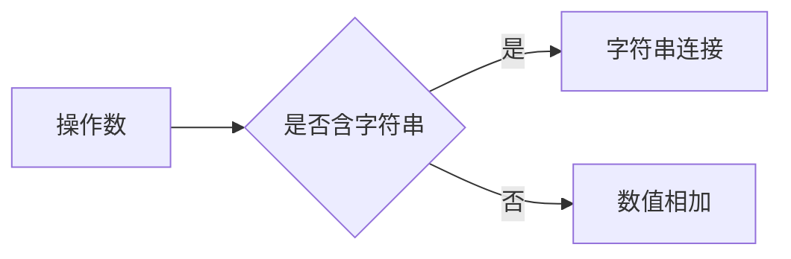
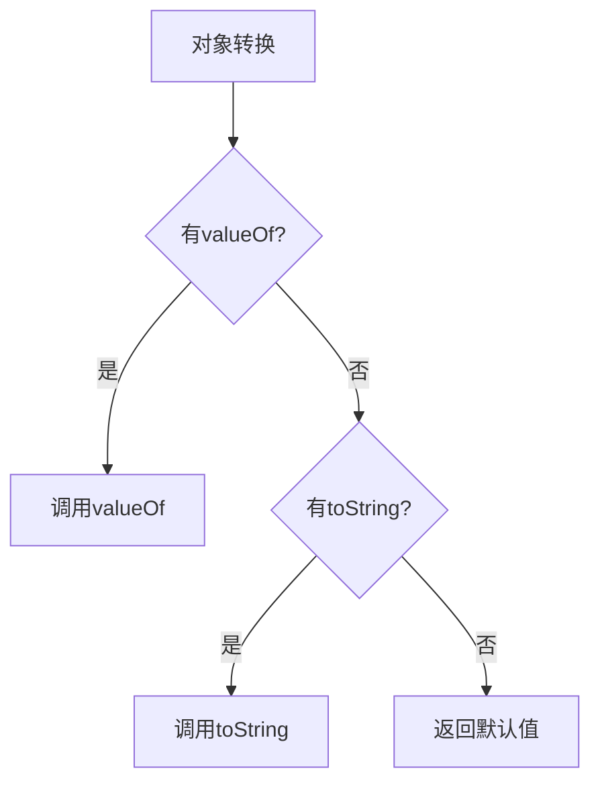
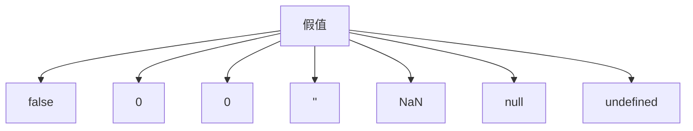

# JavaScript隐式类型转换

## 基本概念

JavaScript作为弱类型语言, 在运算时会进行自动的类型转换。主要包括:

1. 数值运算转换
2. 字符串连接转换  
3. 对象转换
4. 真值运算转换

## 类型转换规则

### 1. 加号运算符的特殊性



### 2. 对象转换优先级



### 3. 假值列表



## 练习题

### 1. 类型转换预测

补全下面代码中的值:

```javascript
let result_1 = 1 + "2" + 3; // result_1 = ___
let result_2 = 1 + 2 + "3"; // result_2 = ___
```

### 2. 对象转换实现

补全代码使下面的等式成立:

```javascript
let obj = {
    // 补全这里的代码
};
console.log("Result:" + obj); // 输出 "Result:100"
```

### 3. NaN检测函数

补全代码实现一个可靠的isReallyNaN函数:

```javascript
function isReallyNaN(x) {
    // 补全这里的代码
}
```

### 4. 参数默认值

修复下面的函数, 使其能正确处理0作为参数的情况:

```javascript
function calculate(x) {
    // 原代码
    if (!x) {
        x = 1;
    }
    return x * 2;

    // 请修改成正确的判断方式
}
```

<details>
<summary>参考答案</summary>

1. 类型转换预测:

```javascript
let result_1 = "123" // 从左到右,1+"2"变成"12",再+"3"
let result_2 = "33" // 1+2=3,然后3+"3"变成"33"
```

2. 对象转换实现:

```javascript
let obj = {
    valueOf: function() {
        return 100;
    }
};
```

3. NaN检测函数:

```javascript
function isReallyNaN(x) {
    return x !== x;
}
```

4. 参数默认值:

```javascript
function calculate(x = 1) {
    return x * 2;
}
```

</details>
