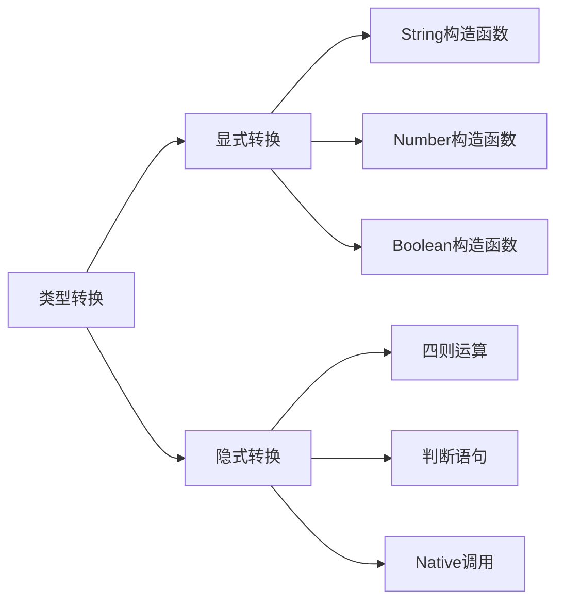

# JavaScript类型转换

## 基本概念

JavaScript中的类型转换分为两种:
* 显式类型转换(强制类型转换)
* 隐式类型转换(自动类型转换)



### 显式转换方法

1. 转为字符串:
* toString()方法
* String()构造函数

2. 转为数字:
* parseInt()
* parseFloat() 
* Number()构造函数

3. 转为布尔值:
* Boolean()构造函数

### 隐式转换规则

1. 加法运算符(+):
* 只要有一个操作数是字符串, 结果就是字符串

2. 其他算术运算符(-,*,/):
* 操作数会被转换为数字

3. 判断语句:
* 条件会被转换为布尔值

## 练习题

### 题目1: 字符串转换

补全代码, 将数字转换为36进制字符串, 并去掉开头的"0."

```javascript
function getRandomString() {
    return Math.random()._____(_____)._____(2);
}
```

### 题目2: 数字转换

补全代码, 将字符串转换为指定进制的数字

```javascript
function parseNumber(str, base) {
    return ______(______, ______);
}
```

### 题目3: 判断类型转换

以下代码输出什么? 为什么?

```javascript
console.log(Boolean([]));
console.log(Boolean(""));
console.log(Boolean(0));
console.log(Boolean({
    a: 1
}));
```

### 题目4: 隐式转换

补全代码空格处的内容, 使得结果为true

```javascript
let result = ("1"
    _____ 2) _____ "12";
console.log(result); // true
```

<details>
<summary>参考答案</summary>

题目1:

```javascript
function getRandomString() {
    return Math.random().toString(36).substr(2);
}
```

题目2:

```javascript
function parseNumber(str, base) {
    return parseInt(str, base);
}
```

题目3:

```javascript
console.log(Boolean([])); // true (空数组是对象,转换为true)
console.log(Boolean("")); // false (空字符串转换为false)
console.log(Boolean(0)); // false (0转换为false)
console.log(Boolean({
    a: 1
})); // true (对象转换为true)
```

题目4:

```javascript
let result = ("1" * 2) == "2";
// 或
let result = ("1" + 2) === "12";
```

</details>
