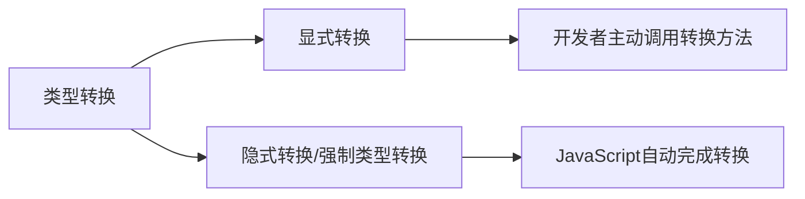
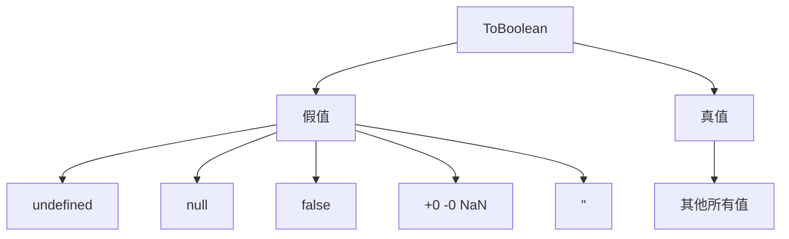
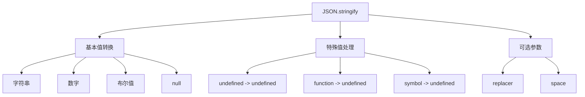

# JavaScript 类型转换详解

## 基本概念

### 类型转换 vs 强制类型转换



- 类型转换:将值从一种类型转换为另一种类型
- 显式转换:开发者通过调用转换方法进行转换,如 `String()`、`Number()`等
- 隐式转换(强制类型转换):JavaScript在运行时自动进行的类型转换

### 基本转换规则

#### ToString 转换规则

- `null` -> `"null"`
- `undefined` -> `"undefined"` 
- `true` -> `"true"`
- 数字按通用规则转字符串
- 对象调用 toString() 方法

#### ToNumber 转换规则

- `true` -> `1`
- `false` -> `0`
- `undefined` -> `NaN`
- `null` -> `0`
- 字符串按数字语法规则解析,失败返回 `NaN`

#### ToBoolean 转换规则



## 练习题

### 1. 补全代码
```javascript
// 实现一个函数,判断传入参数是否为假值
function isFalsy(val) {
  // 补全代码
  return val === undefined || val === null || val === false || val === 0 || val === '' || Number.isNaN(val);
}
```

<details><summary>参考答案</summary>

```javascript
function isFalsy(val) {
  return val === undefined || val === null || val === false || val === 0 || val === '' || Number.isNaN(val);
}

console.log(isFalsy(false)); // true
console.log(isFalsy("")); // true
console.log(isFalsy(0)); // true
console.log(isFalsy(null)); // true
console.log(isFalsy(undefined)); // true
console.log(isFalsy(NaN)); // true
console.log(isFalsy("hello")); // false
```
</details>

### 2. 补全代码
```javascript
// 实现一个函数,将任意值转为数字,如果无法转换则返回 0
function toNumber(val) {
  // 补全代码
  let num = Number(val);
  return isNaN(num) ? 0 : num;
}
```

<details><summary>参考答案</summary>

```javascript
function toNumber(val) {
  let num = Number(val);
  return isNaN(num) ? 0 : num;
}

console.log(toNumber("123")); // 123
console.log(toNumber(true)); // 1
console.log(toNumber(false)); // 0
console.log(toNumber("hello")); // 0
console.log(toNumber(null)); // 0
console.log(toNumber(undefined)); // 0
```
</details>

### 3. 判断输出
```javascript
// 判断以下代码的输出结果
console.log([] == false)
console.log([] == ![])
console.log("" == 0)
console.log("" == [])
console.log(0 == [])
```

<details><summary>参考答案</summary>

```javascript
console.log([] == false) // true
// [] 转为 "" -> 0, false 转为 0

console.log([] == ![]) // true
// ![] 转为 false, 然后同上

console.log("" == 0) // true
// "" 转为 0

console.log("" == []) // true
// [] 转为 ""

console.log(0 == []) // true
// [] 转为 "" -> 0
```
</details>

### 4. 补全代码
```javascript
// 实现一个函数,将数组转为字符串,不使用 toString() 和 join()
function arrayToString(arr) {
  // 补全代码
  return arr + '';
}
```

<details><summary>参考答案</summary>

```javascript
function arrayToString(arr) {
  return arr + '';
}

console.log(arrayToString([1,2,3])); // "1,2,3"
console.log(arrayToString(['a','b'])); // "a,b"
console.log(arrayToString([])); // ""
```
</details>

## 注意事项

1. 在使用 `==` 时要特别小心隐式类型转换,建议:
   - 如果比较的值中有 `true` 或 `false`,使用 `===`
   - 如果比较的值中有 `[]`、`""` 或 `0`,使用 `===`

2. `typeof` 操作是安全的,不会发生隐式类型转换

3. 在进行数学运算时要注意数据类型,必要时进行显式转换

4. 使用 `Boolean()` 或 `!!` 来进行布尔值的显式转换更易读


# JSON.stringify() 详解

## 基本概念



### 基本转换规则

- 字符串: 添加双引号 `"hello"` -> `"\"hello\""`
- 数字: `42` -> `"42"`
- 布尔值: `true` -> `"true"`
- null: `null` -> `"null"`
- undefined/function/symbol: 
  - 作为单独值时返回 undefined
  - 在对象中会被忽略
  - 在数组中转为 null

### 可选参数

1. replacer: 用于过滤或转换序列化的值
   - 数组形式: 指定要序列化的属性名
   - 函数形式: 自定义转换规则

2. space: 控制输出格式
   - 数字: 指定缩进空格数
   - 字符串: 使用字符串作为缩进符号

## 练习题

### 1. 补全代码
```javascript
// 实现一个函数,过滤对象中值为 undefined 的属性后再序列化
function stringifyWithoutUndefined(obj) {
  // 补全代码
  return JSON.stringify(obj, (key, value) => value === undefined ? undefined : value);
}
```

<details><summary>参考答案</summary>

```javascript
function stringifyWithoutUndefined(obj) {
  return JSON.stringify(obj, (key, value) => value === undefined ? undefined : value);
}

const obj = {
  a: 1,
  b: undefined,
  c: 'hello'
};
console.log(stringifyWithoutUndefined(obj)); // {"a":1,"c":"hello"}
```
</details>

### 2. 补全代码
```javascript
// 实现一个函数,只序列化对象中的数字属性
function stringifyNumbersOnly(obj) {
  // 补全代码
  return JSON.stringify(obj, (key, value) => typeof value === 'number' ? value : undefined);
}
```

<details><summary>参考答案</summary>

```javascript
function stringifyNumbersOnly(obj) {
  return JSON.stringify(obj, (key, value) => typeof value === 'number' ? value : undefined);
}

const obj = {
  a: 1,
  b: "hello",
  c: 42,
  d: true
};
console.log(stringifyNumbersOnly(obj)); // {"a":1,"c":42}
```
</details>

### 3. 判断输出
```javascript
const obj = {
  a: undefined,
  b: function() {},
  c: Symbol(),
  d: [1, undefined, function(){}, 4]
};

console.log(JSON.stringify(obj));
console.log(JSON.stringify(obj, ['a', 'b', 'd']));
```

<details><summary>参考答案</summary>

```javascript
// 第一个输出: {"d":[1,null,null,4]}
// 解释: undefined、function 和 symbol 在对象中被忽略,在数组中转为 null

// 第二个输出: {"a":null,"d":[1,null,null,4]}
// 解释: replacer 数组指定了只序列化 a、b、d 属性,但 b 的值是 function 所以被忽略
```
</details>

## 注意事项

1. 处理循环引用的对象时会抛出错误
2. 如果对象有 toJSON() 方法,会优先调用该方法
3. 对于 undefined、function、symbol:
   - 作为单独值时,返回 undefined
   - 作为对象属性时,该属性会被忽略
   - 作为数组元素时,转换为 null
4. 日期对象会被转换为 ISO 格式的字符串
