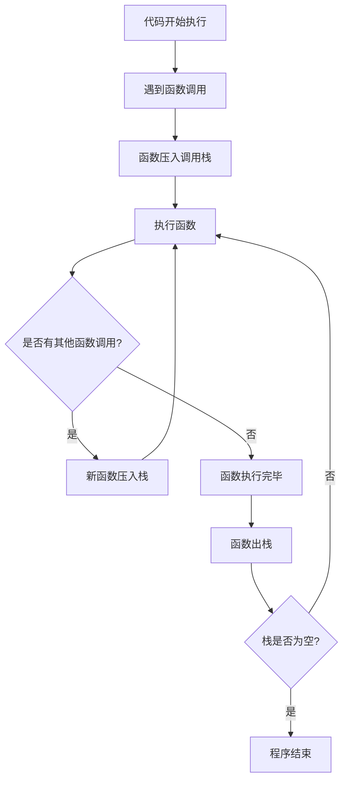
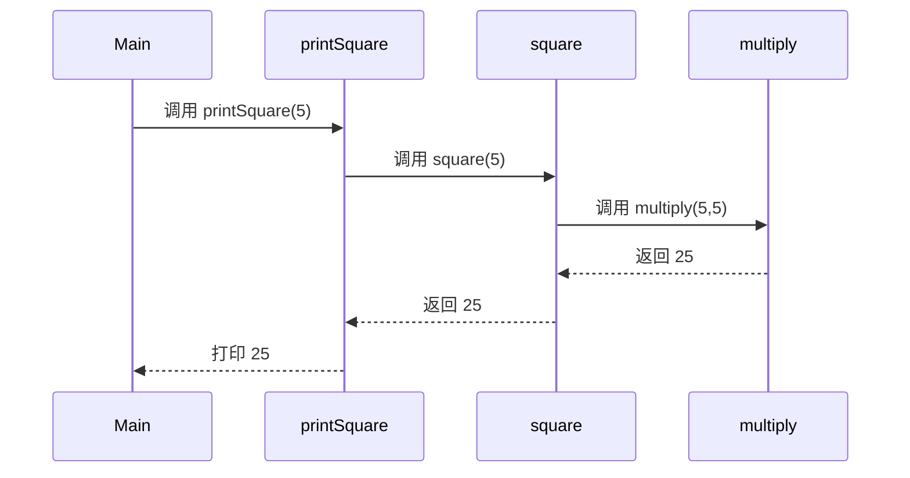

# JavaScript 调用栈详解

## 什么是调用栈
调用栈(Call Stack)是 JavaScript 引擎中用于跟踪函数执行的一种机制。它记录了当前程序执行的位置，以及函数调用的顺序。

### 调用栈工作原理图示



## 示例分析

考虑以下代码：
```javascript
function multiply(x, y) {
    return x * y;
}

function square(x) {
    return multiply(x, x);
}

function printSquare(x) {
    let result = square(x);
    console.log(result);
}
```

调用栈变化过程：



## 练习题

### 题目1：基础概念
请解释调用栈的主要功能是什么？

### 题目2：代码分析
分析下面代码的调用栈变化：
```javascript
function first() {
    console.log('1');
    second();
    console.log('2');
}

function second() {
    console.log('3');
}

first();
console.log('4');
```

### 题目3：堆栈溢出
以下代码为什么会导致堆栈溢出？
```javascript
function recursive() {
    recursive();
}
recursive();
```

### 题目4：执行顺序预测
预测以下代码的输出顺序并解释原因：
```javascript
function a() {
    console.log('a');
    b();
}

function b() {
    console.log('b');
    c();
}

function c() {
    console.log('c');
}

a();
```

## 参考答案

<details>
<summary>点击查看答案</summary>

### 答案1
调用栈的主要功能是：
- 追踪当前执行的函数位置
- 维护函数调用的顺序
- 管理函数的执行上下文

### 答案2
输出顺序：1, 3, 2, 4
调用栈变化：
1. [] -> [first]
2. [first] -> [second, first]
3. [first] -> []

### 答案3
因为递归调用没有终止条件，会不断向调用栈添加新的函数调用，最终超出调用栈的最大容量限制。

### 答案4
输出顺序：a, b, c
调用栈变化：
1. [] -> [a]
2. [a] -> [b, a]
3. [b, a] -> [c, b, a]
4. [b, a] -> [b, a]
5. [a] -> []

</details>

## 注意事项
- 调用栈大小是有限的
- 每个函数调用都会消耗调用栈空间
- 递归调用需要注意终止条件
- 理解调用栈对于调试代码非常重要