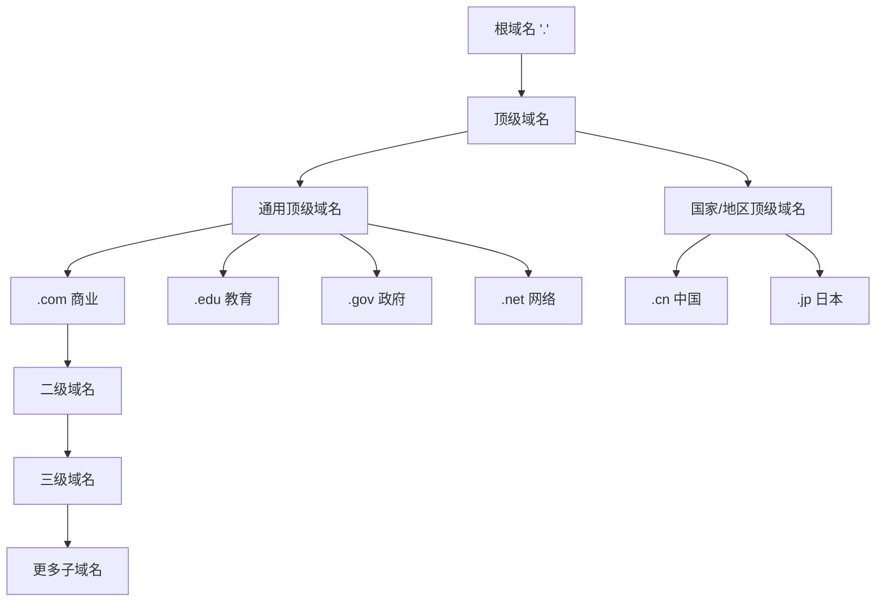
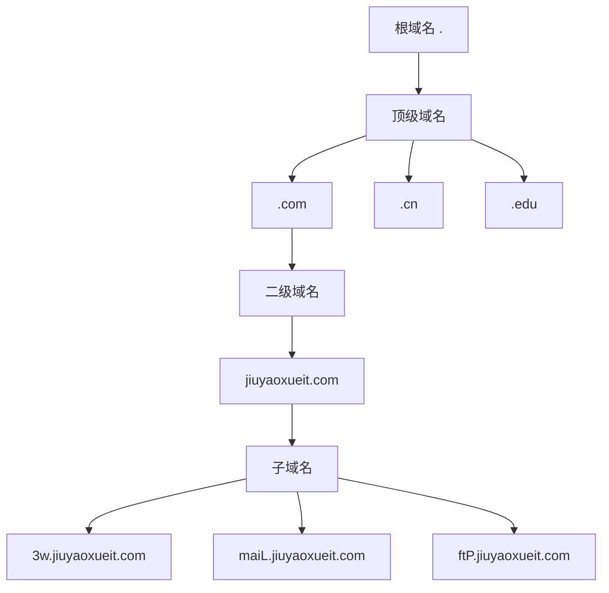

# DNS与域名层次结构

## 基本概念

### DNS (Domain Name System)
- DNS是一个将域名转换为IP地址的服务器系统
- 作用是将人类易读的域名翻译成计算机网络通信所需的IP地址

### 域名特点
1. 全球唯一性
2. 层次化结构
3. 自上而下以点分隔

## 域名层次结构



### 域名级别说明
1. 根域名: "."
2. 顶级域名(TLD): .com, .net, .cn 等
3. 二级域名: 组织注册的主域名 (如: google.com)
4. 三级域名: 服务标识 (如: www.google.com)

### 同一域名下的不同服务示例
- 网站服务: www.example.com
- 邮件服务: mail.example.com
- FTP服务: ftp.example.com

## 练习题

### 1. 域名解析顺序
给出域名 "blog.study.example.com", 请将其按照从右到左的顺序排列各级域名。

<details>
<summary>参考答案</summary>

```js
const domain = "blog.study.example.com";
const parts = domain.split('.').reverse();
// 结果: ['com', 'example', 'study', 'blog']
```

</details>

### 2. 域名有效性验证
补全以下代码，验证一个域名是否是有效的三级域名（如www.example.com）：

```js
function isValidThreeLevelDomain(domain) {
    // 补充代码：
    // 1. 将域名按点分割
    // 2. 判断是否正好包含3部分
}
```

<details>
<summary>参考答案</summary>

```js
function isValidThreeLevelDomain(domain) {
    const parts = domain.split('.');
    return parts.length === 3 && parts.every(part => part.length > 0);
}
```

</details>

### 3. 获取顶级域名
补全代码，从一个完整域名中提取顶级域名：

```js
function getTopLevelDomain(domain) {
    // 补充代码：返回顶级域名
}
```

<details>
<summary>参考答案</summary>

```js
function getTopLevelDomain(domain) {
    const parts = domain.split('.');
    return parts[parts.length - 1];
}
```

</details>

# 域名与DNS服务器

## 基本定义

- **域名**：在互联网上用于标识网站的名称，例如 `www.sohu.com`。域名是全球唯一的，通过层次化的名称结构来保证唯一性。
- **DNS服务器**：域名解析服务器，将域名转换为IP地址，使计算机能够访问相应的网站。

## 域名的层次结构



- **根域名**：以 `.` 表示
- **顶级域名**：如 `.com`、`.cn`、`.edu` 等
- **二级域名**：个人或企业在顶级域名下申请的域名，如 `jiuyaoxueit.com`
- **子域名**：在二级域名下的具体服务，如 `www.jiuyaoxueit.com`

## 学以致用

### 题目1：域名解析

请补全以下JavaScript代码，模拟一个简单的域名解析过程。

```javascript
// 定义一个简单的域名解析函数
function resolveDomain(domain) {
    const dnsRecords = {
        "www.example.com": "192.168.1.1",
        "mail.example.com": "192.168.1.2"
    };
    // 补全代码：返回域名对应的IP地址
    return {{ code }};
}

// 测试
console.log(resolveDomain("www.example.com")); // 输出: 192.168.1.1
```

<details><summary>参考答案</summary>

```javascript
return dnsRecords[domain];
```
</details>

### 题目2：域名层级解析

请补全以下JavaScript代码，将完整域名拆分为各个层级。

```javascript
function parseDomainLevels(domain) {
    // 补全代码：将域名拆分为数组，例如 "www.example.com" => ["www", "example", "com"]
    {{ code }}
}

// 测试
console.log(parseDomainLevels("www.example.com")); // 输出: ["www", "example", "com"]
```

<details><summary>参考答案</summary>

```javascript
return domain.split('.');
```
</details>