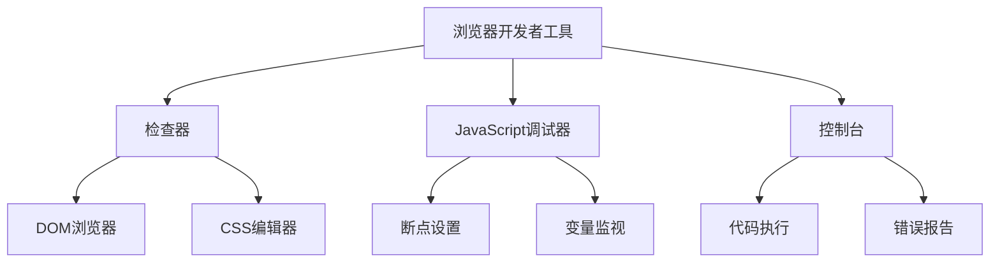

# 浏览器开发者工具

## 基本定义
浏览器开发者工具是现代浏览器内置的一套开发调试工具集，用于检查和调试网页的HTML、CSS和JavaScript代码。

## 主要组件



## 快捷键打开方式
- Windows: `Ctrl + Shift + I` 或 `F12`
- macOS: `⌘ + ⌥ + I`

## 练习题

### 1. DOM操作题
请补全以下代码，使用开发者工具的Console完成对页面背景颜色的修改：
```javascript
document.querySelector("____").style.____ = "lightblue";
```

### 2. 调试器使用题
在以下代码中，你应该在哪一行设置断点来监控`sum`变量的变化？
```javascript
function calculateSum(arr) {
    let sum = 0;
    for(let i = 0; i < arr.length; i++) {
        sum += arr_i;
    }
    return sum;
}
```

### 3. CSS检查题
使用开发者工具的检查器，如何查看一个元素的计算后的最终样式值？请补全操作步骤：
1. 打开开发者工具
2. ______
3. ______

<details>
<summary>参考答案</summary>

1. DOM操作题答案：
```javascript
document.querySelector("body").style.backgroundColor = "lightblue";
```

2. 调试器使用题答案：
应该在`sum += arr_i`后设置断点，这样可以监控sum的初始值和每次循环后的变化。

3. CSS检查题答案：
1. 打开开发者工具
2. 选择"检查器"面板
3. 点击"计算值"标签查看最终样式

</details>

### 4. Console调试题
以下代码执行后会在控制台输出什么？为什么？请补全代码：
```javascript
let x = 10;
let y;
console.log("x = ____");
console.log("y = ____");
```

<details>
<summary>参考答案</summary>

```javascript
let x = 10;
let y;
console.log("x = " + x);    // 输出: x = 10
console.log("y = " + y);    // 输出: y = undefined
```

因为y未被赋值，所以它的值是undefined。
</details>