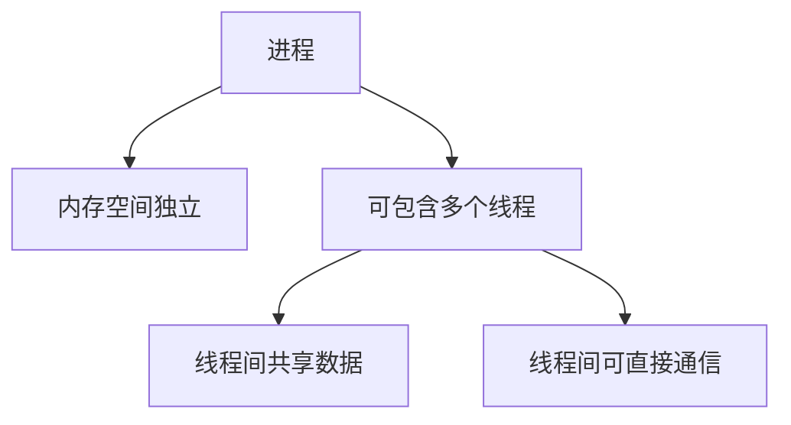
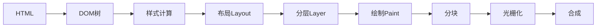
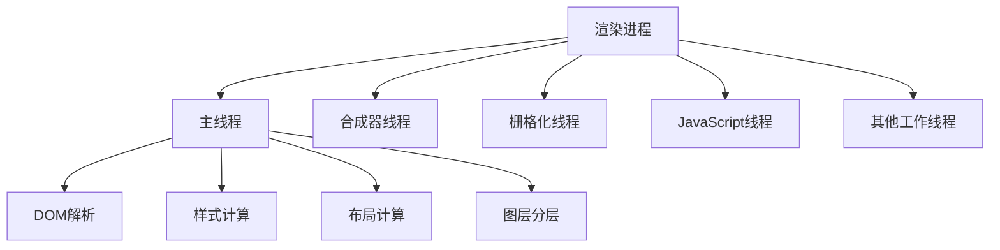
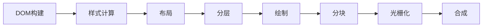

# 浏览器工作原理

## 基本概念

### 进程与线程

* 进程: 操作系统进行资源分配和调度的基本单元
* 线程: 操作系统能够进行运算调度的最小单位



### 浏览器的多进程架构

* 浏览器进程: 控制浏览器界面、地址栏、书签等
* 网络进程: 处理网络请求
* GPU进程: 处理浏览器界面渲染
* 插件进程: 控制网站使用的插件
* 渲染进程: 控制标签页内的内容展示

### 渲染流程

1. HTML解析构建DOM树
2. 样式计算
3. 布局(Layout)
4. 分层(Layer)
5. 绘制(Paint)
6. 分块
7. 光栅化
8. 合成



## 练习题

### 1. 进程与线程

问题: 以下哪些说法是正确的?
A. 一个进程可以包含多个线程
B. 不同进程间的内存空间是共享的
C. 同一进程内的线程可以直接通信
D. 每个线程都有独立的内存空间

<details><summary>答案</summary>
A和C是正确的。
* 一个进程确实可以包含多个线程
* 进程间内存空间是独立的, 不是共享的
* 同一进程内的线程可以直接通信
* 线程共享所属进程的内存空间, 而不是独立的
</details>

### 2. 代码补全练习

完成以下代码, 实现一个不会阻塞主线程的动画效果:

```javascript
function smoothAnimation() {
    const element = document.querySelector('.animated-box');
    let position = 0;

    function animate() {
        // 补充代码: 使用transform移动元素
        // 每次移动1px,当position达到100px时重置为0

    }

    // 补充代码: 使用requestAnimationFrame调用animate

}
```

<details><summary>答案</summary>

```javascript
function smoothAnimation() {
    const element = document.querySelector('.animated-box');
    let position = 0;

    function animate() {
        position = (position + 1) % 100;
        element.style.transform = `translateX(${position}px)`;
        requestAnimationFrame(animate);
    }

    requestAnimationFrame(animate);
}
```

```javascript
function smoothAnimation() {
    const element = document.querySelector('.animated-box');
    let position = 0;
    let animationId;

    function animate() {
        position = (position + 1) % 100;
        element.style.transform = `translateX(${position}px)`;
        // 保存requestAnimationFrame的返回值，以便后续可以停止动画
        animationId = requestAnimationFrame(animate);
    }

    // 启动动画
    animate();

    // 如果需要停止动画
    // cancelAnimationFrame(animationId);
}
```

</details>

### 3. 性能优化问题

问题: 以下哪些操作会触发重排(reflow)?
A. 改变元素的color
B. 改变元素的width
C. 改变元素的transform
D. 改变元素的background-color

<details><summary>答案</summary>
B是正确的。
* color和background-color只会触发重绘(repaint)
* transform不会触发重排或重绘, 直接在合成线程处理
* width会改变元素尺寸, 触发重排
</details>

### 4. 代码优化练习

优化以下可能导致性能问题的代码:

```javascript
function updateLayout() {
    const box = document.getElementById('box');
    box.style.width = '100px';
    box.style.height = '100px';
    box.style.left = '100px';
    box.style.top = '100px';
}
```

<details><summary>答案</summary>

```javascript
function updateLayout() {
    const box = document.getElementById('box');
    // 使用transform替代直接修改位置和尺寸
    box.style.transform = 'translate(100px, 100px) scale(1)';
}
```

说明: 使用transform可以避免重排, 提高性能。
</details>

# 浏览器渲染进程详解

## 基本概念

### 渲染进程的组成

渲染进程是多线程的,主要包含:
- 主线程: 负责处理DOM、样式、布局等
- 合成器线程: 负责将页面分层并合成
- 栅格化线程: 负责将图层转换为位图
- JavaScript线程: 负责执行JS代码
- 其他工作线程: 如Web Worker等



### 渲染流水线

主要步骤包括:
1. DOM构建: 解析HTML生成DOM树
2. 样式计算: 解析CSS,计算每个节点的样式
3. 布局: 计算每个元素的位置和大小
4. 分层: 将页面分成多个图层
5. 绘制: 记录绘制操作
6. 分块: 将图层分成小块
7. 光栅化: 将每个块转换为位图
8. 合成: 将所有图层合成最终页面



## 练习题

### 1. 概念理解

问题: 以下哪些操作会触发完整的渲染流水线?
A. 修改元素的color属性
B. 修改元素的width属性
C. 修改元素的transform属性
D. 修改元素的opacity属性

<details><summary>答案</summary>
B是正确的。
- color只会触发重绘,不需要重新布局
- width会触发重排(reflow),需要重新计算布局
- transform和opacity只会触发合成,不需要重新布局或重绘
</details>

### 2. 代码补全练习

完成以下代码,实现一个性能优化的动画效果:

```javascript
function animateBox() {
    const box = document.querySelector('.box');
    
    // 补充代码:使用requestAnimationFrame和transform
    // 实现box元素的移动动画
    function animate() {
        // 在这里补充代码
    }
}
```

<details><summary>答案</summary>

```javascript
function animateBox() {
    const box = document.querySelector('.box');
    let position = 0;
    
    function animate() {
        position += 2;
        box.style.transform = `translateX(${position}px)`;
        requestAnimationFrame(animate);
    }
    
    requestAnimationFrame(animate);
}
```

说明: 使用transform和requestAnimationFrame可以让动画在合成线程中执行,避免触发主线程的重排和重绘。
</details>

### 3. 实践题

问题: 如何优化以下可能导致性能问题的代码?

```javascript
function updateElements() {
    const elements = document.querySelectorAll('.item');
    elements.forEach(el => {
        el.style.width = '100px';
        el.style.height = '100px';
        el.style.left = '100px';
    });
}
```

<details><summary>答案</summary>

```javascript
function updateElements() {
    const elements = document.querySelectorAll('.item');
    // 使用CSS类统一修改样式
    elements.forEach(el => {
        el.classList.add('optimized-item');
    });
}

// CSS
/*
.optimized-item {
    width: 100px;
    height: 100px;
    transform: translateX(100px);
}
*/
```

说明:
1. 使用CSS类批量修改样式,减少DOM操作
2. 使用transform代替left属性,避免触发重排
</details>