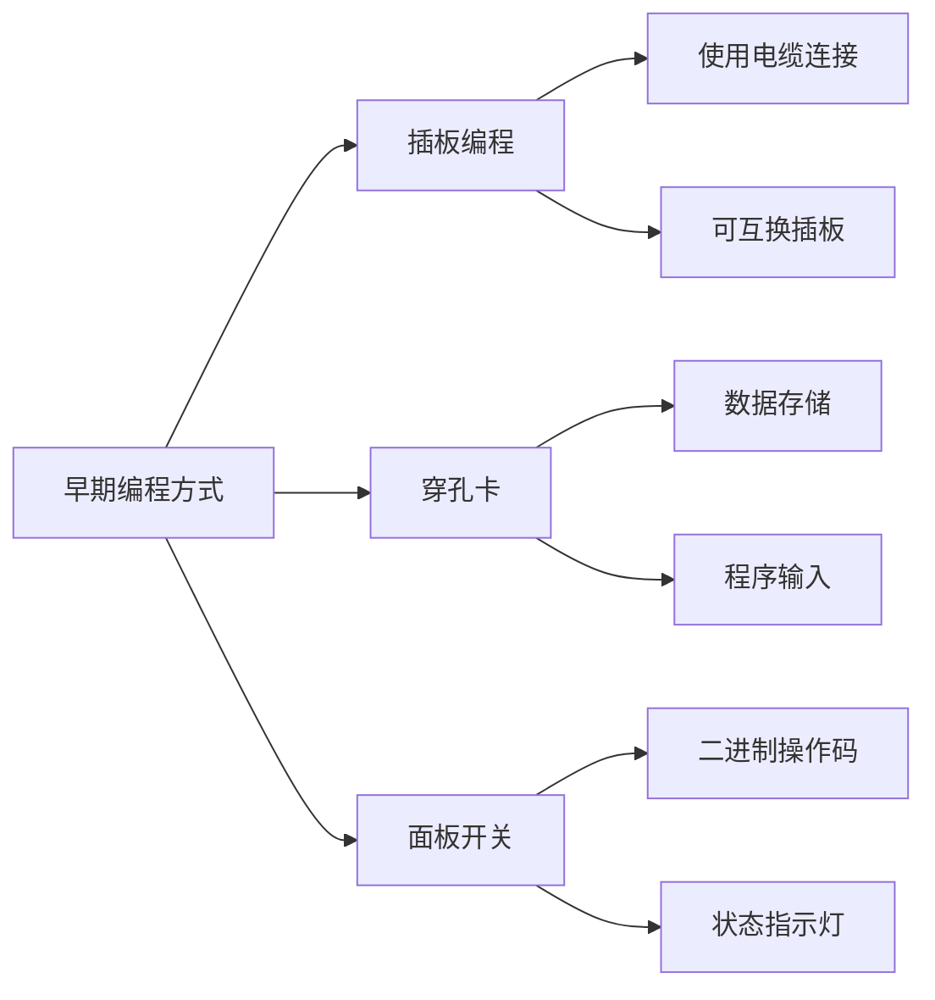
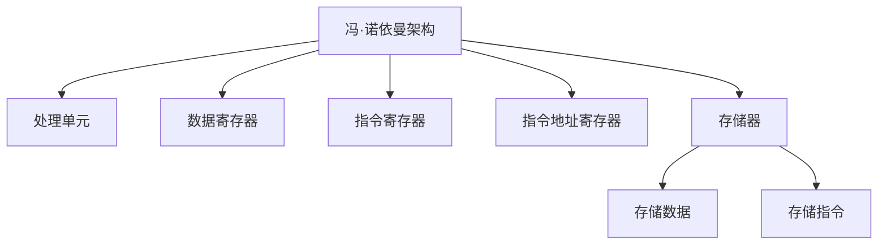

# 早期的编程方式 | TODO 还没有整理完成

## 关键概念

### 1. 可编程织布机
- 1801年由玛丽·雅卡尔发明
- 使用穿孔卡来控制织布机的编织模式
- 被认为是最早的编程形式之一

### 2. 早期计算机编程方式




### 3. 冯·诺依曼架构




## 练习题

### 1. 概念题
请选择正确的描述:
1. 早期的制表机可以:
   A. 进行任意编程
   B. 只能做固定的操作
   C. 可以存储程序
   D. 可以执行复杂的逻辑运算

### 2. 编程题
完成以下代码,模拟一个简单的穿孔卡系统。代码会接收一个二进制字符串(0表示无孔,1表示有孔),并返回对应的十进制数值。

```javascript
function punchCardToDecimal(binaryString) {
    // 补全代码:
    // 1. 检查输入是否为有效的二进制串
    // 2. 将二进制转换为十进制
}
```


### 3. 实现题
模拟冯·诺依曼架构中的简单内存操作,补全下面的代码:

```javascript
class SimpleMemory {
    constructor(size) {
        this.memory = new Array(size).fill(0);
        this.instructionPointer = 0;
    }

    // 补全write方法
    write(address, value) {
        // 在这里补全代码
    }

    // 补全read方法
    read(address) {
        // 在这里补全代码
    }
}
```


<details>
<summary>查看答案</summary>

### 概念题答案
正确答案: B. 只能做固定的操作

解释: 早期的制表机是专用机器,只能执行预设的固定操作,不能进行编程。

### 编程题答案
```javascript
function punchCardToDecimal(binaryString) {
    if(!/^[01]+$/.test(binaryString)) return null;
    return parseInt(binaryString, 2);
}
```


### 实现题答案
```javascript
class SimpleMemory {
    constructor(size) {
        this.memory = new Array(size).fill(0);
        this.instructionPointer = 0;
    }

    write(address, value) {
        if(address >= 0 && address < this.memory.length) {
            this.memory[address] = value;
        }
    }

    read(address) {
        if(address >= 0 && address < this.memory.length) {
            return this.memory[address];
        }
        return null;
    }
}
```

</details>