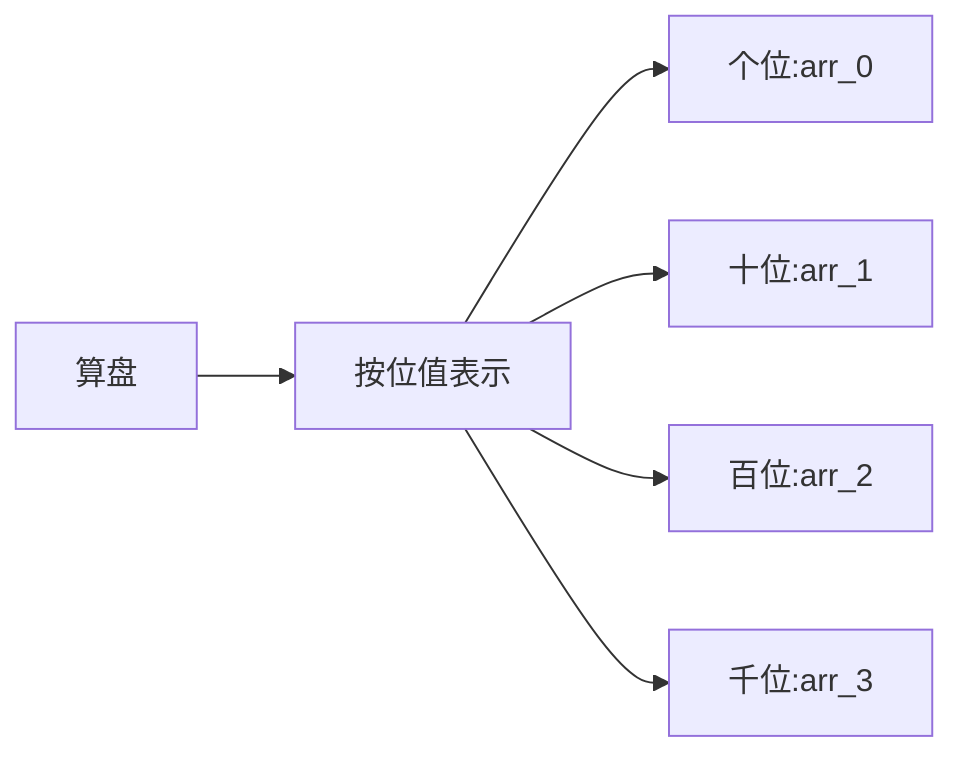
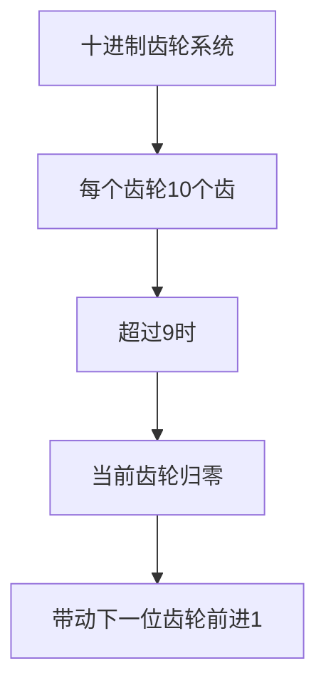
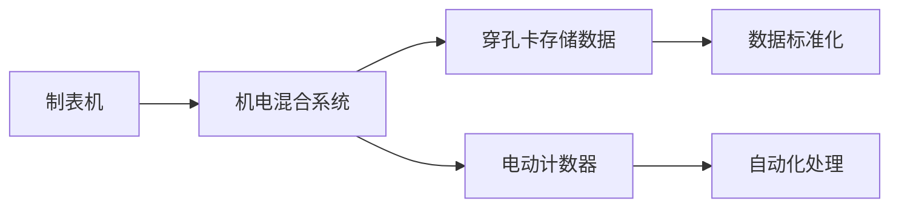
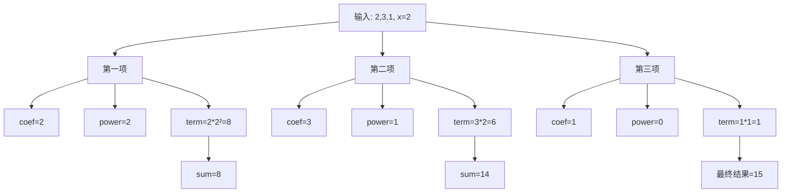

# 计算机早期历史

## 关键概念

### 1. 计算设备的演进

* 算盘(约公元前2500年) - 最早的计算设备
* 星盘 - 用于计算船只纬度
* 计算尺 - 辅助乘除运算
* 步进计算器(1694年) - 第一台可进行四则运算的机械计算器
* 差分引擎(1822年) - 用于计算多项式的机械装置
* 分析引擎 - 第一个通用计算机概念
* 制表机(1880年代) - 首个机电计算设备

### 2. 算盘工作原理



### 3. 步进计算器原理



### 4. 制表机创新点



## 练习题

### 1. 进位计算模拟

补全下面的代码, 模拟十进制数字的进位运算:

```javascript
function carryOver(num) {
    let digits = String(num).split('').map(Number);
    let result = [];
    let carry = 0;

    // 补全代码:实现个位数字大于9时的进位逻辑
    for (let i = digits.length - 1; i >= 0; i--) {
        // 你的代码
    }

    return result.reverse().join('');
}
```

### 2. 穿孔卡数据编码

实现一个函数, 将布尔数据转换为穿孔卡的0/1表示:

```javascript
function encodeCard(data) {
    // 补全代码:将布尔值数组转换为0/1字符串
}
```

### 3. 多项式计算器

模拟差分引擎的基本功能, 计算简单多项式:

```javascript
function polynomialCalculator(coefficients, x) {
    // 补全代码:计算多项式 ax^2 + bx + c 的值
}
```

<details>
<summary>参考答案</summary>

```javascript
// 1. 进位计算模拟
// 方案1: 使用unshift,不需要reverse
function carryOver(num) {
    let digits = String(num).split('').map(Number);
    let result = [];
    let carry = 0;

    for (let i = digits.length - 1; i >= 0; i--) {
        let sum = digits[i] + carry;
        result.unshift(sum % 10); // 直接从头部插入,自然就是正序
        carry = Math.floor(sum / 10);
    }

    return result.join('');
}

// 方案2: 使用push,最后reverse
function carryOver2(num) {
    let digits = String(num).split('').map(Number);
    let result = [];
    let carry = 0;

    for (let i = digits.length - 1; i >= 0; i--) {
        let sum = digits[i] + carry;
        result.push(sum % 10); // 从尾部插入,最后需要reverse
        carry = Math.floor(sum / 10);
    }

    return result.reverse().join('');
}

// 支持两个数相加的版本
function carryOverAdd(num1, num2) {
    // 转换成字符串后拆分成数组
    let digits1 = String(num1).split('').map(Number);
    let digits2 = String(num2).split('').map(Number);

    let result = [];
    let carry = 0;

    // 获取最长的数组长度
    let maxLength = Math.max(digits1.length, digits2.length);

    // 从右往左遍历
    for (let i = 0; i < maxLength; i++) {
        // 从右边取数,如果超出长度则为0
        let d1 = digits1[digits1.length - 1 - i] || 0;
        let d2 = digits2[digits2.length - 1 - i] || 0;

        let sum = d1 + d2 + carry;
        result.unshift(sum % 10);
        carry = Math.floor(sum / 10);
    }

    // 如果最后还有进位,加到最前面
    if (carry > 0) {
        result.unshift(carry);
    }

    return result.join('');
}

// 测试
console.log(carryOverAdd(789, 456)); // "1245"
// 步骤:
// 1. 9+6=15, 记录5,进位1
// 2. 8+5+1=14, 记录4,进位1
// 3. 7+4+1=12, 记录2,进位1
// 4. 最后进位1, 放到最前面
// 最终结果: 1245

// 2. 穿孔卡数据编码
function encodeCard(data) {
    return data.map(x => x ? '1' : '0').join('');
}
```

// 3. 多项式计算器

```javascript
function polynomialCalculator(coefficients, x) {
    // 假设输入: coefficients = [2, 3, 1], x = 2
    // 表示多项式: 2x² + 3x + 1
    return coefficients.reduce((sum, coef, i) => {
        // sum: 累加的结果
        // coef: 当前的系数(coefficient的缩写)
        // i: 当前的索引

        // 计算当前项的幂次
        let power = coefficients.length - 1 - i;
        // 计算当前项的值
        let term = coef * Math.pow(x, power);
        // 返回累加结果
        return sum + term;
    }, 0);
}

// 让我们看看每一步的执行过程:
console.log(polynomialCalculator([2, 3, 1], 2));

// 第1次循环: i = 0
// coef = 2 (第一个系数)
// power = 3 - 1 - 0 = 2 (x的二次方)
// term = 2 * 2² = 2 * 4 = 8
// sum = 0 + 8 = 8

// 第2次循环: i = 1
// coef = 3 (第二个系数)
// power = 3 - 1 - 1 = 1 (x的一次方)
// term = 3 * 2¹ = 3 * 2 = 6
// sum = 8 + 6 = 14

// 第3次循环: i = 2
// coef = 1 (第三个系数)
// power = 3 - 1 - 2 = 0 (x的零次方)
// term = 1 * 2⁰ = 1 * 1 = 1
// sum = 14 + 1 = 15
```



</details>
