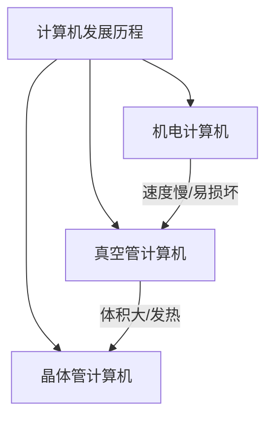

# 早期计算机发展史要点

## 关键概念

### 机电计算机
- 哈佛马克一号 (1944)
  - 300万个连接点
  - 500英里电线
  - 每秒3次加减运算
  - 使用继电器作为核心组件

### 继电器工作原理


### 真空管
- 1904年发明
- 优点：
  - 无机械磨损
  - 每秒可切换数千次
- 缺点：
  - 易损坏
  - 发热量大
  - 成本高

### 晶体管
- 1947年发明
- 优势：
  - 体积小
  - 可靠性高
  - 功耗低
  - 切换速度快（每秒数万次）
  - 成本低




## 练习题

1. 模拟继电器状态切换
```javascript
// 补全代码：实现一个继电器的开关状态模拟
function Relay() {
    this.state = false; // false表示开路，true表示闭合
    
    // 补全此处代码，实现toggle方法，切换state状态
    this.toggle = function() {
        // 你的代码
    }
}
```


2. 计算不同计算机的运算时间
```javascript
// 补全代码：根据不同计算机的性能计算完成100次加法需要的时间
function calculateTime(computerType) {
    // 哈佛马克一号：每秒3次运算
    // ENIAC：每秒5000次运算
    // 现代计算机：每秒数百万次运算
    
    // 补全此处代码，返回完成100次加法所需时间（秒）
    
}
```


3. 真空管可靠性计算
```javascript
// 补全代码：假设每个真空管的年故障率是5%，计算包含n个真空管的计算机一年内不发生故障的概率
function calculateReliability(n) {
    // 你的代码
}
```


<details>
<summary>参考答案</summary>

1. 继电器模拟
```javascript
this.toggle = function() {
    this.state = !this.state;
}
```


2. 计算时间
```javascript
function calculateTime(computerType) {
    switch(computerType) {
        case 'harvard': return 100 / 3;
        case 'eniac': return 100 / 5000;
        case 'modern': return 100 / 1000000;
        default: return 0;
    }
}
```


3. 真空管可靠性
```javascript
function calculateReliability(n) {
    return Math.pow(0.95, n);
}
```

</details>